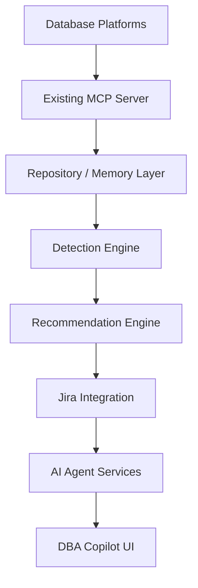

# AI DBA Copilot Platform - Enterprise Project Charter and Technical Design

Document Version: 1.0  
Date: 2026-06-10  
Status: Draft

---

## Executive Summary

Develop an enterprise AI-powered DBA platform leveraging an existing MCP server, PostgreSQL memory repository, AI analysis services, Jira integration, and predictive analytics. The platform will reduce operational toil, preserve institutional knowledge, improve RCA quality, and provide a foundation for AI-assisted database operations.

---

## Business Case

### Challenges

- Alert fatigue
- Repetitive DBA investigations
- Duplicate Jira tickets
- Knowledge silos
- Inconsistent remediation

### Benefits

- Faster triage
- Historical learning
- Standardized recommendations
- Reduced MTTR
- Improved operational scalability

---

## Scope

### In Scope

| Area | Details |
|------|---------|
| Database Platforms | PostgreSQL, Oracle, RDS MySQL, Databricks |
| Integration | MCP integration, Jira workflows |
| Features | Incident detection, recommendations, semantic search, predictive analytics |

### Out of Scope

- Fully autonomous high-risk database changes in the initial release

---

## Target Architecture

The platform is composed of the following layered architecture:

| Layer | Description |
|-------|-------------|
| 1. Database Platforms | PostgreSQL, Oracle, RDS MySQL, Databricks |
| 2. Existing MCP Server | MCP-based tool connectivity |
| 3. Repository / Memory Layer | Persistent storage for metrics, incidents, and knowledge |
| 4. Detection Engine | Rule- and ML-based issue detection |
| 5. Recommendation Engine | AI-powered recommendation generation |
| 6. Jira Integration | Ticket lifecycle management |
| 7. AI Agent Services | LLM-based analysis and reasoning |
| 8. DBA Copilot UI | Unified user interface |

---

## Memory Layer Design

### Core Tables

| Table | Purpose |
|-------|---------|
| metric_snapshots | Point-in-time metric data |
| incidents | Detected incident records |
| recommendations | Generated recommendations |
| jira_mapping | Jira ticket to incident mappings |
| remediation_history | Remediation action tracking |
| configuration_history | Configuration change snapshots |
| embeddings | Vector embeddings for semantic search |

### Retention Policy

| Data Type | Retention Period |
|-----------|-----------------|
| Raw metrics | 90 days |
| Aggregates | 2 years |
| Incidents and recommendations | Indefinite |

---

## MCP Tool Catalog

### Metrics Tools

| Tool | Description |
|------|-------------|
| get_database_metrics | Retrieve database performance metrics |
| get_host_metrics | Retrieve host-level metrics |
| get_replication_metrics | Retrieve replication status and metrics |

### Performance Tools

| Tool | Description |
|------|-------------|
| get_slow_queries | Identify slow-running queries |
| get_query_plan | Retrieve query execution plans |
| get_blocking_sessions | Identify blocking/session contention |

### Operations Tools

| Tool | Description |
|------|-------------|
| search_incidents | Search historical incidents |
| get_recommendations | Retrieve generated recommendations |
| search_jira | Search Jira tickets |
| create_jira | Create a new Jira ticket |
| update_jira | Update an existing Jira ticket |

---

## Issue Detection Engine

### Detection Domains

- Performance
- Capacity
- Availability
- Maintenance
- Cost

### Severity Levels

- Critical
- High
- Medium
- Low

### Output

Normalized incident records stored in the repository.

---

## Jira Integration Strategy

1. Generate deterministic fingerprints.
2. Check local repository.
3. Search Jira only when necessary.
4. Update existing issues instead of creating duplicates.
5. Track full lifecycle.

---

## AI Recommendation Engine

### Inputs

- Current state
- Historical incidents
- Configuration snapshots
- Query plans

### Outputs

- RCA
- Recommendations
- Risk level
- Confidence score
- Suggested remediation

---

## Semantic Search and Knowledge Graph

- Use pgvector.
- Store embeddings for incidents, RCAs, recommendations, and tickets.
- Enable similarity search and historical pattern recognition.

---

## Predictive Analytics

Forecast:

- Storage exhaustion
- Connection saturation
- Replication lag growth
- Cost anomalies
- Capacity planning risks

---

## Security and Governance

- RBAC
- Audit logging
- Approval workflows
- Secrets management
- Data retention policies
- Human approval for medium/high-risk actions

---

## Deployment Architecture

- Containerized services
- PostgreSQL repository
- FastAPI services
- MCP integration
- CI/CD pipelines
- Monitoring and observability

---

## Sprint Plan

| Sprint | Focus Area |
|--------|------------|
| Sprint 1-2 | Foundation |
| Sprint 3-4 | Memory Layer |
| Sprint 5-6 | Detection Engine |
| Sprint 7-8 | Jira Integration |
| Sprint 9-10 | Recommendation Engine |
| Sprint 11-12 | MCP Expansion |
| Sprint 13-14 | Copilot UI |
| Sprint 15-16 | Semantic Search |
| Sprint 17-18 | Predictive Analytics |
| Sprint 19-22 | Remediation Framework |

---

## Resource Plan

Roles:

- Lead DBA/Product Owner
- Backend Engineer
- AI Engineer
- DevOps Engineer
- QA/Test Engineer

MVP Team: 2-4 people

---

## KPIs

- Reduce duplicate Jira tickets by more than 95%
- Reduce triage effort by 50%
- Reduce MTTR by 30%
- Increase recommendation reuse
- Improve operational visibility

---

## Commercialization Roadmap

- Phase 1: Internal accelerator
- Phase 2: Consulting accelerator
- Phase 3: Managed service
- Phase 4: SaaS offering
- Phase 5: Marketplace ecosystem

---

## Risk Register

| Risk | Mitigation |
|------|------------|
| AI hallucinations | Rule-based detection, approvals, audits, testing |
| Metric quality issues | Data validation and quality checks |
| False positives | Feedback tuning and threshold calibration |
| Scope creep | Phased delivery and strict backlog control |
| Integration complexity | Incremental integration and contract testing |
