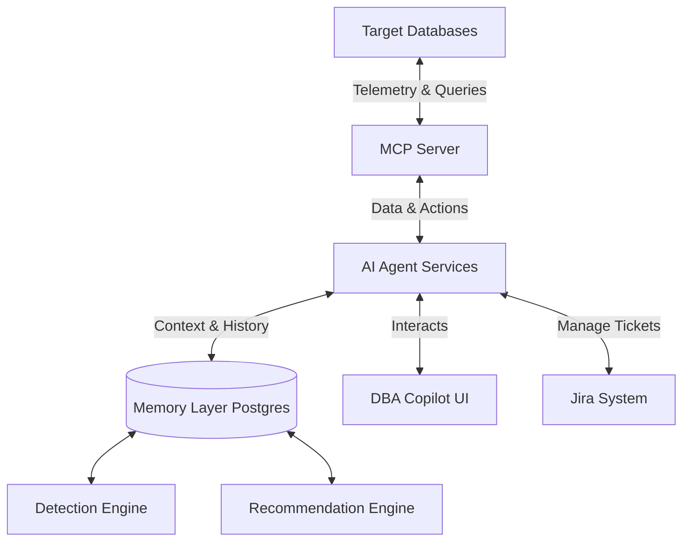
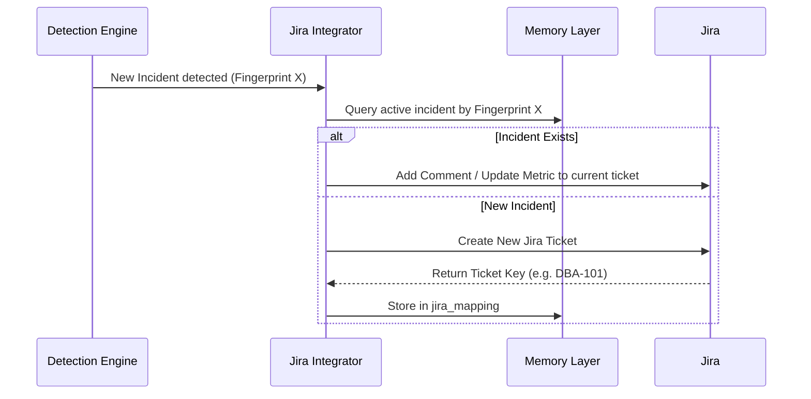

# AI DBA Copilot Platform - Detailed Functional Design Document

## 1. Introduction
The AI DBA Copilot Platform is an enterprise-scale solution designed to assist Database Administrators by leveraging an existing Model Context Protocol (MCP) server, a PostgreSQL memory repository, and AI analysis services. This document outlines the highly detailed functional design of the platform, including system architecture, component integrations, detailed workflows, data models, and user interaction sequences.

### 1.1 Purpose
To reduce operational toil, preserve institutional knowledge, improve Root Cause Analysis (RCA) quality, prevent alert fatigue, and provide a secure foundation for AI-assisted database operations.

### 1.2 Actors
- **DBA (Database Administrator):** Primary human user interacting via the Copilot UI to review recommendations, approve actions, and search history.
- **AI Agent System:** Intermediary LLM system orchestrating logic, consuming MCP tools, and formulating recommendations.
- **MCP Server:** Interface layer between the Copilot and underlying Target Databases.
- **Target Databases:** Postgres, Oracle, RDS MySQL, Databricks.

---

## 2. System Architecture Overview

The platform uses a layered, event-driven, and query-based architecture:

---

## 3. Detailed Module Specifications

### 3.1 Memory Layer (Repository)
The Memory Layer is a PostgreSQL database. It stores historical data to provide context for AI recommendations and deduplication.

**Core Tables & Data Structures:**
- **`metric_snapshots`**: Stores point-in-time metrics. 
  - Fields: `snapshot_id`, `db_target`, `metric_type`, `payload (JSONB)`, `timestamp`
- **`incidents`**: Identified issues.
  - Fields: `incident_id`, `fingerprint (Hash)`, `severity`, `domain`, `status`, `created_at`, `resolved_at`
- **`recommendations`**: Generated AI recommendations linked to incidents.
  - Fields: `rec_id`, `incident_id`, `rca_text`, `action_steps (JSON)`, `confidence_score (0-1)`, `risk_level`
- **`jira_mapping`**: Matches internal incidents to external Jira tickets.
  - Fields: `incident_id`, `jira_ticket_key`, `sync_status`, `last_sync`
- **`embeddings`**: Uses `pgvector` for semantic search.
  - Fields: `vector_id`, `source_type (incident/rec)`, `source_id`, `embedding (vector(1536))`

### 3.2 Issue Detection Engine
**Functionality:** Periodically or event-driven analysis of metrics to trigger `incidents`.
- **Pre-condition:** `metric_snapshots` is populated by the MCP metrics tools.
- **Flow:**
  1. Engine evaluates metric thresholds (e.g., active sessions > 90% capacity).
  2. Generates a unique `fingerprint` based on DB target, issue type, and timestamp window.
  3. Checks `incidents` table for existing ongoing fingerprint to prevent alert spam.
  4. If new, inserts record into `incidents`.
  5. Triggers the Recommendation Engine workflow.

### 3.3 Target Jira Integration (Smart Ticket Management)
**Functionality:** Prevents duplicate ticket creation.

### 3.4 AI Recommendation Engine
**Functionality:** Derives Root Cause Analysis (RCA) and actionable steps.
- **Inputs:** Triggered `incident_id`, related `metric_snapshots`, database configuration state, output of `get_query_plan`.
- **Flow:**
  1. AI Agent queries the Memory Layer for past incidents with similar semantic embeddings.
  2. Synthesizes current telemetry with past successful remediations.
  3. Generates RCA text, structured Remediation Steps, Confidence Score (e.g., 0.92), and Risk Level (Low/Medium/High).
  4. Outputs data to the `recommendations` table.
- **Rules:** High-risk actions (e.g., index creation, process termination) cannot be executed autonomously and are marked `Requires DBA Approval`.

### 3.5 Semantic Search & Knowledge Graph
**Functionality:** Natural language DBA queries over historical data.
- **Flow:**
  1. DBA inputs query via Copilot UI: *"Show me blocking issues on the Order DB from last month."*
  2. AI translates query to vector embedding.
  3. Queries `pgvector` index in the Memory Layer using Cosine Similarity (`<=>`).
  4. Returns top 5 relevant historical incidents and their attached recommendations.

### 3.6 Predictive Analytics
**Functionality:** Forecasting impending failures.
- **Data Pipeline:** Consumes daily roll-up data from `metric_snapshots`.
- **Extrapolation:** Applies linear regression and time-series profiling to project:
  - Time-to-exhaustion for storage (Disk Space constraints).
  - Time-to-exhaustion for connection pools (Connection Saturation).
- **Output:** Creates a "Predictive" severity incident if exhaustion is predicted within 14 days.

---

## 4. MCP Tool Catalog Contracts
The platform interfaces with databases via these strongly-typed tool definitions:

| Tool Category | Tool Name | Parameters | Return Schema |
|---------------|-----------|------------|---------------|
| **Metrics** | `get_database_metrics` | `db_name` (str) | JSON containing TPS, IOPS, CPU usage, Active Connections |
| **Metrics** | `get_replication_metrics` | `db_name` (str) | JSON containing replica lag (ms), replica state |
| **Performance**| `get_slow_queries` | `db_name` (str), `threshold_ms` (int) | Array of JSON containing `query_id`, `sql_text`, `duration_ms` |
| **Performance**| `get_query_plan` | `db_name` (str), `query_id` (str) | Text representation of EXPLAIN plan |
| **Performance**| `get_blocking_sessions`| `db_name` (str) | Array of JSON containing `blocker_pid`, `blocked_pid`, `wait_time` |
| **Operations** | `search_incidents` | `query_text` (str), `limit` (int) | Array of resolving incidents via Semantic Search |
| **Operations** | `create_jira` | `title` (str), `description` (str), `priority` | `jira_ticket_key` |

---

## 5. Security, Governance & Safety Guardrails
- **Execution Guardrails:** 
  - Read-Only Operations: Fully autonomous (e.g., Explain Plan, View Metrics).
  - Write/Configuration Operations: Require explicit User Approval via Copilot UI through an MFA/RBAC token validation. Fully autonomous high-risk writes are strictly prohibited.
- **Data Protection:** Query variables and raw SQL are sanitized. Passwords/Secrets are explicitly scrubbed from `get_query_plan` and `get_slow_queries` payloads before being written to the Memory Layer.
- **Retention Rules enforcement:** A cron-job sweeps the Memory layer daily to prune `metric_snapshots` older than 90 days, retaining only rolled-up aggregates for 2 years.

---

## 6. Exceptions and Error Handling
- **Database Unreachable:** The MCP tool issues a standardized connection timeout payload. The Detection Engine logs a platform-level availability incident, pausing downstream performance metric evaluation until connectivity is restored.
- **AI Hallucination/Low Confidence:** If the Recommendation Engine scores below a `0.60` confidence threshold, the UI flags the recommendation as "Draft - Needs Human Validation" and requires a mandatory peer-review before any suggested scripts can be extracted.
