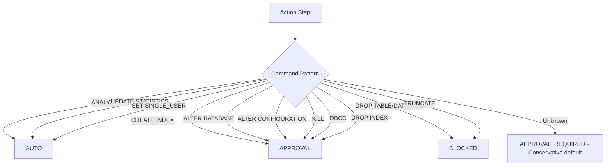

<!--
  Document Structure: This file contains three stacked specification layers.
    § TSD — Technical Specification Document (requirements, API contracts, DDL, configs)
    § SDD — Software Design Document (architecture diagrams, component specs, data models)
    § PRD — Product Requirements Document (business context, objectives, market, release)
  The filename prefix "PRD-" is retained for discoverability.
  Last reviewed: 2026-07-13 (see plan/PLAN-AUDIT-2026-07-13.md)
-->

# Technical Specification Document: Automated Remediation

## 1. Technical Requirements

### 1.1 Mandatory Requirements
| ID | Requirement | Verification |
|----|-------------|-------------|
| AR-TR-001 | AUTO actions must execute immediately without human intervention | Integration test |
| AR-TR-002 | APPROVAL_REQUIRED actions must fail with 403 when no token provided | Integration test |
| AR-TR-003 | APPROVAL_REQUIRED actions must execute when valid token provided | Integration test |
| AR-TR-004 | BLOCKED actions must never execute through any code path | Integration test |
| AR-TR-005 | Every remediation attempt must log to remediation_history | Integration test |
| AR-TR-006 | AUTO actions must use system service account identity | Unit test |
| AR-TR-007 | JWT token validation must check expiry, scope, and action claims | Unit test |
| AR-TR-008 | Concurrent execution for same rec_id must be prevented | Integration test |
| AR-TR-009 | Classification must be deterministic for same input | Unit test |
| AR-TR-010 | Orchestrator must handle partial success gracefully | Integration test |

### 1.2 Performance Targets
| Metric | Target | Measurement |
|--------|--------|-------------|
| Classification latency | < 10ms per action | Timer |
| AUTO execution (simple command) | < 10s | End-to-end timer |
| Token validation | < 5ms | Timer |
| Remediation history write | < 200ms P95 | Request timer |
| Orchestrator partial success response | < 30s | Timer |

## 2. API Specification

### 2.1 OpenAPI Contract

**Endpoint:** Added to `mcp-layer` on port 8004

```yaml
openapi: 3.0.3
info:
  title: AI DBA Copilot - Remediation
  version: 1.0.0

paths:
  /remediation/execute:
    post:
      operationId: executeRemediation
      summary: Execute remediation actions for a recommendation
      requestBody:
        required: true
        content:
          application/json:
            schema:
              type: object
              required: [rec_id]
              properties:
                rec_id:
                  type: string
                  format: uuid
                  description: Recommendation ID
                auth_token:
                  type: string
                  nullable: true
                  description: JWT approval token (required for APPROVAL_REQUIRED actions)
      responses:
        '200':
          description: Remediation execution completed
          content:
            application/json:
              schema:
                $ref: '#/components/schemas/RemediationResult'
        '403':
          description: Invalid or missing approval token
          content:
            application/json:
              schema:
                type: object
                properties:
                  error:
                    type: string
                    example: AUTH_001
                  message:
                    type: string
                  pending_approval:
                    type: array
                    items:
                      $ref: '#/components/schemas/PendingAction'
        '404':
          description: Recommendation not found
        '409':
          description: Remediation already in progress for this rec_id

components:
  schemas:
    RemediationResult:
      type: object
      properties:
        rec_id:
          type: string
          format: uuid
        auto_results:
          type: array
          items:
            $ref: '#/components/schemas/ActionResult'
        pending_approval:
          type: array
          items:
            $ref: '#/components/schemas/PendingAction'
        blocked:
          type: array
          items:
            $ref: '#/components/schemas/BlockedAction'
        executed_at:
          type: string
          format: date-time
        duration_ms:
          type: integer

    ActionResult:
      type: object
      properties:
        step_index:
          type: integer
        action:
          type: string
        success:
          type: boolean
        output:
          type: string
          nullable: true
        error:
          type: string
          nullable: true
        duration_ms:
          type: integer

    PendingAction:
      type: object
      properties:
        step_index:
          type: integer
        action:
          type: string
        reason:
          type: string
          enum: [auth_token_required, token_expired, scope_insufficient]

    BlockedAction:
      type: object
      properties:
        step_index:
          type: integer
        action:
          type: string
        reason:
          type: string
        classification:
          type: string
          enum: [BLOCKED]
```

### 2.2 Error Codes
| Code | HTTP Status | Description |
|------|-------------|-------------|
| AUTH_001 | 403 | Missing approval token for APPROVAL_REQUIRED action |
| AUTH_002 | 403 | Expired approval token |
| AUTH_003 | 403 | Approval token lacks required scope |
| REM_001 | 404 | Recommendation not found |
| REM_002 | 409 | Remediation already in progress (idempotency lock) |
| REM_003 | 500 | MCP write path execution failure |
| REM_004 | 500 | Audit log write failure |

## 3. Classification Rules

### 3.1 Pattern Matching Table
```python
CLASSIFICATION_RULES = [
    # AUTO: non-destructive maintenance
    (r'^\s*ANALYZE\s+', 'AUTO'),
    (r'^\s*UPDATE\s+STATISTICS\s+', 'AUTO'),
    (r'^\s*SET\s+\w+\s+(SINGLE_USER|MULTI_USER)', 'AUTO'),
    
    # APPROVAL_REQUIRED: schema or config changes
    (r'^\s*CREATE\s+(INDEX|STATISTICS)\s+', 'APPROVAL_REQUIRED'),
    (r'^\s*ALTER\s+(DATABASE|TABLE|INDEX|PROCEDURE)', 'APPROVAL_REQUIRED'),
    (r'^\s*DROP\s+INDEX\s+', 'APPROVAL_REQUIRED'),
    (r'^\s*KILL\s+\d+', 'APPROVAL_REQUIRED'),
    (r'^\s*DBCC\s+', 'APPROVAL_REQUIRED'),
    (r'^\s*EXEC\s+', 'APPROVAL_REQUIRED'),
    
    # BLOCKED: destructive operations (never executable)
    (r'^\s*DROP\s+(TABLE|DATABASE|VIEW|PROCEDURE|FUNCTION)', 'BLOCKED'),
    (r'^\s*TRUNCATE\s+TABLE\s+', 'BLOCKED'),
    (r'^\s*DELETE\s+FROM\s+', 'BLOCKED'),
    (r'^\s*UPDATE\s+.+\s+SET\s+.*\s+WHERE\s+', 'BLOCKED'),
    (r'^\s*INSERT\s+INTO\s+', 'BLOCKED'),
]

def classify_action(command: str) -> str:
    """Returns AUTO | APPROVAL_REQUIRED | BLOCKED"""
    for pattern, classification in CLASSIFICATION_RULES:
        if re.match(pattern, command.strip(), re.IGNORECASE):
            return classification
    return 'APPROVAL_REQUIRED'  # Conservative default
```

## 4. Configuration Specification

```yaml
# config/remediation.yaml
remediation:
  auto_enabled: true
  auto_service_account: system
  timeout_seconds: 30
  idempotency_window_minutes: 60

approval:
  jwt_algorithm: RS256
  jwt_public_key: ${JWT_PUBLIC_KEY}
  required_scope: dba_admin
  token_max_age_seconds: 3600

blocked_actions:
  alert_on_block: true
  log_level: WARNING
  notify_channel: remediation_blocked  # Future: Slack/PagerDuty

mcp_layer:
  url: http://mcp-layer:8004
  timeout_seconds: 30

memory_service:
  url: http://memory-service:8005
  timeout_seconds: 10
```

## 5. Interface Contracts

### 5.1 RemediationOrchestrator Interface
```python
class RemediationOrchestrator:
    async def execute(
        self, rec_id: str, auth_token: str | None = None
    ) -> RemediationResult:
        """
        Fetches recommendation, classifies actions, executes or queues
        based on classification, returns aggregate result.
        """
        
    async def get_status(self, rec_id: str) -> dict:
        """Returns current execution status for a rec_id."""
```

### 5.2 Memory Service Interface
```python
async def get_recommendation(rec_id: str) -> dict:
    """GET /recommendations/{rec_id}"""

async def log_remediation(entry: dict) -> dict:
    """POST /remediation_history"""
```

## 6. Error Handling Specification

| Error Scenario | Log Level | Metric | Recovery |
|----------------|-----------|--------|----------|
| MCP write path timeout | ERROR | `rem.mcp_timeout` | Log failure in auto_results |
| Token validation failure | INFO | `rem.token_invalid` | Return 403, add to pending_approval |
| Concurrent execution detected | WARNING | `rem.concurrent_blocked` | Return 409 Conflict |
| BLOCKED action attempted | WARNING | `rem.blocked_attempt` | Log to audit, return in blocked list |
| Remediation history write failure | ERROR | `rem.audit_failed` | Log critical, operation continues |
| Recommendation not found | ERROR | `rem.rec_not_found` | Return 404 |

## 7. Performance Specification

| Scenario | Target | Measurement |
|----------|--------|-------------|
| Classification (10 actions) | < 100ms | Timer |
| Token validation | < 5ms | Timer |
| AUTO execution (single command) | < 10s | End-to-end timer |
| Orchestrator response (mixed types) | < 30s | Timer |
| Remediation history write | < 200ms P95 | Request timer |

## 8. Implementation Notes

### 8.1 Idempotency Lock
```python
# Prevent concurrent execution for same rec_id
lock_key = f"remediation:lock:{rec_id}"
acquired = await redis.setnx(lock_key, "in_progress", ttl=300)  # 5 min TTL
if not acquired:
    raise RemediationInProgressError(f"Remediation already in progress for {rec_id}")
```

### 8.2 AUTO Action Execution Flow
```python
async def execute_auto(action: ActionStep) -> ActionResult:
    try:
        response = await mcp_client.call_tool(
            "exec_proc",
            {"database_id": action.db_target, "action_script": action.command}
        )
        success = response.get("success", False)
        await log_to_history(action, system_account, success, response)
        return ActionResult(step=action.index, success=success, ...)
    except Exception as e:
        await log_to_history(action, system_account, False, {"error": str(e)})
        return ActionResult(step=action.index, success=False, error=str(e))
```

### 8.3 Approved Action Execution Flow
```python
async def execute_approved(action: ActionStep, token: str) -> ActionResult:
    if not validate_token(token, "dba_admin", action.type):
        return ActionResult(step=action.index, success=False, 
                           error="AUTH_001: Invalid or expired token")
    # Proceed with execution (same as AUTO)
    return await execute_auto(action)  # Same execution path, different auth path
```

### 8.4 Audit Log Entry Schema
```json
{
    "rec_id": "uuid",
    "action_taken": "UPDATE STATISTICS orders",
    "executed_by": "system",
    "executed_at": "2026-07-13T10:00:00Z",
    "success": true,
    "result_details": {
        "output": "Statistics updated. Rows: 50000000",
        "error": null,
        "duration_ms": 3421,
        "action_type": "AUTO",
        "classification": "UPDATE STATISTICS"
    }
}
```

---

# Software Design Document: Automated Remediation

## 1. Overview

This SDD describes the detailed technical design of the Automated Remediation module. It executes low-risk actions (AUTO) autonomously, queues medium/high-risk actions (APPROVAL_REQUIRED) for DBA approval, blocks destructive actions (BLOCKED) entirely, and logs every outcome to remediation_history.

## 2. Architecture

### 2.1 High-Level Component Diagram

```mermaid
graph TD
    REC[Recommendation rec_id] --> Fetcher[Fetch Action Steps]
    Fetcher -->|GET /recommendations/{rec_id}| MS[Memory Service]
    
    MS -->|action_steps| Classifier[RemediationClassifier]
    Classifier -->|Tagged steps| Orchestrator[RemediationOrchestrator]
    
    Orchestrator -->|AUTO| AutoExec[AutoExecutor]
    Orchestrator -->|APPROVAL_REQUIRED| ApprovalGate{Valid Token?}
    Orchestrator -->|BLOCKED| Blocker[Blocked Handler]
    
    ApprovalGate -->|Yes| ApprovedExec[ApprovedExecutor]
    ApprovalGate -->|No| Reject[403 Forbidden]
    
    AutoExec -->|execute| MCP[MCP Layer Write Path]
    ApprovedExec -->|execute| MCP
    
    MCP --> Result{Success?}
    Result -->|Yes| LogOK[Log to remediation_history]
    Result -->|No| LogFail[Log with error details]
    
    Blocker --> LogBlock[Log BLOCKED to remediation_history]
    
    LogOK --> Response[Return aggregate result]
    LogFail --> Response
    LogBlock --> Response
```

### 2.2 Classification Decision Tree



## 3. Component Specifications

### 3.1 RemediationClassifier

**File:** `src/recommendation-engine/remediation_classifier.py`

**Class: RemediationClassifier**

**Method: classify(actions: list[dict]) -> list[dict]:**
Tags each action step with a `type` field.

| Command Pattern | Type | Rationale |
|----------------|------|-----------|
| `ANALYZE` | AUTO | Non-destructive, safe to repeat |
| `UPDATE STATISTICS` | AUTO | Non-destructive maintenance |
| `SET SINGLE_USER` | AUTO | Safe in context (revert with MULTI_USER) |
| `CREATE INDEX` | APPROVAL_REQUIRED | Schema change, performance risk |
| `ALTER (DATABASE\|INDEX\|TABLE)` | APPROVAL_REQUIRED | Configuration or schema change |
| `KILL` | APPROVAL_REQUIRED | Process termination |
| `DBCC` | APPROVAL_REQUIRED | Some DBCC commands are invasive |
| `DROP TABLE`, `DROP DATABASE` | BLOCKED | Destructive data loss risk |
| `DROP INDEX` | APPROVAL_REQUIRED | Reversible — index can be recreated; no data loss |
| `TRUNCATE` | BLOCKED | Destructive data loss risk |
| Any unknown | APPROVAL_REQUIRED | Conservative default |

### 3.2 AutoExecutor

**File:** `src/mcp-layer/tools/auto_remediation.py`

**Class: AutoExecutor**

| Property | Type | Description |
|----------|------|-------------|
| mcp_client | MCPClient | MCP integration layer client |
| system_account | str | Pre-configured system service identity |

**Method: execute(action: dict) -> dict:**
1. Map action type to MCP tool call (e.g., ANALYZE → `db_execute_query`).
2. Call MCP layer with system service account.
3. Return {success: bool, output: str, error: str | None}.

**Auto-Executable Actions (MVP):**
| Action | MCP Call | Validation |
|--------|----------|------------|
| UPDATE STATISTICS [table] | exec_query with STATS command | Must include UPDATE STATISTICS, not DROP |
| ANALYZE [table] | exec_query with ANALYZE command | Must include ANALYZE, not ALTER |

### 3.3 ApprovedExecutor

**File:** `src/mcp-layer/tools/approved_remediation.py`

**Class: ApprovedExecutor**

**Method: execute(action: dict, auth_token: str) -> dict:**
1. Validate auth_token via ApprovalGate.validate_approval_token().
2. If invalid → raise ApprovalRequiredError.
3. If valid → execute via MCP layer controlled-write path.
4. Return {success: bool, output: str, error: str | None}.

### 3.4 RemediationOrchestrator

**File:** `src/mcp-layer/remediation_orchestrator.py`

**Class: RemediationOrchestrator**

| Property | Type | Description |
|----------|------|-------------|
| memory_client | MemoryServiceClient | Memory service client |
| auto_executor | AutoExecutor | Auto-remediation executor |
| approved_executor | ApprovedExecutor | Approval-gated executor |
| approval_gate | ApprovalGate | JWT validation gate |

**Method: execute(rec_id: str, auth_token: str | None = None) -> dict:**

1. Fetch recommendation from memory service: `GET /recommendations/{rec_id}`.
2. For each action_step in recommendation.action_steps:
   a. If type == AUTO:
      - Call auto_executor.execute(step).
      - Log result to remediation_history.
      - Add to auto_results list.
   b. If type == APPROVAL_REQUIRED:
      - If auth_token is None → add to pending_approval list.
      - If auth_token present → validate via approval_gate.
        - Valid → call approved_executor.execute(step, token).
        - Invalid → add to pending_approval with "invalid token" reason.
      - Log result to remediation_history.
   c. If type == BLOCKED:
      - Log to remediation_history with status=BLOCKED and reason.
      - Add to blocked list with explanatory message.
3. Return aggregate result.

**Return Payload:**
```json
{
    "rec_id": "uuid",
    "auto_results": [
        {"step": 1, "action": "UPDATE STATISTICS orders", "success": true, "output": "..."}
    ],
    "pending_approval": [
        {"step": 2, "action": "CREATE INDEX idx_orders_date ON orders(date)", "reason": "auth_token required"}
    ],
    "blocked": [
        {"step": 3, "action": "DROP TABLE temp_cleanup", "reason": "BLOCKED: Destructive operation not allowed through automated remediation"}
    ],
    "executed_at": "2026-07-13T10:00:00Z"
}
```

### 3.5 Audit Logging

Every remediation attempt writes to the remediation_history table:

```sql
INSERT INTO remediation_history (
    rec_id, action_taken, executed_by, executed_at, success, result_details
) VALUES (
    :rec_id,
    :action_taken,           -- "UPDATE STATISTICS orders"
    :executed_by,            -- "system" for AUTO, user identity for APPROVED
    NOW(),
    :success,                -- true / false
    :result_details          -- JSONB: {output, error, duration_ms, action_type}
);
```

## 4. REST API Contract

**Service:** Added to `src/mcp-layer/main.py` (port 8004)

| Method | Path | Request | Response | Description |
|--------|------|---------|----------|-------------|
| POST | /remediation/execute | `{"rec_id": "uuid", "auth_token": "..."}` | `{"auto_results": [], "pending_approval": [], "blocked": []}` | Execute remediation for a rec_id |

**Error Responses:**
| Status | Body | Condition |
|--------|------|-----------|
| 403 | `{"error": "AUTH_001", "message": "Invalid or expired approval token"}` | Token validation failed |
| 404 | `{"error": "REC_001", "message": "Recommendation not found"}` | Invalid rec_id |
| 409 | `{"error": "REM_001", "message": "Remediation already in progress for this rec_id"}` | Concurrent execution |

## 5. Data Models

### remediation_history Table
```sql
CREATE TABLE remediation_history (
    remediation_id UUID PRIMARY KEY DEFAULT gen_random_uuid(),
    rec_id UUID NOT NULL REFERENCES recommendations(rec_id),
    action_taken TEXT NOT NULL,
    executed_by VARCHAR(255) NOT NULL,
    executed_at TIMESTAMPTZ NOT NULL DEFAULT NOW(),
    success BOOLEAN NOT NULL,
    result_details JSONB
);
```

### result_details JSONB Schema
```json
{
    "output": "Statistics updated for table 'orders'. Rows: 50000000, Sample: 1000000",
    "error": null,
    "duration_ms": 3421,
    "action_type": "AUTO",
    "classification": "UPDATE STATISTICS"
}
```

## 6. Error Handling

| Scenario | Behavior | Error Code |
|----------|----------|------------|
| MCP write path unavailable | Log failure, return in auto_results with success=false | MCP_001 |
| Token expired | Return 403 in pending_approval | AUTH_001 |
| Concurrent execution for same rec_id | Return 409 Conflict | REM_001 |
| BLOCKED action submitted with approval token | Reject with BLOCKED classification, log audit | REM_002 |
| Action execution timeout (> 30s) | Return success=false with timeout error | REM_003 |

## 7. Configuration

| Variable | Default | Description |
|----------|---------|-------------|
| MCP_LAYER_URL | http://mcp-layer:8004 | MCP integration layer |
| MEMORY_SERVICE_URL | http://memory-service:8005 | Memory service |
| SYSTEM_SERVICE_ACCOUNT | system | Identity for AUTO action execution |
| REMEDIATION_TIMEOUT_SECONDS | 30 | Max execution time per action |

## 8. Testing

| Test ID | Description | Type |
|---------|-------------|------|
| T-CLS-001 | ANALYZE classified as AUTO | Unit |
| T-CLS-002 | CREATE INDEX classified as APPROVAL_REQUIRED | Unit |
| T-CLS-003 | DROP TABLE classified as BLOCKED | Unit |
| T-CLS-004 | Unknown action classified as APPROVAL_REQUIRED | Unit |
| T-AUTO-001 | AUTO action executes and logs success | Integration |
| T-AUTO-002 | AUTO action failure logs error details | Integration |
| T-APPR-001 | Valid token → action executes | Integration |
| T-APPR-002 | Missing token → pending_approval | Integration |
| T-APPR-003 | Invalid token → 403 | Integration |
| T-BLK-001 | BLOCKED action returned in blocked list | Integration |
| T-BLK-002 | BLOCKED action never executes (verify via mock) | Integration |
| T-ORCH-001 | Mixed action types handled correctly | Integration |
| T-E2E-001 | Full flow: classify → orchestrator → execute → audit log | Integration |

---

# Product Requirements Document: Automated Remediation

## 1. Summary
The Automated Remediation module executes safe, low-risk corrective actions automatically and queues higher-risk actions for DBA approval. It classifies every recommendation action step as AUTO (autonomous execution), APPROVAL_REQUIRED (human gate), or BLOCKED (never executed), logs every outcome to remediation_history, and enforces the platform's core safety principle: read-only is autonomous, write/configure requires approval.

## 2. Contacts
| Name | Role | Comment |
|------|------|---------|
| AI DBA Platform Team | Product and Engineering Owner | Owns remediation classification accuracy, execution reliability, and safety policy enforcement. |
| DBA Leads | Domain Stakeholders | Validate classification rules and approve the MVP set of auto-executable actions. |
| Security Team | Governance Stakeholder | Validates that BLOCKED actions are never executable through any path. |
| Audit and Compliance Team | Oversight Stakeholder | Validates full audit trail for every remediation attempt. |

## 3. Background
### Context
The recommendation engine produces action steps with type tags, but there is no mechanism to execute them safely. Without automated remediation, DBAs must manually run suggested scripts, creating inconsistency and missing audit trails.

### Why now
The recommendation engine and remediation classifier are producing structured, type-tagged action steps. The mcp-layer has safety wrappers and controlled-write paths. Automated remediation connects these pieces safely.

### What recently became possible
1. RemediationClassifier tags each action step by risk (AUTO, APPROVAL_REQUIRED, BLOCKED) based on action type.
2. mcp-layer has validated controlled-write paths for approved operations.
3. JWT-based approval tokens provide verifiable authorization for each write action.

## 4. Objective
### Objective statement
Build a remediation orchestrator that safely executes auto-classified actions, gates approval-required actions behind token validation, and blocks never-executable actions — with full audit logging for every outcome.

### Why it matters
1. Low-risk maintenance actions (statistics refresh, index maintenance) execute without human delay.
2. Medium/high-risk actions (index creation, parameter changes) are reviewed before touching production.
3. Destructive actions (DROP, TRUNCATE) are blocked by policy with no execution path.

### Strategic alignment
Automated remediation is the final step in the detect–recommend–remediate pipeline. It directly enables MTTR reduction while preserving the platform's non-negotiable safety posture.

### Key Results (SMART)
1. Auto-classified actions execute within 2 minutes of recommendation generation.
2. Approval-required actions are queued and presented in the UI within 1 minute.
3. Zero BLOCKED actions are ever executed through any platform path.
4. 100 percent of remediation attempts (success or failure) are logged to remediation_history.
5. Approval token validation rejects 100 percent of requests with missing or invalid tokens.

## 5. Market Segment(s)
### Primary segment
DBA teams that want to automate routine maintenance actions while keeping strict human control over production changes.

### Secondary segment
SRE and platform teams that need auditable, policy-enforced remediation workflows across shared database environments.

### Jobs to be done
1. When a recommendation includes ANALYZE or UPDATE STATISTICS, I want it executed automatically without my involvement.
2. When a recommendation includes CREATE INDEX or parameter change, I want to review and approve before execution.
3. When a recommendation includes DROP or TRUNCATE, I want it clearly blocked and flagged for manual handling outside the platform.

### Constraints
1. AUTO actions must be non-destructive and reversible or safe-by-nature.
2. APPROVAL_REQUIRED actions must never execute without a valid JWT token with appropriate scope.
3. BLOCKED actions must have no execution code path in the platform — only logging and alerting.

## 6. Value Proposition(s)
### Customer gains
1. Routine maintenance happens automatically — no ticket needed.
2. DBAs review and approve changes with full context before they touch production.
3. Every action has an audit trail: who approved, what ran, whether it succeeded.

### Pains avoided
1. Manual execution of repetitive, low-risk maintenance tasks.
2. Approval workflows that require switching to separate authorization tools.
3. Missing audit trails when maintenance actions are performed ad hoc.

### Differentiation
1. Three-tier classification (AUTO / APPROVAL_REQUIRED / BLOCKED) maps directly to the platform's safety policy.
2. Approval flow is integrated with the Copilot UI — no separate authorization system.
3. Full audit logging with outcome details for every remediation attempt.

## 7. Solution
### 7.1 UX and Prototypes
The remediation orchestrator is headless. Its touchpoints in the UI are:
- Action steps list with type badges showing AUTO (green), APPROVAL_REQUIRED (yellow), BLOCKED (red).
- Approval button on APPROVAL_REQUIRED steps (dba_admin only).
- Execution status indicator: pending, running, succeeded, failed.

### 7.2 Key Features
1. Remediation classifier (RemediationClassifier):
   - Tags each recommendation action step during generation.
   - AUTO: ANALYZE, UPDATE STATISTICS, non-destructive index maintenance operations.
   - APPROVAL_REQUIRED: CREATE INDEX, parameter configuration changes, schema modifications.
   - BLOCKED: DROP, TRUNCATE, DROP INDEX, any destructive data operation.

2. Auto-remediation executor (tools/auto_remediation.py):
   - Maps AUTO action types to mcp-sql-server tool calls.
   - Executes via mcp-layer controlled-write path with system service account.
   - Returns execution result (success, output, error).
   - Logs every attempt to remediation_history.

3. Approved-remediation executor (tools/approved_remediation.py):
   - Validates JWT token for required scope (write or admin).
   - Routes action via mcp-layer controlled-write path.
   - Returns execution result.
   - Logs every attempt to remediation_history.

4. Remediation orchestrator (RemediationOrchestrator):
   - Accepts recommendation rec_id and optional auth_token.
   - Fetches recommendations action steps from memory service.
   - Classifies each step:
     - AUTO → execute immediately.
     - APPROVAL_REQUIRED → validate token → execute.
     - BLOCKED → log with BLOCKED status → return in block list.
   - Returns aggregate result: {auto_results, pending_approval, blocked}.

5. REST endpoint:
   - POST /remediation/execute: {rec_id, auth_token?} → {auto_results, pending_approval, blocked}.
   - Idempotent for same rec_id within a configurable window.

6. Audit logging:
   - Every remediation attempt writes to remediation_history.
   - Fields: action_taken, executed_by (system or user), executed_at, success, result_details (JSONB).

### 7.3 Technology
- Python 3.12+, FastAPI.
- PyJWT for approval token validation.
- httpx for MCP layer calls and memory service calls.

### 7.4 Assumptions
1. mcp-layer controlled-write path is operational and can execute approved commands.
2. JWT tokens for approval have appropriate scope claims (write, admin) that are verifiable.
3. System service account for AUTO actions has least-privilege access configured in mcp-sql-server allowlist.
4. Remediation_history table in memory layer is accessible for all write operations.

## 8. Release
### Timeline approach
Delivered as part of MVP Phase 10 (Sprints 19–20), estimated 3–4 weeks.

### Release 1 scope
- RemediationClassifier integrated with recommendation generator.
- Auto-remediation executor for ANALYZE and UPDATE STATISTICS operations.
- Approved-remediation executor with JWT token validation.
- Remediation orchestrator with three-tier routing.
- POST /remediation/execute endpoint.
- Full audit logging to remediation_history.
- Integration test: recommendation → classify → auto-execute → log → verify.

### Post-MVP scope
- Approval timeout and automatic rejection for stale requests.
- Remediation rollback capability for reversible operations.
- Scheduled remediation window enforcement (only run during maintenance windows).
- Notification integration for pending approval requests (email, Slack, PagerDuty).
- Remediation runbook auto-generation for BLOCKED actions.

### Launch readiness criteria
1. AUTO actions execute and produce successful remediation_history entries.
2. APPROVAL_REQUIRED actions without valid token are rejected with 403.
3. BLOCKED actions are never executed and return blocked list with explanatory message.
4. Orchestrator handles partial success (some actions succeed, some fail).
5. Integration test covers all three classification paths end-to-end.
