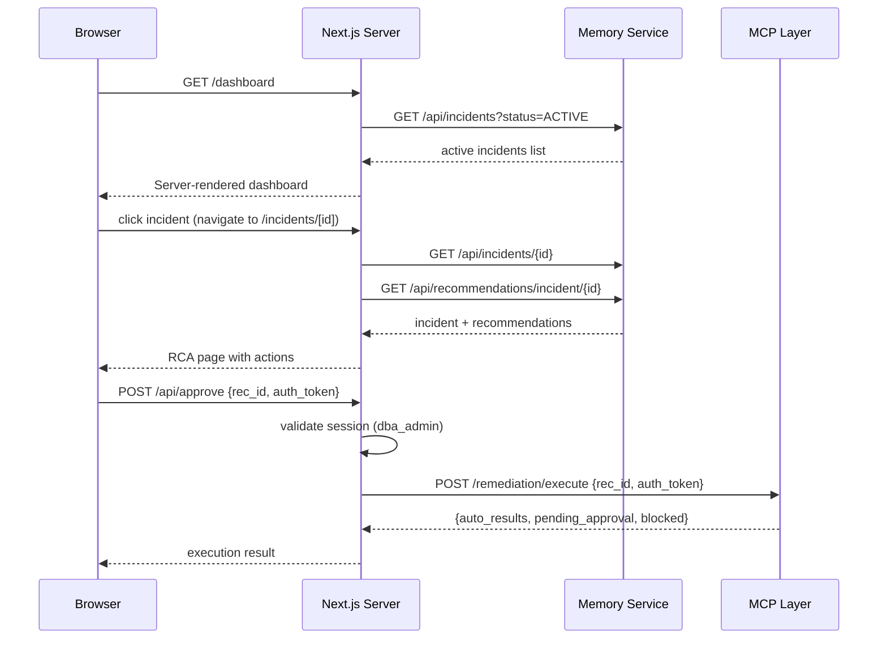

<!--
  Document Structure: This file contains three stacked specification layers.
    § TSD — Technical Specification Document (requirements, API contracts, DDL, configs)
    § SDD — Software Design Document (architecture diagrams, component specs, data models)
    § PRD — Product Requirements Document (business context, objectives, market, release)
  The filename prefix "PRD-" is retained for discoverability.
  Last reviewed: 2026-07-13 (see plan/PLAN-AUDIT-2026-07-13.md)
-->

# Technical Specification Document: Copilot UI

## 1. Technical Requirements

### 1.1 Mandatory Requirements
| ID | Requirement | Verification |
|----|-------------|-------------|
| UI-TR-001 | Dashboard must poll incidents every 10 seconds | Integration test |
| UI-TR-002 | API routes must proxy to backend services without exposing internal URLs | Security review |
| UI-TR-003 | Admin users must see approval buttons; readonly users must see disabled buttons | Component test |
| UI-TR-004 | Confidence bar must be green (≥0.80), yellow (≥0.60), red (<0.60) | Component test |
| UI-TR-005 | Search input must debounce API calls (300ms) | Component test |
| UI-TR-006 | Unknown or expired session must redirect to login | Integration test |
| UI-TR-007 | All API routes must return 401 for unauthenticated requests | Integration test |
| UI-TR-008 | Dashboard must handle empty incident list gracefully | Component test |
| UI-TR-009 | Incident detail must show loading skeleton during data fetch | Component test |
| UI-TR-010 | Approval flow must show success/error state after submission | Component test |

### 1.2 Performance Targets
| Metric | Target | Measurement |
|--------|--------|-------------|
| Initial page load (dashboard) | < 3s | Lighthouse |
| Dashboard poll response | < 1s P95 (backend + network) | Request timer |
| Incident detail page load | < 2s | Navigation timer |
| Semantic search response | < 3s P95 | Request timer |
| Time-to-interactive | < 4s | Lighthouse |
| Bundle size (JS, gzipped) | < 200KB | Bundle analyzer |

## 2. API Specification

### 2.1 Next.js API Routes

All routes proxy to internal backend services. The browser never sees backend URLs.

```yaml
# API Route Map
/api/incidents:
  GET:   proxy → http://memory-service:8005/incidents
  POST:  proxy → http://memory-service:8005/incidents

/api/incidents/[id]:
  GET:   proxy → http://memory-service:8005/incidents/{id}
  PATCH: proxy → http://memory-service:8005/incidents/{id}

/api/recommendations/incident/[id]:
  GET:   proxy → http://memory-service:8005/recommendations/{id}

/api/search:
  POST:  proxy → http://memory-service:8005/embeddings/search

/api/forecast/storage/[target]:
  GET:   proxy → http://predictive-analytics:8006/forecast/storage/{target}

/api/approve:
  POST:  proxy → http://mcp-layer:8004/remediation/execute
```

### 2.2 API Route Implementation Pattern
```typescript
// src/app/api/incidents/route.ts
import { NextRequest, NextResponse } from 'next/server';

const MEMORY_SERVICE = process.env.MEMORY_SERVICE_URL!;
const INTERNAL_KEY = process.env.INTERNAL_API_KEY!;

export async function GET(request: NextRequest) {
  const params = new URL(request.url).searchParams;
  const response = await fetch(
    `${MEMORY_SERVICE}/incidents?${params}`,
    { headers: { 'Authorization': `Bearer ${INTERNAL_KEY}` } }
  );
  if (!response.ok) {
    return NextResponse.json(
      { error: 'UPSTREAM_ERROR', message: 'Memory service unavailable' },
      { status: 502 }
    );
  }
  return NextResponse.json(await response.json());
}

export async function POST(request: NextRequest) {
  const body = await request.json();
  const response = await fetch(
    `${MEMORY_SERVICE}/incidents`,
    {
      method: 'POST',
      headers: {
        'Content-Type': 'application/json',
        'Authorization': `Bearer ${INTERNAL_KEY}`
      },
      body: JSON.stringify(body)
    }
  );
  return NextResponse.json(await response.json(), { status: response.status });
}
```

## 3. Component Specification

### 3.1 Props Interfaces

```typescript
// Types shared across components
interface Incident {
  incident_id: string;
  fingerprint: string;
  severity: 'CRITICAL' | 'HIGH' | 'MEDIUM' | 'LOW';
  domain: string;
  status: 'ACTIVE' | 'RESOLVED' | 'IGNORED';
  db_target: string;
  detection_count: number;
  detected_at: string;
  resolved_at?: string;
}

interface Recommendation {
  rec_id: string;
  incident_id: string;
  rca_text: string;
  action_steps: ActionStep[];
  confidence_score: number;
  risk_level: 'LOW' | 'MEDIUM' | 'HIGH';
  requires_human_validation: boolean;
  generated_at: string;
}

interface ActionStep {
  step: string;
  command: string;
  type: 'AUTO' | 'APPROVAL_REQUIRED' | 'BLOCKED';
}

// Component Props
interface IncidentCardProps {
  incident: Incident;
  onClick: (id: string) => void;
}

interface StatsBarProps {
  total: number;
  critical: number;
  high: number;
  medium: number;
  low: number;
}

interface RCAPanelProps {
  rcaText: string;
  loading?: boolean;
}

interface ConfidenceBarProps {
  score: number;  // 0.0 - 1.0
}

interface ApprovalButtonProps {
  recId: string;
  isAdmin: boolean;
  onApprovalComplete: (result: ApprovalResult) => void;
}

interface SearchResultCardProps {
  result: {
    source_type: string;
    source_id: string;
    similarity: number;
    content: string;
    created_at: string;
    db_target?: string;
  };
}
```

## 4. Configuration Specification

```typescript
// src/copilot-ui/.env.local
NEXT_PUBLIC_APP_NAME=AI DBA Copilot
MEMORY_SERVICE_URL=http://memory-service:8005
PREDICTIVE_ANALYTICS_URL=http://predictive-analytics:8006
MCP_LAYER_URL=http://mcp-layer:8004
INTERNAL_API_KEY=  # Shared secret for inter-service auth
OIDC_CLIENT_ID=
OIDC_CLIENT_SECRET=
OIDC_ISSUER=
NEXTAUTH_SECRET=
NEXTAUTH_URL=http://localhost:3000
POLL_INTERVAL_MS=10000
```

### 4.1 Theme Tokens (TailwindCSS)
```typescript
// tailwind.config.ts
module.exports = {
  theme: {
    extend: {
      colors: {
        severity: {
          critical: '#DC2626',  // red-600
          high: '#EA580C',      // orange-600
          medium: '#CA8A04',    // yellow-600
          low: '#6B7280',       // gray-500
        },
        confidence: {
          high: '#16A34A',      // green-600 (>= 0.80)
          medium: '#CA8A04',    // yellow-600 (>= 0.60)
          low: '#DC2626',       // red-600 (< 0.60)
        },
        action: {
          auto: '#16A34A',
          approval: '#CA8A04',
          blocked: '#DC2626',
        },
      },
    },
  },
};
```

## 5. Error Handling Specification

| Error Scenario | User-Facing Message | HTTP Status | Recovery |
|----------------|---------------------|-------------|----------|
| Backend service unavailable | "This service is temporarily unavailable. Retrying..." | 502 | Retry on next poll |
| Network offline | "No internet connection. Data may be stale." | — | Show cached data |
| Session expired | Redirect to login | 401 | Full page redirect |
| Approval token invalid | "Invalid or expired token. Please re-authenticate." | 403 | Show re-auth dialog |
| Search empty | "No results found. Try a different search term." | 200 | Empty state display |
| API rate limited | "Too many requests. Please wait before retrying." | 429 | Show countdown |

## 6. Performance Specification

| Scenario | Target | Method |
|----------|--------|--------|
| Dashboard initial render | < 3s TTI | Lighthouse |
| Dashboard update (poll) | < 1s from response | Timer |
| Incident detail navigation | < 2s | e2e test |
| Search response display | < 500ms after API response | Timer |
| Total JS bundle (gzipped) | < 200KB | Bundle analyzer |
| First Contentful Paint | < 1.5s | Lighthouse |

## 7. Testing Specification

### 7.1 Component Test Requirements
```typescript
// Example: ApprovalButton test
describe('ApprovalButton', () => {
  it('shows disabled state for readonly user', () => {
    render(<ApprovalButton recId="abc" isAdmin={false} />);
    expect(screen.getByRole('button')).toBeDisabled();
    expect(screen.getByText('Contact an admin')).toBeInTheDocument();
  });

  it('shows enabled state for admin user', () => {
    render(<ApprovalButton recId="abc" isAdmin={true} />);
    expect(screen.getByRole('button')).toBeEnabled();
  });

  it('shows loading state during API call', async () => {
    render(<ApprovalButton recId="abc" isAdmin={true} />);
    fireEvent.click(screen.getByRole('button'));
    expect(screen.getByText('Approving...')).toBeInTheDocument();
  });
});
```

### 7.2 Page Route Structure
```
src/copilot-ui/src/app/
├── layout.tsx              # Root layout with Sidebar
├── page.tsx                # Redirect to /dashboard
├── dashboard/
│   └── page.tsx            # Dashboard page
├── incidents/
│   └── [id]/
│       └── page.tsx        # Incident detail page
├── search/
│   └── page.tsx            # Search page
├── api/
│   ├── incidents/
│   │   ├── route.ts        # GET, POST
│   │   └── [id]/route.ts   # GET, PATCH
│   ├── recommendations/
│   │   └── incident/[id]/route.ts  # GET
│   ├── search/route.ts     # POST
│   ├── forecast/
│   │   └── storage/[target]/route.ts  # GET
│   └── approve/route.ts    # POST
```

---

# Software Design Document: Copilot UI

## 1. Overview

This SDD describes the detailed technical design of the Copilot UI — a React / Next.js web application providing three core views: Anomaly Dashboard, Incident RCA & Remediation Review, and Semantic Archive Search. It enforces RBAC (dba_readonly / dba_admin) and gates all write actions behind MFA token approval.

## 2. Architecture

### 2.1 Component Tree

```mermaid
graph TD
    Layout --> Sidebar
    Layout --> Main[Main Content Area]
    
    Sidebar --> Nav[Dashboard | Incidents | Search | Settings]
    
    Main --> Dashboard/Incidents/Search
    
    subgraph "Dashboard (/dashboard)"
        Dashboard --> StatsBar[StatsBar]
        Dashboard --> SeverityFilter[SeverityFilter]
        Dashboard --> IncidentStream[IncidentStream]
        IncidentStream --> IncidentCard[IncidentCard]
    end
    
    subgraph "Incident Detail (/incidents/[id])"
        Incident --> RCAPanel[RCAPanel]
        Incident --> ActionSteps[ActionStepsList]
        Incident --> ConfidenceBar[ConfidenceBar]
        Incident --> RiskBadge[RiskBadge]
        Incident --> ApprovalButton[ApprovalButton]
    end
    
    subgraph "Search (/search)"
        Search --> SearchInput[SearchInput]
        Search --> ResultsList[ResultsList]
        ResultsList --> ResultCard[ResultCard]
    end
    
    subgraph "API Routes"
        API[/api/incidents --> memory-service]
        API2[/api/recommendations --> memory-service]
        API3[/api/search --> memory-service /embeddings/search]
        API4[/api/forecast --> predictive-analytics]
        API5[/api/approve --> mcp-layer remediation]
    end
```

### 2.2 Data Flow



## 3. Component Specifications

### 3.1 Layout and Navigation

**File:** `src/copilot-ui/src/app/layout.tsx`

| Component | Description |
|-----------|-------------|
| Layout | Root layout with Sidebar and main content area |
| Sidebar | Navigation: Dashboard, Incidents, Search, Settings |
| NavItem | Active state highlighting, icon + label |

**Sidebar Items:**
| Route | Icon | Label | Auth |
|-------|------|-------|------|
| /dashboard | Activity | Dashboard | All |
| /incidents | AlertTriangle | Incidents | All |
| /search | Search | Search | All |
| /settings | Settings | Settings | Admin |

### 3.2 Dashboard Page

**File:** `src/copilot-ui/src/app/dashboard/page.tsx`

**Components:**

**StatsBar**
| Stat | Source | Display |
|------|--------|---------|
| Total Active | incidents count with status=ACTIVE | Number with label |
| Critical | incidents with severity=CRITICAL | Red number |
| High | incidents with severity=HIGH | Orange number |
| Medium/Low | incidents with severity=MEDIUM/LOW | Yellow/gray |

**SeverityFilter**
- Filter buttons: All, Critical, High, Medium, Low.
- Active filter state stored in URL search params.

**IncidentStream**
- Auto-polling every 10 seconds via `useInterval` hook.
- GET /api/incidents?status=ACTIVE&severity={filter}.
- Sorted by severity (CRITICAL → LOW), then by detected_at (newest first).

**IncidentCard**
| Field | Display |
|-------|---------|
| Severity badge | Colored badge (CRITICAL=red, etc.) |
| Domain label | Gray pill: PERFORMANCE, CAPACITY, etc. |
| DB Target | Monospace font |
| Detection count | Badge if > 1 |
| Time since detection | Relative time ("2h ago") |
| Click | navigate(`/incidents/${id}`) |

### 3.3 Incident Detail Page

**File:** `src/copilot-ui/src/app/incidents/[id]/page.tsx`

**Components:**

**RCAPanel**
- Renders rca_text as markdown in a card.
- Loading skeleton while fetching.

**ActionStepsList**
- Ordered list of action steps.
- Each step shows:
  - Step number and description.
  - Syntax-highlighted command block.
  - Type badge: AUTO (green), APPROVAL_REQUIRED (yellow), BLOCKED (red).
  - Execution status indicator (pending/running/succeeded/failed).

**ConfidenceBar**
- Visual bar: width = confidence * 100%.
- Color: green (≥0.80), yellow (≥0.60), red (<0.60).
- Numeric percentage displayed inside bar.

**RiskBadge**
- LOW (green), MEDIUM (yellow), HIGH (red).

**ApprovalButton**
- Visible only for dba_admin role.
- Disabled with tooltip for dba_readonly: "Contact an admin to approve this action."
- On click: prompt for MFA token input dialog.
- On token submit: POST /api/approve with rec_id and token.
- Displays loading state during API call.
- Shows success/error result inline.

### 3.4 Search Page

**File:** `src/copilot-ui/src/app/search/page.tsx`

**Components:**

**SearchInput**
- Text input with search icon.
- Debounced input (300ms).
- GET /api/search?q={query} on input change.
- Loading spinner during request.

**ResultsList**
- Renders ResultCard for each result.
- Empty state: "No results found. Try a different search term."
- Error state: "Search is currently unavailable."

**ResultCard**
| Field | Display |
|-------|---------|
| Similarity score | Percentage badge |
| Source type | INCIDENT / RECOMMENDATION badge |
| DB target | Monospace label |
| Date | Formatted timestamp |
| Content preview | First 150 chars of rca_text |
| Click | navigate to /incidents/${source_id} |

### 3.5 API Routes

**File:** `src/copilot-ui/src/app/api/`

| Route | Proxy Target | Method |
|-------|-------------|--------|
| /api/incidents | http://memory-service:8005/incidents | GET, POST |
| /api/incidents/[id] | http://memory-service:8005/incidents/{id} | GET, PATCH |
| /api/recommendations/incident/[id] | http://memory-service:8005/recommendations/{id} | GET |
| /api/search | http://memory-service:8005/embeddings/search | POST |
| /api/forecast/storage/[target] | http://predictive-analytics:8006/forecast/storage/{target} | GET |
| /api/approve | http://mcp-layer:8004/remediation/execute | POST |

**API Route Design Pattern:**
```typescript
// src/app/api/incidents/route.ts
export async function GET(request: Request) {
    const { searchParams } = new URL(request.url);
    const response = await fetch(
        `${process.env.MEMORY_SERVICE_URL}/incidents?${searchParams}`,
        { headers: { 'Authorization': `Bearer ${process.env.INTERNAL_API_KEY}` } }
    );
    return NextResponse.json(await response.json());
}
```

### 3.6 Authentication and RBAC

**File:** `src/copilot-ui/src/lib/auth.ts`

**Provider:** NextAuth.js with OIDC/SAML.

**Configuration:**
```typescript
export const authOptions: NextAuthOptions = {
    providers: [
        OIDCProvider({
            clientId: process.env.OIDC_CLIENT_ID,
            clientSecret: process.env.OIDC_CLIENT_SECRET,
            issuer: process.env.OIDC_ISSUER,
        }),
    ],
    callbacks: {
        async session({ session, token }) {
            session.user.role = token.role; // dba_readonly or dba_admin
            return session;
        },
        async jwt({ token, account }) {
            // Extract role from OIDC groups claim
            if (account?.id_token) {
                const groups = decodeJwt(account.id_token).groups;
                token.role = groups.includes('DBA-Admin') ? 'dba_admin' : 'dba_readonly';
            }
            return token;
        },
    },
};
```

**Protection Pattern:**
```typescript
// Middleware or component-level
function ApprovalButton({ rec_id }: { rec_id: string }) {
    const { data: session } = useSession();
    const isAdmin = session?.user?.role === 'dba_admin';
    
    if (!isAdmin) {
        return <Tooltip content="Contact an admin to approve this action.">
            <button disabled>Approve & Execute</button>
        </Tooltip>;
    }
    
    return <button onClick={handleApproval}>Approve & Execute</button>;
}
```

## 4. State Management

**No global state library for MVP.** Components use:

- Server Components for initial data fetch.
- Client Components with `useState`/`useEffect` for interactivity.
- URL search params for filter state.
- `useInterval` hook for dashboard polling.

**State shapes:**
```typescript
interface DashboardState {
    incidents: Incident[];
    filter: Severity | 'ALL';
    loading: boolean;
    error: string | null;
    lastUpdated: Date;
}

interface IncidentDetailState {
    incident: Incident | null;
    recommendations: Recommendation[];
    loading: boolean;
    error: string | null;
}

interface SearchState {
    query: string;
    results: SearchResult[];
    loading: boolean;
    error: string | null;
}
```

## 5. Error Handling

| Scenario | Behavior |
|----------|----------|
| Backend service unavailable | Show "Service temporarily unavailable" banner, retry on next poll |
| API route returns 4xx | Show error toast with message |
| Search returns empty | Show "No results found" empty state |
| Approval token invalid | Show "Invalid or expired token. Please re-authenticate." |
| Session expired | Redirect to login via NextAuth |
| Network offline | Show offline indicator, stop polling |

## 6. Configuration

| Variable | Default | Description |
|----------|---------|-------------|
| MEMORY_SERVICE_URL | http://memory-service:8005 | Backend memory service |
| PREDICTIVE_ANALYTICS_URL | http://predictive-analytics:8006 | Forecast service |
| MCP_LAYER_URL | http://mcp-layer:8004 | Remediation endpoint |
| OIDC_CLIENT_ID | — | OIDC client ID |
| OIDC_CLIENT_SECRET | — | OIDC client secret |
| OIDC_ISSUER | — | OIDC issuer URL |
| NEXTAUTH_SECRET | — | NextAuth encryption secret |
| POLL_INTERVAL_MS | 10000 | Dashboard auto-refresh interval |

## 7. Testing

| Test ID | Description | Type |
|---------|-------------|------|
| T-DASH-001 | Dashboard renders active incidents | Component |
| T-DASH-002 | Severity filter narrows results | Component |
| T-DASH-003 | Polling updates incident list | Component |
| T-INCIDENT-001 | RCA panel renders markdown correctly | Component |
| T-INCIDENT-002 | Confidence bar shows correct color per threshold | Component |
| T-INCIDENT-003 | Approval button disabled for readonly role | Component |
| T-SEARCH-001 | Search input debounces API calls | Component |
| T-SEARCH-002 | Results display similarity scores | Component |
| T-AUTH-001 | Unauthenticated user redirected to login | Integration |
| T-AUTH-002 | Admin user sees approval button enabled | Integration |
| T-AUTH-003 | Readonly user sees disabled approval button with tooltip | Integration |

---

# Product Requirements Document: Copilot UI

## 1. Summary
The Copilot UI is a React / Next.js web application that provides database administrators with three core views: an Anomaly Dashboard for active incidents, an RCA and Remediation Review for deep incident analysis and approval actions, and a Semantic Archive Search for natural language querying of historical incidents and recommendations. The UI enforces role-based access (dba_readonly and dba_admin) and gates all write/configuration actions behind MFA approval.

## 2. Contacts
| Name | Role | Comment |
|------|------|---------|
| AI DBA Platform Team | Product and Engineering Owner | Owns UX design, feature completeness, and API integration. |
| DBA Leads | Domain Stakeholders | Validate workflow usability, dashboard usefulness, and approval flow clarity. |
| Security Team | Governance Stakeholder | Validates RBAC enforcement, MFA flow, and secure API proxying. |

## 3. Background
### Context
DBAs currently use multiple monitoring dashboards, ticket systems, and ad hoc queries to investigate database issues. There is no unified interface that combines real-time incident visibility, AI-generated RCA, historical search, and safe remediation in one place.

### Why now
The backend services (detection engine, recommendation engine, Jira integration, memory layer) are producing structured data that needs a human-facing interface. Without the UI, the platform would be API-only and inaccessible to DBA teams.

### What recently became possible
1. Backend services expose consistent REST APIs for incidents, recommendations, search, and forecasts.
2. Next.js API routes provide a secure proxy layer that keeps backend URLs and credentials hidden from the browser.
3. NextAuth.js with OIDC/SAML providers enables straightforward RBAC integration.

## 4. Objective
### Objective statement
Build a Copilot UI that lets DBAs triage active incidents, review AI-generated RCA and action steps, approve or reject remediation actions, and search historical incident knowledge — all within a single, role-aware interface.

### Why it matters
1. DBAs get a single pane of glass for their entire incident response workflow.
2. Approval-gated remediation is intuitive and clearly communicates risk.
3. Semantic search makes institutional knowledge accessible in seconds instead of lost in chat history.

### Strategic alignment
The UI is the primary human interaction point for the platform. Its design directly enables the goals of faster MTTR and safe AI-assisted operations.

### Key Results (SMART)
1. DBA can triage the top 10 active incidents from the dashboard in under 30 seconds.
2. Approval action for a remediation step completes in under 3 clicks.
3. Semantic search returns relevant results in under 3 seconds for 95 percent of queries.
4. Role enforcement correctly blocks write actions for dba_readonly users.
5. Dashboard auto-refreshes with less than 10-second staleness during active incident periods.

## 5. Market Segment(s)
### Primary segment
Database administrators who need a single, fast interface for incident triage, investigation, and action.

### Secondary segment
SRE and platform engineering managers who need a read-only view of active incidents, trends, and response metrics.

### Jobs to be done
1. When I open the dashboard, I want to see active incidents sorted by severity so I know what needs attention first.
2. When I click an incident, I want RCA, action steps, confidence, and risk so I can decide what to do.
3. When an action requires my approval, I want a clear, secure approval flow so I can authorize with confidence.
4. When I search for a past issue, I want results ranked by relevance so I find the right incident fast.

### Constraints
1. Read-only views accessible without authentication for monitoring displays (future).
2. Write/configuration actions require authenticated session with dba_admin role and MFA token.
3. UI must not expose backend service URLs or credentials to the browser.

## 6. Value Proposition(s)
### Customer gains
1. Unified incident workflow — no switching between monitoring, ticketing, and documentation tools.
2. Clear confidence signals for every recommendation — know when to trust and when to verify.
3. Fast semantic search that surfaces past incidents and their resolutions.

### Pains avoided
1. Context switching between multiple tools during incident response.
2. Uncertainty about whether an AI recommendation is trustworthy.
3. Lost institutional knowledge when team members leave.

### Differentiation
1. Approval flow is built into the incident review page — no separate authorization tool.
2. Confidence bar (green/yellow/red) and risk badge provide immediate visual trust signals.
3. Semantic search works with natural language queries, not SQL or keywords.

## 7. Solution
### 7.1 UX and Prototypes

Three main views:

1. Anomaly Dashboard (/dashboard):
   - Stats bar: total active, critical, high, medium, low incident counts.
   - IncidentStream: real-time scrolling list of active incidents.
   - IncidentCard: severity badge, domain label, db_target, detection count, time since first detection.
   - SeverityFilter: filter by severity level.
   - Auto-refresh every 10 seconds.

2. Incident RCA Review (/incidents/[id]):
   - RCA panel: full root cause analysis text.
   - Action steps list: each step with type badge (AUTO, APPROVAL_REQUIRED, BLOCKED) and command snippet.
   - Confidence bar: green (≥0.80), yellow (≥0.60), red (<0.60).
   - Risk badge: LOW (green), MEDIUM (yellow), HIGH (red).
   - Approval button: for ADMIN role only; prompts MFA token.

3. Semantic Archive Search (/search):
   - Search input accepting natural language queries.
   - Results list with incident summary, similarity score, date, db_target.
   - Click-through to incident RCA view.

### 7.2 Key Features
1. Layout and navigation:
   - App layout with sidebar navigation.
   - Sidebar items: Dashboard, Incidents, Search, Settings (placeholder).

2. Dashboard:
   - GET /api/incidents (proxied to memory service) with polling.
   - IncidentCard components with severity-appropriate colors.
   - Click navigates to /incidents/[id].

3. Incident detail:
   - GET /api/incidents/{id} (proxied to memory service).
   - GET /api/recommendations/incident/{id} (proxied to memory service).
   - RCA text rendered in readable markdown.
   - Action steps displayed as ordered list with type badges.
   - Confidence bar with color coding.
   - Approval button triggers POST /api/approve with MFA token.

4. Semantic search:
   - GET /api/search?q={query} (proxied to memory service /embeddings/search).
   - Results ranked by cosine similarity score.
   - Each result links to incident detail.

5. API routes (Next.js):
   - /api/incidents → memory service.
   - /api/recommendations → memory service.
   - /api/search → memory service /embeddings/search.
   - /api/forecast → predictive analytics.
   - /api/approve → mcp-layer remediation (admin only).

6. Authentication and RBAC:
   - NextAuth.js with OIDC/SAML provider.
   - Roles: dba_readonly (read-only) and dba_admin (read + approve).
   - Session token in secure HTTP-only cookie.
   - dba_readonly users see approval buttons as disabled with tooltip.

### 7.3 Technology
- Next.js 14+ with App Router, TypeScript.
- React 18+ with Server and Client Components.
- TailwindCSS 3+ for styling.
- NextAuth.js for authentication.
- Hosted on port 3000, proxied through API routes.

### 7.4 Assumptions
1. OIDC/SAML provider is available and configured with dba_readonly and dba_admin groups.
2. All backend services are reachable from the Next.js server (same Docker network or VPC).
3. API routes are sufficient for MVP; dedicated BFF (backend-for-frontend) is not required.
4. Auto-refresh every 10 seconds is acceptable for dashboard load.

## 8. Release
### Timeline approach
Delivered as part of MVP Phase 9 (Sprints 17–18), estimated 3–4 weeks.

### Release 1 scope
- App layout with sidebar navigation.
- Anomaly Dashboard with IncidentCard, SeverityFilter, StatsBar, 10-second polling.
- Incident RCA Review page with RCA panel, action steps, confidence bar, risk badge.
- Approval button for dba_admin role with MFA token input.
- Semantic Archive Search with natural language query and ranked results.
- Next.js API routes proxying to all backend services.
- NextAuth.js with OIDC/SAML, dba_readonly and dba_admin roles.
- Component tests for IncidentCard, RCAPanel, ApprovalButton.

### Post-MVP scope
- Settings page for notification preferences and threshold configuration.
- Incident timeline view (metrics timeline around detection time).
- Bulk approval for multiple low-risk actions.
- Read-only public dashboard for monitoring displays.
- Dark mode and theme customization.
- Mobile-responsive layout.

### Launch readiness criteria
1. Dashboard loads and displays incidents from memory service within 3 seconds.
2. Incident detail page shows RCA, actions, confidence, and risk.
3. Approval flow: click → MFA prompt → token validated → action executed → success confirmation.
4. Semantic search returns results for natural language queries.
5. Role enforcement: dba_readonly user cannot see approval buttons as active.
6. API routes correctly proxy to backend services without exposing internal URLs.
