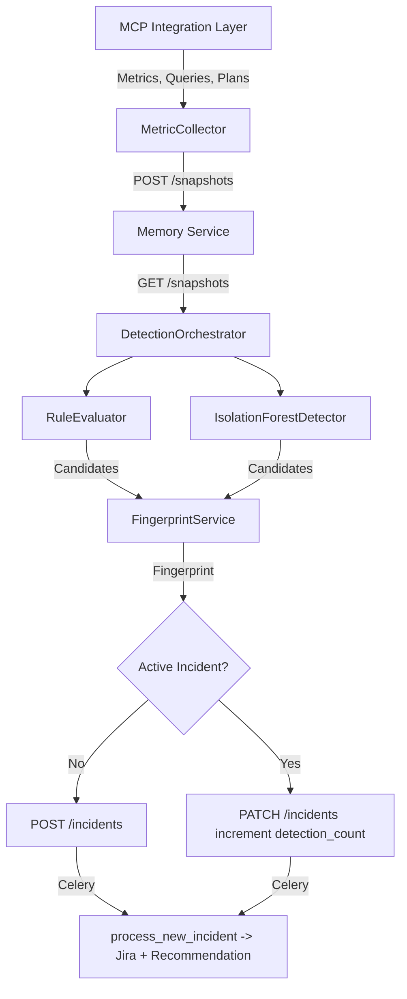
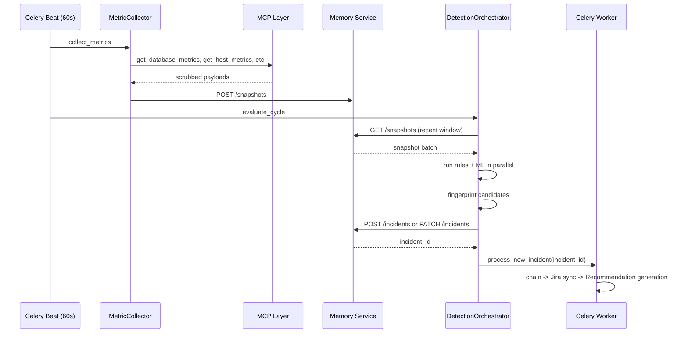

<!--
  Document Structure: This file contains three stacked specification layers.
    § TSD — Technical Specification Document (requirements, API contracts, DDL, configs)
    § SDD — Software Design Document (architecture diagrams, component specs, data models)
    § PRD — Product Requirements Document (business context, objectives, market, release)
  The filename prefix "PRD-" is retained for discoverability.
  Last reviewed: 2026-07-13 (see plan/PLAN-AUDIT-2026-07-13.md)
-->

# Technical Specification Document: Detection Engine

## 1. Technical Requirements

### 1.1 Mandatory Requirements
| ID | Requirement | Verification |
|----|-------------|-------------|
| DE-TR-001 | Metric collection interval must be configurable per target (default 60s) | Integration test |
| DE-TR-002 | Rule evaluation must complete within 3 seconds for 1,000 snapshots | Benchmark test |
| DE-TR-003 | ML anomaly detection must complete within 5 seconds for 1,000 snapshots | Benchmark test |
| DE-TR-004 | Fingerprint algorithm must produce deterministic output for identical inputs | Unit test |
| DE-TR-005 | Fingerprint 4-hour window must coalesce (hour 0,1,2,3 → bucket 00) | Unit test |
| DE-TR-006 | At least one rule must be defined for each of the 5 domains | Static analysis |
| DE-TR-007 | ML model training must not block the detection evaluation cycle | Architecture review |
| DE-TR-008 | Evaluation cycle must never throw unhandled exceptions | Integration test |
| DE-TR-009 | Service must expose Prometheus metrics for evaluation latency, incident count | Integration test |
| DE-TR-010 | Celery Beat schedules must survive worker restart | Integration test |

### 1.2 Performance Targets
| Metric | Target | Measurement |
|--------|--------|-------------|
| Snapshot-to-incident latency | < 5s at 1,000 concurrent snapshots | Benchmark |
| Rule evaluation throughput | 500 rules / second | Benchmark |
| ML evaluation throughput | 1,000 rows / second | Benchmark |
| Memory service write throughput | 100 POST /snapshots / second | Load test |
| Celery task queue backlog | < 100 tasks under normal load | Monitoring |

## 2. API Specification

### 2.1 OpenAPI Contract

**Service:** `detection-engine` on port 8001

```yaml
openapi: 3.0.3
info:
  title: AI DBA Copilot - Detection Engine
  version: 1.0.0
  description: Rule-based and ML-based database issue detection

paths:
  /health:
    get:
      operationId: healthCheck
      responses:
        '200':
          description: Service healthy
          content:
            application/json:
              schema:
                type: object
                properties:
                  status:
                    type: string
                    enum: [ok]
                  version:
                    type: string
                  uptime_seconds:
                    type: integer

  /evaluate:
    post:
      operationId: triggerEvaluation
      responses:
        '200':
          description: Evaluation complete
          content:
            application/json:
              schema:
                type: object
                properties:
                  incidents_created:
                    type: integer
                  incidents_updated:
                    type: integer
                  duration_ms:
                    type: integer
                  rules_evaluated:
                    type: integer
                  ml_evaluated:
                    type: boolean

  /rules:
    get:
      operationId: listRules
      responses:
        '200':
          description: List of detection rules
          content:
            application/json:
              schema:
                type: array
                items:
                  $ref: '#/components/schemas/DetectionRule'
    post:
      operationId: createRule
      requestBody:
        required: true
        content:
          application/json:
            schema:
              $ref: '#/components/schemas/DetectionRule'
      responses:
        '201':
          description: Rule created
        '400':
          description: Invalid rule configuration

components:
  schemas:
    DetectionRule:
      type: object
      required: [name, domain, metric_type, error_code, threshold, operator, severity]
      properties:
        name:
          type: string
          pattern: '^[a-z0-9_]{3,64}$'
        domain:
          type: string
          enum: [PERFORMANCE, CAPACITY, AVAILABILITY, MAINTENANCE, COST]
        metric_type:
          type: string
          maxLength: 50
        error_code:
          type: string
          maxLength: 100
        threshold:
          type: number
        operator:
          type: string
          enum: [gt, gte, lt, lte, eq]
        duration_minutes:
          type: integer
          minimum: 0
          default: 0
        severity:
          type: string
          enum: [CRITICAL, HIGH, MEDIUM, LOW]
```

### 2.2 Error Codes
| Code | HTTP Status | Description |
|------|-------------|-------------|
| DE_001 | 400 | Invalid rule configuration (missing field, invalid enum) |
| DE_002 | 404 | Rule not found |
| DE_003 | 503 | Memory service unreachable |
| DE_004 | 503 | MCP layer unreachable |
| DE_005 | 500 | ML model evaluation failed |

## 3. Database Schema

### 3.1 No Direct Database Access
The Detection Engine does **not** access the PostgreSQL memory layer directly. All persistence happens through the Memory Service REST API (`POST /snapshots`, `POST /incidents`, `PATCH /incidents`).

### 3.2 Local State (Redis / Celery)
| Key Pattern | Type | TTL | Purpose |
|-------------|------|-----|---------|
| `eval:last_run:{db_target}` | String | None | Track last evaluation timestamp |
| `ml:model:{db_target}` | Serialized | 7 days | Cached isolation forest model |
| `rules:version` | String | None | Ruleset version hash for cache invalidation |

## 4. Configuration Specification

```yaml
# config/detection-engine.yaml
service:
  name: detection-engine
  port: 8001
  log_level: INFO

memory_service:
  url: http://memory-service:8005
  timeout_seconds: 10
  max_retries: 3

mcp_layer:
  url: http://mcp-layer:8004
  timeout_seconds: 30

collection:
  enabled: true
  interval_seconds: 60
  db_targets:
    - db_primary_sql2019
    - db_secondary_sql2019

evaluation:
  enabled: true
  interval_seconds: 60
  snapshot_window_minutes: 5
  ml_enabled: true
  ml_contamination: 0.1
  ml_train_window_days: 7
  ml_train_schedule: "0 2 * * *"  # Daily 02:00 UTC

celery:
  broker_url: redis://redis:6379/0
  result_backend: redis://redis:6379/1
  task_serializer: json
  result_serializer: json
  accept_content: [json]
  timezone: UTC
  task_track_started: true
  task_acks_late: true
  worker_prefetch_multiplier: 1
```

## 5. Interface Contracts

### 5.1 Outbound: MCP Layer
```python
# Adapter call pattern
async def get_database_metrics(db_name: str) -> dict:
    """Returns {cpu_pct, iops, tps, active_connections, ...}"""
    
async def get_host_metrics(db_name: str) -> dict:
    """Returns {cpu_pct, memory_pct, disk_io_pct}"""
    
async def get_connection_metrics(db_name: str) -> dict:
    """Returns {total_sessions, active_sessions, waiting_sessions, blocked_sessions}"""
```

### 5.2 Outbound: Memory Service
```python
async def post_snapshot(db_target: str, metric_type: str, payload: dict) -> dict:
    """Returns {snapshot_id, created_at}"""
    
async def get_active_incident(fingerprint: str) -> dict | None:
    """Returns incident or None if no active match"""
    
async def create_incident(incident: dict) -> dict:
    """Returns created incident with incident_id"""
    
async def update_incident(incident_id: str, updates: dict) -> dict:
    """Returns updated incident"""
```

### 5.3 Internal: Celery Tasks
```python
@celery.task(bind=True, max_retries=3, default_retry_delay=60)
def process_new_incident(self, incident_id: str) -> dict:
    """Triggers Jira sync and recommendation generation"""
    
@celery.task
def collect_metrics() -> dict:
    """Runs MetricCollector for all targets"""
    
@celery.task
def evaluate_cycle() -> dict:
    """Runs DetectionOrchestrator.evaluate_cycle()"""
    
@celery.task
def train_ml_models() -> dict:
    """Retrains isolation forest models"""
```

## 6. Error Handling Specification

| Error Scenario | Log Level | Metric | Recovery |
|----------------|-----------|--------|----------|
| MCP layer timeout | WARNING | `detection.mcp_unreachable` | Skip cycle, retry next interval |
| Memory service 503 | ERROR | `detection.memory_unreachable` | Retry 3x with backoff, then skip |
| Invalid rule config | ERROR | `detection.invalid_rule` | Skip rule, continue evaluation |
| ML model not trained | INFO | `detection.ml_skipped` | Run rules only |
| Evaluation exception | CRITICAL | `detection.eval_failed` | Log full stack, skip cycle |
| Celery task failure | ERROR | `detection.task_failed` | Retry with exponential backoff |

## 7. Performance Specification

| Scenario | Target | Measurement Method |
|----------|--------|--------------------|
| Cold start (first evaluation) | < 30s | Startup timer |
| Steady-state evaluation cycle | < 5s | Per-cycle timer |
| ML model training (7 days data) | < 60s | Training timer |
| Concurrent evaluations (same moment) | 10 | Load test |
| Memory service snapshot write | < 200ms P99 | Request timer |
| Celery task queue drain | < 60s | Queue length monitor |

## 8. Implementation Notes

### 8.1 Fingerprint Implementation
```python
import hashlib
from datetime import datetime

def generate_fingerprint(db_target: str, error_code: str, timestamp: datetime) -> str:
    """Deterministic SHA-256 fingerprint with 4-hour window coalescing."""
    hour_window = (timestamp.hour // 4) * 4
    raw = f"{db_target}:{error_code}:{timestamp.strftime('%Y-%m-%d')}-{hour_window:02d}"
    return hashlib.sha256(raw.encode()).hexdigest()
```

### 8.2 Rule Evaluation Order
Rules should be evaluated in order of computational cost (cheapest first) to fail fast:
1. Simple threshold checks (e.g., storage_pct > 95).
2. Duration-based sustained checks (e.g., CPU > 90 for 10 min).
3. ML anomaly detection (most expensive, run last).

### 8.3 ML Model Persistence
- Models are persisted as pickle files in a Redis cache (key: `ml:model:{db_target}`).
- Training runs as a separate Celery task to avoid blocking evaluation.
- If no trained model exists, evaluation falls back to rules-only mode.

---

# Software Design Document: Detection Engine

## 1. Overview

This SDD describes the detailed technical design of the AI DBA Copilot Detection Engine. The Detection Engine is the incident-firing component that ingests database telemetry via the MCP integration layer, runs rule-based and ML-based anomaly detection, fingerprints candidate issues, and creates or deduplicates incidents in the memory layer.

## 2. Architecture

### 2.1 High-Level Component Diagram



### 2.2 Celery Task Flow



## 3. Component Specifications

### 3.1 MetricCollector

**File:** `src/detection-engine/collector.py`

**Class: MetricCollector**

| Property | Type | Description |
|----------|------|-------------|
| mcp_client | MCPClient | HTTP client to MCP integration layer |
| memory_client | MemoryServiceClient | HTTP client to memory service |
| db_targets | list[str] | Configured database targets from env |
| interval_seconds | int | Collection interval (default 60) |

**Methods:**
- `collect_cycle() -> None`: Iterates db_targets, calls MCP adapters, scrubs secrets, POSTs to memory service.
- `collect_single(target: str) -> dict`: Collects metrics for one target. Returns snapshot summary.

**Adapter calls per cycle:**
1. `get_database_metrics(db_name)` — TPS, IOPS, CPU, active connections
2. `get_host_metrics(db_name)` — server-level CPU, memory, I/O
3. `get_connection_metrics(db_name)` — session counts, wait stats
4. `get_replication_metrics(db_name)` — AG lag, replica state
5. `get_storage_growth(db_name)` — file size trends

### 3.2 RuleEvaluator

**File:** `src/detection-engine/rules.py`

**DetectionRule dataclass:**
```python
@dataclass
class DetectionRule:
    name: str
    domain: str                     # PERFORMANCE | CAPACITY | AVAILABILITY | MAINTENANCE | COST
    metric_type: str                # Maps to metric_snapshots.metric_type
    error_code: str                 # Canonical error identifier
    threshold: float                # Numeric threshold value
    operator: str                   # gt | gte | lt | lte | eq
    duration_minutes: int           # Sustained violation window
    severity: str                   # CRITICAL | HIGH | MEDIUM | LOW
```

**Seed Rules Table:**

| Rule Name | Domain | Metric | Threshold | Operator | Duration | Severity |
|-----------|--------|--------|-----------|----------|----------|----------|
| high_cpu | PERFORMANCE | cpu_usage | 90 | gt | 10 | CRITICAL |
| high_iops | PERFORMANCE | iops | 95% max | gt | 5 | HIGH |
| slow_queries | PERFORMANCE | slow_query_count | 50 | gt | 5 | HIGH |
| blocking_sessions | PERFORMANCE | blocking_count | 10 | gt | 2 | HIGH |
| deadlocks | PERFORMANCE | deadlock_rate | 5/min | gt | 1 | CRITICAL |
| storage_critical | CAPACITY | storage_pct | 95 | gte | 0 | CRITICAL |
| storage_warning | CAPACITY | storage_pct | 85 | gte | 0 | HIGH |
| connections_critical | CAPACITY | connection_pct | 95 | gte | 0 | CRITICAL |
| replication_lag | AVAILABILITY | repl_lag_ms | 30000 | gt | 2 | HIGH |
| backup_stale | AVAILABILITY | backup_age_hours | 48 | gt | 0 | HIGH |
| stale_statistics | MAINTENANCE | stats_age_days | 7 | gt | 0 | MEDIUM |
| cost_spike | COST | daily_cost | 1.5x baseline | gt | 0 | MEDIUM |

**Methods:**
- `evaluate(snapshots: list[dict], rules: list[DetectionRule]) -> list[Candidate]`: Evaluates all rules against snapshot window. Returns candidates that have sustained threshold breaches for the required duration.

### 3.3 IsolationForestDetector

**File:** `src/detection-engine/ml_detector.py`

**Class: IsolationForestDetector**

| Property | Type | Description |
|----------|------|-------------|
| contamination | float | Expected proportion of outliers (default 0.1) |
| model | IsolationForest | scikit-learn model instance |
| is_trained | bool | Whether model has been fitted |

**Methods:**
- `train_baseline(metric_data: pd.DataFrame) -> None`: Fits isolation forest on historical data. Extracts feature columns from payload JSON keys.
- `detect_anomalies(current_data: pd.DataFrame) -> list[dict]`: Returns anomaly candidates with anomaly scores. Items with score < 0 (inlier) are filtered. Lower scores = more anomalous.
- `save_model(path: str) -> None`: Persists trained model.
- `load_model(path: str) -> None`: Loads previously trained model.

### 3.4 FingerprintService

**File:** `src/detection-engine/fingerprint.py`

**Function: generate_fingerprint**
```python
def generate_fingerprint(
    db_target: str,
    error_code_or_metric_type: str,
    timestamp: datetime
) -> str:
    """
    Deterministic SHA-256 fingerprint.
    date_bucket rounds hour to 4-hour window: (hour // 4) * 4
    """
    date_bucket = timestamp.strftime('%Y-%m-%d')
    hour_window = (timestamp.hour // 4) * 4
    raw = f"{db_target}:{error_code_or_metric_type}:{date_bucket}-{hour_window:02d}"
    return hashlib.sha256(raw.encode()).hexdigest()
```

### 3.5 DetectionOrchestrator

**File:** `src/detection-engine/evaluator.py`

**Class: DetectionOrchestrator**

| Property | Type | Description |
|----------|------|-------------|
| memory_client | MemoryServiceClient | HTTP client to memory service |
| rule_evaluator | RuleEvaluator | Rule-based detection engine |
| ml_detector | IsolationForestDetector | ML-based detection engine |
| celery_app | Celery | Celery app for task dispatch |

**Method: evaluate_cycle():**
1. Fetch recent snapshots from memory service (last 5 minutes).
2. Run RuleEvaluator.evaluate() on snapshot batch.
3. Run IsolationForestDetector.detect_anomalies() on snapshot batch.
4. Merge candidates, deduplicating by (db_target, error_code).
5. For each candidate, call generate_fingerprint().
6. Check memory service for active incident with same fingerprint.
   - If no active incident → POST /incidents → emit process_new_incident task.
   - If active incident exists → PATCH /incidents to increment detection_count.
7. Log evaluation summary.

### 3.6 Celery Tasks

**File:** `src/detection-engine/tasks.py`

| Task | Trigger | Description |
|------|---------|-------------|
| collect_metrics | Celery Beat every 60s | Runs MetricCollector.collect_cycle() |
| evaluate_cycle | Celery Beat every 60s | Runs DetectionOrchestrator.evaluate_cycle() |
| process_new_incident(incident_id) | Chained from evaluate_cycle | Triggers Jira sync + recommendation generation |
| train_ml_model | Celery Beat daily at 02:00 UTC | Retrains isolation forest on 7-day window |

## 4. REST API Contract

**Service:** `src/detection-engine/main.py` (port 8001)

| Method | Path | Request | Response | Description |
|--------|------|---------|----------|-------------|
| GET | /health | — | `{"status": "ok"}` | Health check |
| POST | /evaluate | — | `{"incidents_created": 2, "incidents_updated": 1, "duration_ms": 3421}` | Manual trigger evaluate cycle |
| GET | /rules | — | `[{"name": "high_cpu", "domain": "PERFORMANCE", ...}]` | List all rules |
| POST | /rules | `DetectionRule` JSON | `201 Created` | Add a new rule |
| GET | /rules/{name} | — | `DetectionRule` JSON | Get rule by name |
| DELETE | /rules/{name} | — | `204 No Content` | Delete a rule |
| PATCH | /rules/{name} | Partial `DetectionRule` | `200 OK` | Update rule parameters |

**Error Response Envelope:**
```json
{
    "error": "DETECTION_002",
    "message": "Rule high_cpu not found",
    "details": {}
}
```

## 5. Data Models

### Incident Creation Payload
```json
{
    "fingerprint": "a1b2c3d4e5f6...",
    "error_code_or_metric_type": "high_cpu",
    "severity": "CRITICAL",
    "domain": "PERFORMANCE",
    "status": "ACTIVE",
    "db_target": "db_primary_sql2019",
    "detection_count": 1
}
```

### Incident Update Payload
```json
{
    "detection_count": 5,
    "status": "ACTIVE"
}
```

## 6. Error Handling

| Scenario | Behavior | Error Code |
|----------|----------|------------|
| MCP layer unreachable | Log warning, skip collection cycle | MCP_001 |
| Memory service unreachable | Retry 3x with exponential backoff, then skip evaluation | MEM_001 |
| ML model not trained | Log info, skip ML detection, run rules only | ML_001 |
| Invalid rule configuration | Log error, skip rule, continue evaluation | RULE_001 |
| Snapshot payload too large | Truncate to 100KB, log warning | PAYLOAD_001 |

## 7. Configuration

**Environment Variables:**

| Variable | Default | Description |
|----------|---------|-------------|
| MEMORY_SERVICE_URL | http://memory-service:8005 | Memory service endpoint |
| MCP_LAYER_URL | http://mcp-layer:8004 | MCP integration layer endpoint |
| DB_TARGETS | db_primary_sql2019 | Comma-separated target list |
| COLLECTION_INTERVAL | 60 | Seconds between collection cycles |
| EVALUATION_INTERVAL | 60 | Seconds between evaluation cycles |
| ML_CONTAMINATION | 0.1 | Isolation forest contamination parameter |
| ML_TRAIN_WINDOW_DAYS | 7 | Training data window |

## 8. Testing

| Test ID | Description | Type |
|---------|-------------|------|
| T-FP-001 | Fingerprint deterministic for same inputs | Unit |
| T-FP-002 | Fingerprint 4-hour window coalescing | Unit |
| T-RULE-001 | Threshold breach triggers candidate | Unit |
| T-RULE-002 | Sustained duration blocks transient spikes | Unit |
| T-RULE-003 | All five domain rules fire correctly | Unit |
| T-ML-001 | Isolation forest detects synthetic anomalies | Unit |
| T-ML-002 | Untrained model returns empty candidates gracefully | Unit |
| T-ORCH-001 | New fingerprint creates incident | Integration |
| T-ORCH-002 | Existing fingerprint increments detection_count | Integration |
| T-ORCH-003 | Evaluation latency < 5s @ 1000 snapshots | Benchmark |

---

# Product Requirements Document: Detection Engine

## 1. Summary
The Detection Engine is the platform's incident-firing component. It ingests telemetry from databases through the MCP integration layer, runs rule-based threshold checks and ML-based anomaly detection, fingerprints candidate issues, and creates or deduplicates incidents in the memory layer. It is the entry point for the entire detect–recommend–remediate pipeline.

## 2. Contacts
| Name | Role | Comment |
|------|------|---------|
| AI DBA Platform Team | Product and Engineering Owner | Owns detection quality, latency, and domain coverage. |
| DBA Leads | Domain Stakeholders | Validate rule thresholds, false-positive tolerance, and severity definitions. |
| SRE Team | Operations Stakeholder | Validates metric collection cadence and snapshot volume impact. |

## 3. Background
### Context
Database problems are currently detected via multiple disconnected monitoring tools with inconsistent thresholds. DBAs spend significant effort correlating alerts from different sources to determine if an issue is real, recurring, or already being handled.

### Why now
The MCP integration layer now provides a single, safe interface for pulling database metrics. Without a detection engine, the platform cannot identify issues worth investigating, and the recommendation and Jira pipelines would have no trigger.

### What recently became possible
1. A consistent metric-ingestion channel through MCP tools that returns structured payloads.
2. A deterministic fingerprinting scheme that collapses duplicate signals into single active incidents.
3. ML-based anomaly detection (isolation forest) that catches patterns static rules miss.

## 4. Objective
### Objective statement
Build a detection engine that captures actionable database incidents across performance, capacity, availability, maintenance, and cost domains — without flooding the platform with noise.

### Why it matters
1. DBAs get a single signal for each real issue instead of many redundant alerts.
2. Downstream pipelines (RCA, Jira) receive clean, deduplicated incident data.
3. False positives are managed through sustained-duration rules and coalescing windows.

### Strategic alignment
The detection engine is the first automated step in reducing operational toil. High-precision detection makes every downstream component more trustworthy.

### Key Results (SMART)
1. Detect at least 90 percent of known incident types from rule seed set within 30 seconds of threshold breach.
2. Maintain false-positive rate below 10 percent for rule-based detection and below 20 percent for ML-based detection.
3. Coalesce duplicate signals within a 4-hour fingerprint window into a single active incident with incremented detection count.
4. Keep snapshot-to-incident latency under 5 seconds at 1,000 concurrent snapshots.
5. Cover all five detection domains (performance, capacity, availability, maintenance, cost) at MVP launch.

## 5. Market Segment(s)
### Primary segment
DBA teams monitoring production database estates with SQL Server workloads who need consolidated, high-confidence issue signals.

### Secondary segment
SRE platform teams that want to standardize detection across multiple database environments without managing custom monitoring scripts per instance.

### Jobs to be done
1. When a metric crosses a dangerous threshold, I want a single incident created — not dozens of alerts.
2. When the same issue resurfaces, I want the existing incident updated rather than a new ticket.
3. When static rules miss an unusual pattern, I want ML-based detection to catch it.

### Constraints
1. Read-only metric collection only — the detection engine never writes to target databases.
2. Fingerprint logic must be deterministic and verifiable.
3. ML model training must not block detection pipeline (train async, detect async).

## 6. Value Proposition(s)
### Customer gains
1. Single source of truth for ongoing incidents instead of scattered alerts.
2. Automatic handling of recurring issues without manual deduplication.
3. ML-based catch for patterns that static thresholds miss.

### Pains avoided
1. Alert fatigue from repeated notifications about the same underlying issue.
2. Manual correlation of metrics across monitoring tools.
3. Lost context when a recurring issue surfaces weeks later.

### Differentiation
1. Combines rule-based and ML-based detection in one pipeline.
2. Uses deterministic SHA-256 fingerprinting with time-window coalescing.
3. Domain taxonomy (performance, capacity, availability, maintenance, cost) maps cleanly to downstream actions.

## 7. Solution
### 7.1 UX and Prototypes
No direct user interface — the detection engine is a headless service. Its outputs (incidents with severity, domain, fingerprint) appear in the Copilot UI Anomaly Dashboard and drive the recommendation and Jira pipelines.

### 7.2 Key Features
1. Metric collection (MetricCollector):
   - Celery Beat task every 60 seconds per configured database target.
   - Calls MCP adapters: get_database_metrics, get_host_metrics, get_connection_metrics, get_replication_metrics, get_storage_growth.
   - Scrubs secrets from payloads before forwarding to memory layer.
   - Posts result to memory service /snapshots endpoint.

2. Rule evaluation (RuleEvaluator):
   - DetectionRule dataclass with name, domain, metric_type, error_code, threshold, operator, duration_minutes, severity.
   - Seed rules for all five domains:
     - Performance: slow query count, blocking session count, deadlock frequency.
     - Capacity: storage usage percentage, connection pool saturation.
     - Availability: replication lag, backup age, instance reachability.
     - Maintenance: index fragmentation, stale statistics signals.
     - Cost: daily compute or storage spend anomaly.
   - Sustained-duration rules require consecutive threshold violations before firing.

3. ML anomaly detection (IsolationForestDetector):
   - sklearn isolation forest with contamination=0.1.
   - train_baseline(metric_data) for initial model fit.
   - detect_anomalies(current_data) returns anomaly scores and flags.
   - Training runs as background Celery task; detection runs in evaluation cycle.

4. Fingerprinting (generate_fingerprint):
   - SHA-256 hash of f"{db_target}:{error_code_or_metric_type}:{date_bucket}".
   - Date bucket rounds hour to 4-hour window (hour // 4) * 4.
   - Deterministic — same input always produces same fingerprint.

5. Detection orchestration (DetectionOrchestrator.evaluate_cycle):
   - Fetch recent snapshots from memory service.
   - Run rules and ML detection in parallel.
   - Merge results and fingerprint each candidate.
   - Upsert incident: POST /incidents for new, PATCH to increment detection_count on active match.
   - Emit process_new_incident Celery task only for genuinely new incidents.

6. Celery task chain:
   - process_new_incident triggers downstream Jira sync and recommendation generation.

### 7.3 Technology
- Python 3.12+, FastAPI, Celery with Redis broker.
- scikit-learn for isolation forest.
- httpx for MCP client calls.
- PostgreSQL via memory service REST endpoints (not direct DB access).

### 7.4 Assumptions
1. Celery Beat at 60-second interval provides adequate detection granularity.
2. Metric payload sizes remain under 100 KB per snapshot.
3. ML contamination parameter of 0.1 is a reasonable starting point for tuning.
4. At least 7 days of metric data exist before ML anomaly detection becomes meaningful.

## 8. Release
### Timeline approach
Delivered as part of MVP Phase 4 (Sprints 7–8), estimated 3–4 weeks.

### Release 1 scope
- Metric collector with full MCP adapter coverage for SQL Server.
- All seed rules for five domains implemented and tested.
- Isolation forest detector with async training pipeline.
- Deterministic fingerprinting with 4-hour coalescing window.
- Orchestrator with upsert logic and Celery task chain.
- /health, /evaluate, /rules CRUD endpoints.
- Unit tests for fingerprint, rules, ML detector.
- Integration test: seed snapshots → evaluate → incident created.

### Post-MVP scope
- Additional rule sets for Oracle, PostgreSQL, and other database platforms.
- Configurable rule import/export via YAML.
- Adaptive threshold discovery from historical metrics.
- Alert fatigue metrics dashboard for tuning false positives.
- Multi-model ensemble for anomaly detection (add HBOS, LOF).

### Launch readiness criteria
1. Seed rules validated against at least two weeks of historical production metrics.
2. False-positive rate below 10 percent for rule-based detection.
3. Fingerprinting correctness verified by integration test.
4. Collector, evaluator, and scheduler can restart without duplicate incident creation.
