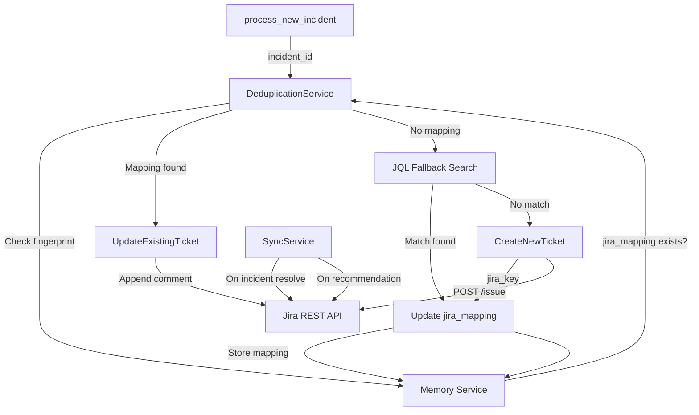
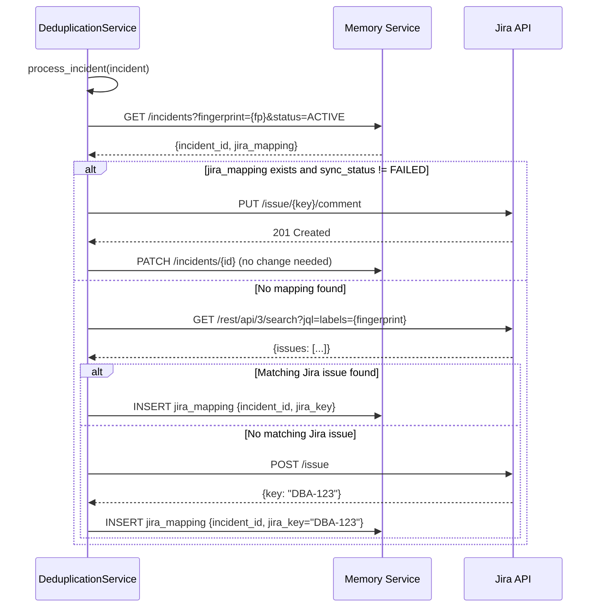

<!--
  Document Structure: This file contains three stacked specification layers.
    § TSD — Technical Specification Document (requirements, API contracts, DDL, configs)
    § SDD — Software Design Document (architecture diagrams, component specs, data models)
    § PRD — Product Requirements Document (business context, objectives, market, release)
  The filename prefix "PRD-" is retained for discoverability.
  Last reviewed: 2026-07-13 (see plan/PLAN-AUDIT-2026-07-13.md)
-->

# Technical Specification Document: Jira Integration — Smart Ticket Management

## 1. Technical Requirements

### 1.1 Mandatory Requirements
| ID | Requirement | Verification |
|----|-------------|-------------|
| JI-TR-001 | Deduplication must check memory mapping first, JQL fallback second | Integration test |
| JI-TR-002 | Jira ticket must be created or updated within 2 minutes of incident creation | Integration test |
| JI-TR-003 | Rate limit (HTTP 429) must trigger exponential backoff | Unit test |
| JI-TR-004 | Auth failure (HTTP 401/403) must log critical and skip sync | Unit test |
| JI-TR-005 | Ticket priority mapping must follow defined severity→priority matrix | Unit test |
| JI-TR-006 | Sync endpoint must be idempotent (retry-safe) | Integration test |
| JI-TR-007 | All JQL search queries must include AND status != Done | Unit test |
| JI-TR-008 | Jira project key must be configurable via environment variable | Static config |
| JI-TR-009 | Celery task for sync must survive worker restart | Integration test |
| JI-TR-010 | Mapping records must include sync_status for observability | Integration test |

### 1.2 Performance Targets
| Metric | Target | Measurement |
|--------|--------|-------------|
| Jira issue creation | < 3s P95 | Request timer |
| Jira issue update (comment) | < 2s P95 | Request timer |
| JQL search | < 5s P95 | Request timer |
| Deduplication (memory hit) | < 200ms P95 | Request timer |
| Concurrent Jira API calls | 5 max | Rate limiter |

## 2. API Specification

### 2.1 OpenAPI Contract

**Service:** `jira-integration` on port 8003

```yaml
openapi: 3.0.3
info:
  title: AI DBA Copilot - Jira Integration
  version: 1.0.0

paths:
  /health:
    get:
      operationId: healthCheck
      responses:
        '200':
          description: Service healthy

  /incidents/{incident_id}/sync:
    post:
      operationId: syncIncidentToJira
      parameters:
        - name: incident_id
          in: path
          required: true
          schema:
            type: string
            format: uuid
      responses:
        '200':
          description: Sync completed
          content:
            application/json:
              schema:
                $ref: '#/components/schemas/SyncResult'
        '404':
          description: Incident not found
        '502':
          description: Jira API unreachable

  /mappings:
    get:
      operationId: listMappings
      parameters:
        - name: sync_status
          in: query
          schema:
            type: string
            enum: [PENDING, SYNCED, FAILED]
        - name: limit
          in: query
          schema:
            type: integer
            default: 50
      responses:
        '200':
          description: List of Jira mappings

  /mappings/{incident_id}:
    get:
      operationId: getMappingByIncident
      parameters:
        - name: incident_id
          in: path
          required: true
          schema:
            type: string
            format: uuid
      responses:
        '200':
          description: Jira mapping for incident
        '404':
          description: No mapping found

components:
  schemas:
    SyncResult:
      type: object
      properties:
        incident_id:
          type: string
          format: uuid
        action:
          type: string
          enum: [created, updated, skipped, failed]
        jira_key:
          type: string
          nullable: true
        sync_status:
          type: string
          enum: [SYNCED, FAILED]
        duration_ms:
          type: integer

    JiraMapping:
      type: object
      properties:
        mapping_id:
          type: string
          format: uuid
        incident_id:
          type: string
          format: uuid
        jira_ticket_key:
          type: string
        sync_status:
          type: string
          enum: [PENDING, SYNCED, FAILED]
        last_sync:
          type: string
          format: date-time
          nullable: true
        created_at:
          type: string
          format: date-time
```

### 2.2 Error Codes
| Code | HTTP Status | Description |
|------|-------------|-------------|
| JI_001 | 502 | Jira API unreachable or timeout |
| JI_002 | 502 | Jira API rate limited (429 after backoff) |
| JI_003 | 502 | Jira auth failure (401/403) |
| JI_004 | 404 | Incident not found in memory service |
| JI_005 | 500 | Memory mapping persistence failed |

## 3. Priority Mapping

| Incident Severity | Jira Priority | Transition ID |
|-------------------|---------------|---------------|
| CRITICAL | Highest | 31 |
| HIGH | High | 21 |
| MEDIUM | Medium | 11 |
| LOW | Low | 2 |

## 4. Configuration Specification

```yaml
# config/jira-integration.yaml
service:
  name: jira-integration
  port: 8003
  log_level: INFO

jira:
  url: ${JIRA_URL}
  api_token: ${JIRA_API_TOKEN}
  user_email: ${JIRA_USER_EMAIL}
  project_key: ${JIRA_PROJECT_KEY}
  issue_type: Incident
  max_retries: 3
  retry_delay_seconds: [2, 4, 8]
  timeout_seconds: 30
  max_concurrent: 5

sync:
  dedup_strategy: memory_first  # memory_first | jql_only
  jql_max_results: 10
  enable_creation: true
  enable_updates: true
  enable_transitions: true

memory_service:
  url: http://memory-service:8005
  timeout_seconds: 10

celery:
  broker_url: redis://redis:6379/0
  result_backend: redis://redis:6379/1
```

## 5. Interface Contracts

### 5.1 Jira REST API v3 Usage

**Create Issue:**
```http
POST /rest/api/3/issue
Content-Type: application/json

{
  "fields": {
    "project": {"key": "DBA"},
    "issuetype": {"name": "Incident"},
    "summary": "[CRITICAL] PERFORMANCE - db_primary: high_cpu",
    "description": {
      "type": "doc",
      "version": 1,
      "content": [
        {"type": "paragraph", "content": [{"type": "text", "text": "..."}]}
      ]
    },
    "priority": {"name": "Highest"},
    "labels": ["a1b2c3...", "PERFORMANCE", "db_primary_sql2019"]
  }
}
```

**Add Comment:**
```http
POST /rest/api/3/issue/DBA-123/comment
Content-Type: application/json

{
  "body": {
    "type": "doc",
    "version": 1,
    "content": [
      {"type": "paragraph", "content": [{"type": "text", "text": "Updated metrics..."}]}
    ]
  }
}
```

### 5.2 Memory Service Interface
```python
async def get_incident(incident_id: str) -> dict:
    """GET /incidents/{id}"""

async def create_mapping(incident_id: str, jira_key: str) -> dict:
    """POST /jira_mappings {incident_id, jira_ticket_key}"""

async def update_mapping(incident_id: str, sync_status: str) -> dict:
    """PATCH /jira_mappings/{incident_id} {sync_status}"""
```

## 6. Error Handling Specification

| Error Scenario | Log Level | Metric | Recovery |
|----------------|-----------|--------|----------|
| Jira API timeout | WARNING | `jira.timeout` | Retry with backoff |
| Jira rate limit (429) | WARNING | `jira.rate_limited` | Retry after Retry-After header |
| Jira auth failure (401) | CRITICAL | `jira.auth_failure` | Skip sync, alert ops |
| Jira permission denied (403) | ERROR | `jira.forbidden` | Skip operation |
| Memory service unavailable | ERROR | `jira.memory_unreachable` | Retry 3x, then fail task |
| JQL returns stale match | WARNING | `jira.stale_match` | Verify fingerprint, create if mismatch |

## 7. Performance Specification

| Scenario | Target | Measurement |
|----------|--------|-------------|
| Dedup check (memory hit) | < 200ms | Request timer |
| Ticket creation | < 3s P95 | Request timer |
| Ticket update (comment) | < 2s P95 | Request timer |
| JQL search | < 5s P95 | Request timer |
| Full sync chain (incident→Jira) | < 120s | End-to-end timer |

## 8. Implementation Notes

### 8.1 Deduplication Flow
```python
async def process_incident(incident: dict) -> SyncResult:
    # Step 1: Check memory mapping
    mapping = await memory.get_mapping_by_incident(incident["incident_id"])
    if mapping and mapping["sync_status"] != "FAILED":
        return await update_ticket(mapping["jira_ticket_key"], incident)
    
    # Step 2: JQL fallback
    jql = f'labels = "{incident["fingerprint"]}" AND status != Done'
    issues = await jira.search_issues(jql)
    if issues:
        key = issues[0]["key"]
        await memory.create_mapping(incident["incident_id"], key)
        return await update_ticket(key, incident)
    
    # Step 3: Create new ticket
    key = await jira.create_issue(build_ticket(incident))
    await memory.create_mapping(incident["incident_id"], key)
    return SyncResult(action="created", jira_key=key, status="SYNCED")
```

### 8.2 Rate Limiting Strategy
```python
# Exponential backoff on 429
backoff_time = min(2 ** attempt, 60)  # 2s, 4s, 8s, 16s, 32s, 60s max
# If Retry-After header present, use instead
retry_after = response.headers.get("Retry-After")
if retry_after:
    backoff_time = int(retry_after)
```

### 8.3 Ticket Update Threshold
To avoid excessive API calls, consecutive updates within 60 seconds are batched: only the latest metrics are sent, with a single comment summarizing the cumulative change.

---

# Software Design Document: Jira Integration — Smart Ticket Management

## 1. Overview

This SDD describes the detailed technical design of the Jira Integration module. It manages bidirectional sync between the AI DBA Copilot and Jira, with a two-layer deduplication strategy (memory-mapping-first, JQL-fallback) that ensures exactly one ticket per unique incident fingerprint.

## 2. Architecture

### 2.1 High-Level Component Diagram



### 2.2 Deduplication Sequence



## 3. Component Specifications

### 3.1 JiraClient

**File:** `src/jira-integration/client.py`

**Class: JiraClient**

| Property | Type | Description |
|----------|------|-------------|
| base_url | str | Jira instance URL |
| api_token | str | Jira API token |
| user_email | str | Jira user email |
| project_key | str | Target project key |
| session | httpx.Client | Reusable HTTP session |

**Methods:**
- `create_issue(summary, description, priority, labels) -> dict`: POST /rest/api/3/issue. Returns issue key.
- `update_issue(issue_key, fields) -> dict`: PUT /rest/api/3/issue/{key}.
- `search_issues(jql, max_results=5) -> list`: GET /rest/api/3/search. Returns matching issues.
- `get_issue(issue_key) -> dict`: GET /rest/api/3/issue/{key}.
- `add_comment(issue_key, body) -> dict`: POST /rest/api/3/issue/{key}/comment.
- `transition_issue(issue_key, transition_id) -> dict`: POST /rest/api/3/issue/{key}/transitions.

**Rate Limiting:**
- Exponential backoff on HTTP 429: wait 2^attempt seconds (max 60s).
- Max 10 concurrent requests per client instance.

### 3.2 DeduplicationService

**File:** `src/jira-integration/dedup.py`

**Method: process_incident(incident: dict) -> dict:**

1. Query memory service for active incident with matching fingerprint.
2. If incident has jira_mapping with non-FAILED sync_status:
   - Call update_existing_ticket.
   - Return {action: "updated", jira_key}.
3. If no mapping:
   - JQL search: `labels = {fingerprint}`.
   - If match found → INSERT mapping → update ticket.
   - If no match → CREATE ticket → INSERT mapping.
4. Return {action: "created" | "updated", jira_key}.

### 3.3 TicketBuilder

**File:** `src/jira-integration/ticket_builder.py`

**Method: format_incident_for_jira(incident: dict) -> dict:**

| Field | Content |
|-------|---------|
| summary | `[{severity}] {domain} - {db_target}: {error_code_or_metric_type}` |
| description | Markdown: incident overview, metrics table, timeline, fingerprint |
| priority | CRITICAL→Highest, HIGH→High, MEDIUM→Medium, LOW→Low |
| labels | [fingerprint, domain_value, db_target_value] |
| issueType | "Incident" or configurable |

**Description Template (markdown):**
```markdown
*Incident ID:* `{incident_id}`
*DB Target:* `{db_target}`
*Domain:* {domain}
*Severity:* {severity}
*Fingerprint:* `{fingerprint}`
*First Detected:* {detected_at}

## Current Metrics
| Metric | Value |
|--------|-------|
| {metric_1} | {value_1} |
| {metric_2} | {value_2} |

## Detection Count
This incident has been detected {detection_count} time(s).
```

### 3.4 TicketUpdater

**File:** `src/jira-integration/updater.py`

**Method: update_existing_ticket(incident: dict, jira_key: str):**
1. Add comment with latest metrics and detection_count.
2. If severity increased → update issue priority field.
3. Optionally update description with latest snapshot.

**Comment Template:**
```markdown
*Updated: {timestamp}*
Detection count incremented to {detection_count}.
Latest metrics: CPU {cpu}%, Connections {conn_count}, Storage {storage_pct}%.
```

### 3.5 SyncService

**File:** `src/jira-integration/sync.py`

**Class: SyncService**

| Method | Trigger | Description |
|--------|---------|-------------|
| sync_recommendation(incident_id, rec_id) | recommendation generated | Comment on ticket with RCA summary |
| sync_resolution(incident_id) | incident status → RESOLVED | Transition ticket to Done |
| sync_escalation(incident_id) | severity increased | Update priority on ticket |

### 3.6 Celery Tasks

**File:** `src/jira-integration/tasks.py`

| Task | Trigger | Description |
|------|---------|-------------|
| process_jira_for_incident(incident_id) | process_new_incident chain | Full dedup → create/update flow |
| sync_recommendation(incident_id, rec_id) | recommendation generated | Add RCA comment to ticket |
| sync_resolution(incident_id) | incident resolved | Transition ticket |

## 4. REST API Contract

**Service:** `src/jira-integration/main.py` (port 8003)

| Method | Path | Request | Response | Description |
|--------|------|---------|----------|-------------|
| GET | /health | — | `{"status": "ok"}` | Health check |
| POST | /incidents/{id}/sync | — | `{"action": "created", "jira_key": "DBA-123"}` | Trigger sync for incident |
| GET | /mappings | — | `[mapping objects]` | List all mappings |
| GET | /mappings/{incident_id} | — | `mapping object` | Get mapping for incident |

**Mapping Object:**
```json
{
    "mapping_id": "uuid",
    "incident_id": "uuid",
    "jira_ticket_key": "DBA-123",
    "sync_status": "SYNCED",
    "last_sync": "2026-07-13T10:00:00Z",
    "created_at": "2026-07-13T09:00:00Z"
}
```

## 5. Data Models

### jira_mapping Table
| Column | Type | Constraints |
|--------|------|-------------|
| mapping_id | UUID | PK, DEFAULT gen_random_uuid() |
| incident_id | UUID | FK → incidents(incident_id) ON DELETE CASCADE |
| jira_ticket_key | VARCHAR(50) | UNIQUE |
| sync_status | VARCHAR(20) | CHECK (IN 'PENDING','SYNCED','FAILED') |
| last_sync | TIMESTAMPTZ | |
| created_at | TIMESTAMPTZ | DEFAULT NOW() |

## 6. Error Handling

| Scenario | Behavior | Error Code |
|----------|----------|------------|
| Jira API rate limited (429) | Exponential backoff, retry queue | JIRA_001 |
| Jira API auth failure (401/403) | Log critical, skip sync | JIRA_002 |
| Jira project not found (404) | Log error, create incident only | JIRA_003 |
| Memory service unreachable | Retry 3x, fail dedup | MEM_001 |
| JQL returns stale match | Verify fingerprint label match before using | JIRA_004 |

## 7. Configuration

| Variable | Default | Description |
|----------|---------|-------------|
| JIRA_URL | — | Jira instance base URL |
| JIRA_API_TOKEN | — | Jira API token |
| JIRA_USER_EMAIL | — | Jira user email for auth |
| JIRA_PROJECT_KEY | DBA | Jira project key |
| JIRA_ISSUE_TYPE | Incident | Jira issue type |
| MEMORY_SERVICE_URL | http://memory-service:8005 | Memory service endpoint |

## 8. Testing

| Test ID | Description | Type |
|---------|-------------|------|
| T-DEDUP-001 | Same fingerprint → single ticket, detection_count increments | Integration |
| T-DEDUP-002 | Different fingerprint → separate tickets | Integration |
| T-DEDUP-003 | Mapping exists with FAILED status → retry dedup | Unit |
| T-TKT-001 | Ticket builder formats all fields correctly | Unit |
| T-TKT-002 | Priority maps CRITICAL→Highest correctly | Unit |
| T-UPD-001 | Update adds comment with latest metrics | Unit |
| T-UPD-002 | Severity escalation updates priority | Unit |
| T-SYNC-001 | Resolution sync transitions ticket | Unit |
| T-CLI-001 | Rate limit backoff on 429 | Unit |
| T-E2E-001 | Full flow: incident → Jira create → update → resolve | Integration |

---

# Product Requirements Document: Jira Integration — Smart Ticket Management

## 1. Summary
The Jira Integration module manages bidirectional sync between the AI DBA Copilot and a Jira project. It prevents duplicate ticket creation by checking the memory layer fingerprint and existing Jira labels before creating a new ticket, and it updates or transitions existing tickets as incident status changes.

## 2. Contacts
| Name | Role | Comment |
|------|------|---------|
| AI DBA Platform Team | Product and Engineering Owner | Owns deduplication reliability and sync fidelity. |
| DBA Leads | Domain Stakeholders | Validate ticket content, priority mapping, and transition workflow. |
| Jira Admin | Platform Stakeholder | Validates API access, project schema, and rate limits. |

## 3. Background
### Context
When the detection engine fires incidents, those incidents need to be visible in the team's existing Jira project. Without smart deduplication, every detection cycle could create duplicate tickets, drowning the board in noise.

### Why now
The detection engine produces deterministic fingerprints for every incident. This creates a reliable key for deduplication that works before any Jira API call is made.

### What recently became possible
1. Memory layer stores active incident fingerprint → Jira ticket mapping with sync status.
2. Deterministic fingerprinting ensures same issue maps to same key across 4-hour windows.
3. Jira REST API v3 supports label-based search for fallback deduplication.

## 4. Objective
### Objective statement
Build a Jira integration that maintains exactly one ticket per unique incident across its lifecycle, with automatic creation, content updates, and status transitions.

### Why it matters
1. DBAs see one ticket per real issue, not dozens of duplicates.
2. Ticket content stays current because the integration appends updated metrics and escalates priority as needed.
3. Ticket lifecycle tracks incident resolution automatically.

### Strategic alignment
Reducing duplicate tickets is a primary platform KPI (≥95 percent reduction target). Reliable ticket management is essential for team adoption.

### Key Results (SMART)
1. Eliminate at least 95 percent of duplicate Jira tickets compared to baseline (pre-platform).
2. Sync new incident to Jira within 2 minutes of incident creation.
3. Update existing ticket with latest metrics within 2 minutes of detection count increment.
4. Maintain zero duplicate tickets with identical fingerprints across the same active window.
5. Successfully transition ticket to Resolved within 2 minutes of incident resolution.

## 5. Market Segment(s)
### Primary segment
DBA and SRE teams that use Jira for incident tracking and need automated ticket management without manual deduplication.

### Secondary segment
Platform operations teams that manage shared Jira projects for multiple database services and need consistent ticket formatting.

### Jobs to be done
1. When a new incident is detected, I want a Jira ticket created automatically with the right priority and content.
2. When an existing incident resurfaces, I want the existing ticket updated — not a duplicate.
3. When an incident is resolved, I want the ticket transitioned to Done automatically.

### Constraints
1. Must work with Jira Cloud and Jira Data Center REST API v3.
2. Rate limits must be respected with exponential backoff.
3. Memory mapping is the primary deduplication source; Jira search is fallback.

## 6. Value Proposition(s)
### Customer gains
1. Automatic, consistent ticket creation for every unique incident.
2. Self-updating tickets that reflect latest state without manual editing.
3. Clean Jira board with one ticket per issue, even for recurring problems.

### Pains avoided
1. Manual ticket creation for every detected issue.
2. Duplicate tickets that clutter the board and hide real priorities.
3. Stale tickets that show outdated severity or metrics.

### Differentiation
1. Deduplication works in two layers: memory mapping first (zero API cost), Jira label search second (fallback).
2. Detection count escalation lets teams see how often an issue recurred without creating new tickets.
3. Bidirectional sync between incident lifecycle and Jira status.

## 7. Solution
### 7.1 UX and Prototypes
No direct user interface. Integration outputs appear as:
- Jira ticket key linked in the Copilot UI incident detail view.
- Ticket comments with updated metrics and detection count.
- Status transitions visible in Jira board.

### 7.2 Key Features
1. Jira REST client (JiraClient):
   - create_issue, update_issue, search_issues, get_issue, add_comment, transition_issue.
   - Configured via environment variables: JIRA_URL, JIRA_API_TOKEN, JIRA_USER_EMAIL, JIRA_PROJECT_KEY.
   - Exponential backoff on rate limit responses (HTTP 429).

2. Deduplication service (DeduplicationService.process_incident):
   - Primary: Query memory service for active incident with matching fingerprint.
   - If incident has jira_mapping with sync_status != FAILED → update existing ticket.
   - Secondary (fallback): JQL search for fingerprint label in Jira.
   - Tertiary (new): Create ticket + insert mapping.

3. Ticket builder (format_incident_for_jira):
   - Summary: brief issue description with domain and severity.
   - Description: markdown-formatted with metrics, timeline, and context.
   - Priority mapping: CRITICAL→Highest, HIGH→High, MEDIUM→Medium, LOW→Low.
   - Labels: [fingerprint, domain, db_target] for searchability.

4. Ticket updater (update_existing_ticket):
   - Append comment with updated metric values and detection count.
   - Escalate priority if severity has increased since last update.
   - Update ticket description with latest snapshot context.

5. Lifecycle sync (sync_recommendation_to_jira, sync_resolution):
   - When recommendation is generated, add comment linking to recommendation.
   - When incident is resolved, transition Jira ticket to resolved state.

6. REST endpoints:
   - GET /health — service availability.
   - POST /incidents/{id}/sync — trigger immediate sync for an incident.
   - GET /mappings — list all jira_mapping entries.
   - GET /mappings/{incident_id} — get mapping for specific incident.

### 7.3 Technology
- Python 3.12+, FastAPI, Celery with Redis broker.
- httpx for Jira REST API v3 calls.
- JQL for fallback deduplication search.

### 7.4 Assumptions
1. Jira project exists with appropriate issue types (incident or task).
2. API token has create, edit, transition, comment, and search permissions.
3. Priority field exists in target project with values matching CRITICAL→LOW mapping.
4. Jira rate limits allow at least one request per 2 seconds per issue operation.

## 8. Release
### Timeline approach
Delivered as part of MVP Phase 5 (Sprints 9–10), estimated 2–3 weeks.

### Release 1 scope
- Jira REST client with full CRUD and comment operations.
- Two-layer deduplication (memory mapping → JQL fallback).
- Ticket builder with priority mapping and label assignments.
- Ticket updater with detection count escalation.
- Resolution sync on incident status change.
- Celery tasks chained from detection engine.
- REST endpoints for manual sync and mapping inspection.
- Unit tests for dedup, ticket builder, and client.

### Post-MVP scope
- Configurable issue type selection (incident vs problem vs task).
- Custom field mapping per project.
- SLA timer creation linked to ticket priority.
- Multi-project support (separate Jira projects per database environment).
- Webhook receiver for Jira-side changes (manual comment, status change).

### Launch readiness criteria
1. Deduplication test: duplicate fingerprint → single ticket, detection_count increments.
2. Update test: new metrics append comment to existing ticket.
3. Resolution test: incident resolved → ticket transitioned.
4. Integration test with sandbox Jira project passes end-to-end.
