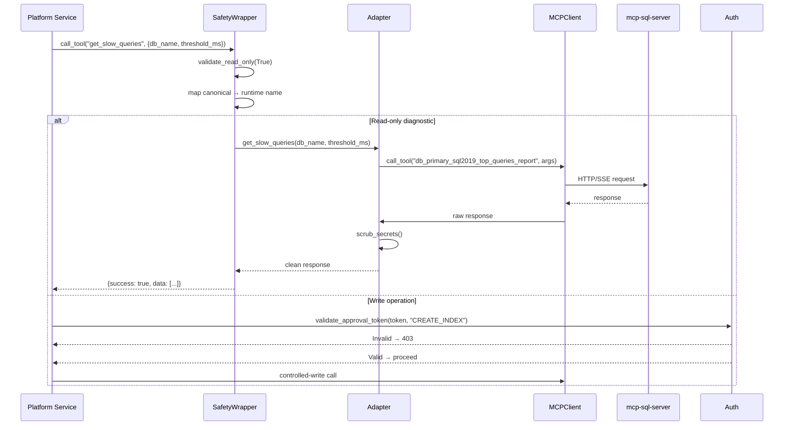

<!--
  Document Structure: This file contains three stacked specification layers.
    § TSD — Technical Specification Document (requirements, API contracts, DDL, configs)
    § SDD — Software Design Document (architecture diagrams, component specs, data models)
    § PRD — Product Requirements Document (business context, objectives, market, release)
  The filename prefix "PRD-" is retained for discoverability.
  Last reviewed: 2026-07-13 (see plan/PLAN-AUDIT-2026-07-13.md)
-->

# Technical Specification Document: MCP Integration Layer

## 1. Technical Requirements

### 1.1 Mandatory Requirements
| ID | Requirement | Verification |
|----|-------------|-------------|
| MCP-TR-001 | All TDD-catalog tools must have a mapping in tool_mapping.yaml | Static analysis |
| MCP-TR-002 | Canonical tool names must resolve to runtime names via YAML | Unit test |
| MCP-TR-003 | SafetyWrapper must reject DROP/ALTER/TRUNCATE in diagnostic paths | Unit test |
| MCP-TR-004 | SafetyWrapper must redact password=, IDENTIFIED BY, secret= patterns | Unit test |
| MCP-TR-005 | ApprovalGate must validate JWT scope claims | Unit test |
| MCP-TR-006 | Missing or invalid approval token must return 403 | Unit test |
| MCP-TR-007 | MCPClient must return standardized error envelope on failure | Unit test |
| MCP-TR-008 | MCPClient must timeout after configurable duration (default 30s) | Unit test |
| MCP-TR-009 | Tool mapping YAML must support primary and secondary instances | Static analysis |
| MCP-TR-010 | Secret scrubbing must not modify non-sensitive text | Unit test |

### 1.2 Performance Targets
| Metric | Target | Measurement |
|--------|--------|-------------|
| Integration layer overhead per call | < 500ms P95 (beyond MCP response) | Benchmark |
| SafetyWrapper validation | < 10ms per call | Timer |
| Secret scrubbing (1KB text) | < 5ms per call | Timer |
| Tool mapping resolution | < 1ms per call | Timer |
| Concurrent proxy requests | 20 | Load test |

## 2. API Specification

### 2.1 OpenAPI Contract

**Service:** `mcp-layer` on port 8004

```yaml
openapi: 3.0.3
info:
  title: AI DBA Copilot - MCP Integration Layer
  version: 1.0.0

paths:
  /health:
    get:
      operationId: healthCheck
      responses:
        '200':
          description: Service healthy

  /mcp/status:
    get:
      operationId: mcpStatus
      responses:
        '200':
          description: MCP server connectivity status
          content:
            application/json:
              schema:
                $ref: '#/components/schemas/MCPStatus'

  /tools/{canonical_name}:
    post:
      operationId: invokeTool
      parameters:
        - name: canonical_name
          in: path
          required: true
          schema:
            type: string
      requestBody:
        content:
          application/json:
            schema:
              type: object
      responses:
        '200':
          description: Tool execution result
        '400':
          description: Invalid parameters or blocked operation
        '403':
          description: Operation requires approval
        '503':
          description: MCP server unreachable

  /remediation/execute:
    post:
      operationId: executeRemediation
      requestBody:
        required: true
        content:
          application/json:
            schema:
              type: object
              properties:
                rec_id:
                  type: string
                  format: uuid
                auth_token:
                  type: string
                  nullable: true
      responses:
        '200':
          description: Remediation execution result
        '403':
          description: Invalid or missing approval token
        '404':
          description: Recommendation not found

  /memory/search:
    post:
      operationId: semanticSearch
      requestBody:
        required: true
        content:
          application/json:
            schema:
              type: object
              properties:
                query:
                  type: string
                limit:
                  type: integer
                  default: 5
      responses:
        '200':
          description: Search results

components:
  schemas:
    MCPStatus:
      type: object
      properties:
        connected:
          type: boolean
        server_url:
          type: string
        tools_available:
          type: integer
        last_ping:
          type: string
          format: date-time
        error:
          type: string
          nullable: true

    ToolResponse:
      type: object
      properties:
        success:
          type: boolean
        data:
          type: object
          nullable: true
        error:
          type: object
          nullable: true
          properties:
            code:
              type: string
            message:
              type: string
```

### 2.2 Error Codes
| Code | HTTP Status | Description |
|------|-------------|-------------|
| MCP_001 | 503 | MCP server unreachable |
| MCP_002 | 504 | MCP server timeout |
| MAP_001 | 404 | Canonical tool name not in mapping |
| SAFE_001 | 400 | Destructive SQL pattern in diagnostic path |
| AUTH_001 | 403 | Missing or invalid approval token |
| AUTH_002 | 403 | Approval token lacks required scope |
| REM_001 | 404 | Recommendation not found |
| REM_002 | 409 | Remediation already in progress |

## 3. Tool Mapping Specification

### 3.1 YAML Schema
```yaml
# config/tool_mapping.yaml
# Schema version: 1.0

instances:
  primary:
    driver: sql2019
    description: "Primary SQL Server 2019 instance"
    connection:
      host: ${MCP_SERVER_URL}
    tools:
      get_database_metrics:
        runtime: db_primary_sql2019_diagnostics
        read_only: true
        timeout_seconds: 30
        parameters:
          db_name:
            type: string
            required: true
      get_host_metrics:
        runtime: db_primary_sql2019_sessions
        read_only: true
        timeout_seconds: 30
      get_slow_queries:
        runtime: db_primary_sql2019_top_queries_report
        read_only: true
        timeout_seconds: 60
        parameters:
          db_name:
            type: string
            required: true
          threshold_ms:
            type: integer
            required: false
            default: 1000
      get_query_plan:
        runtime: db_primary_sql2019_execute_query
        read_only: true
        timeout_seconds: 60
        parameters:
          db_name:
            type: string
            required: true
          query_id:
            type: string
            required: true
      exec_proc:
        runtime: db_primary_sql2019_execute_query
        read_only: false
        requires_approval: true
        timeout_seconds: 120
```

## 4. Configuration Specification

```yaml
# config/mcp-layer.yaml
service:
  name: mcp-layer
  port: 8004
  log_level: INFO

mcp_server:
  url: ${MCP_SERVER_URL}
  transport: http  # http | sse
  timeout_seconds: 30
  max_retries: 3
  health_check_interval_seconds: 30

safety:
  read_only_enforcement: true
  scrub_secrets: true
  scrub_patterns:
    - pattern: "password\\s*=\\s*['\"][^'\"]+['\"]"
      replacement: "password='[REDACTED]'"
    - pattern: "IDENTIFIED\\s+BY\\s+['\"][^'\"]+['\"]"
      replacement: "IDENTIFIED BY [REDACTED]"
    - pattern: "secret\\s*=\\s*['\"][^'\"]+['\"]"
      replacement: "secret='[REDACTED]'"
    - pattern: "(connection_string|conn_str)\\s*=\\s*['\"][^'\"]+['\"]"
      replacement: "$1='[REDACTED]'"

auth:
  jwt_algorithm: RS256
  jwt_public_key: ${JWT_PUBLIC_KEY}
  required_scope: dba_admin
  token_expiry_seconds: 3600

memory_service:
  url: http://memory-service:8005
  timeout_seconds: 10
```

## 5. Interface Contracts

### 5.1 MCPClient Interface
```python
class MCPClient:
    async def call_tool(
        self, tool_name: str, arguments: dict
    ) -> ToolResponse:
        """Sends MCP tool execution request."""
        
    async def ping(self) -> bool:
        """Health check against MCP server."""
        
    async def list_tools(self) -> list[str]:
        """Returns available tools from MCP server."""
```

### 5.2 SafetyWrapper Interface
```python
class SafetyWrapper:
    def validate_read_only(self, sql: str) -> bool:
        """Returns False if destructive pattern detected."""
        
    def scrub_secrets(self, text: str) -> str:
        """Returns text with secret patterns redacted."""
        
    def validate_tool_parameters(self, tool: str, params: dict) -> bool:
        """Validates parameter types and constraints."""
```

### 5.3 ApprovalGate Interface
```python
class ApprovalGate:
    def validate_token(self, token: str, action: str) -> bool:
        """Validates JWT signature, expiry, scope, and action claim."""
        
    def require_approval(self, action_type: str, token: str | None):
        """Raises ApprovalRequiredError if action requires approval and token is invalid/missing."""
```

## 6. Error Handling Specification

| Error Scenario | Log Level | Metric | Recovery |
|----------------|-----------|--------|----------|
| MCP server unreachable | ERROR | `mcp.connection_failed` | Return degraded status, cache last known state |
| MCP server timeout | WARNING | `mcp.timeout` | Retry 2x, return 503 |
| Destructive SQL detected | WARNING | `mcp.destructive_blocked` | Return 400, log audit event |
| Invalid tool name | WARNING | `mcp.tool_not_found` | Return 404 with available tools list |
| Approval token expired | INFO | `mcp.token_expired` | Return 403 with "token expired" message |
| Approval scope insufficient | INFO | `mcp.scope_insufficient` | Return 403 with required scope |
| Secret scrubbing fails | ERROR | `mcp.scrub_failed` | Return original text, log warning |

## 7. Performance Specification

| Scenario | Target | Measurement |
|----------|--------|-------------|
| Tool mapping resolution | < 1ms P99 | Timer |
| Safety validation (10KB SQL) | < 10ms P99 | Timer |
| Secret scrubbing (1KB text) | < 5ms P99 | Timer |
| Approval token validation (JWT) | < 5ms P99 | Timer |
| MCP call overhead (beyond server) | < 500ms P95 | Benchmark |
| Proxy route (tool passthrough) | < 100ms P99 | Timer |

## 8. Implementation Notes

### 8.1 Tool Name Resolution Strategy
```python
def resolve_tool_name(canonical_name: str, instance: str = "primary") -> str:
    mapping = load_yaml("tool_mapping.yaml")
    runtime_name = mapping["instances"][instance]["tools"][canonical_name]["runtime"]
    return runtime_name
# Raises KeyError with helpful message if not found: 
# "Tool '{name}' not found for instance '{instance}'. Available: [...]"
```

### 8.2 Read-Only Enforcement Order
1. Check YAML `read_only: true` flag for the tool.
2. If the tool accepts SQL text, run `validate_read_only(sql)`.
3. Reject if either check fails.

### 8.3 Approval Token Validation
```python
def validate_token(token: str, required_scope: str, required_action: str) -> bool:
    try:
        payload = jwt.decode(token, public_key, algorithms=["RS256"])
        if payload.get("exp", 0) < time.time():
            return False  # Expired
        if required_scope not in payload.get("scope", []):
            return False  # Insufficient scope
        if required_action and required_action not in payload.get("actions", []):
            return False  # Action not authorized
        return True
    except jwt.InvalidTokenError:
        return False
```

### 8.4 Tool Instance Fallback
If a tool call to the primary instance fails, and a secondary instance is configured with the same canonical tool name, the MCPLayer should retry the call against the secondary instance before returning an error.

---

# Software Design Document: MCP Integration Layer

## 1. Overview

This SDD describes the detailed technical design of the MCP Integration Layer — the platform's bridge to the existing mcp-sql-server. It provides canonical tool name abstraction, read-only safety enforcement, secret scrubbing, approval-gated write operations, and a unified REST proxy. This is an integration client and policy wrapper, not a standalone MCP server.

## 2. Architecture

### 2.1 High-Level Component Diagram

```mermaid
graph TD
    UI[Copilot UI] -->|POST /tools/{name}| Proxy[MCP REST Proxy]
    DE[Detection Engine] -->|Metrics calls| Adapters[MCP Adapters]
    RE[Recommendation Engine] -->|Query plan calls| Adapters
    Mem[Memory Service] -->|Search calls| Operations[Operations Adapters]
    
    Adapters --> Safety[SafetyWrapper]
    Operations --> Safety
    
    Safety --> Client[MCPClient]
    Safety -->|Read-only check| Client
    
    Client -->|HTTP/SSE| MCPServer[mcp-sql-server]
    
    Remediation[Remediation Tools] --> Auth[ApprovalGate]
    Auth -->|Token valid| Client
    Auth -->|Token invalid| Error[403 Forbidden]
    
    Proxy --> Safety
    Proxy --> Auth
    
    subgraph "MCP Mapping Registry"
        YAML[tool_mapping.yaml]
    end
    
    Adapters --> YAML
```

### 2.2 Tool Invocation Flow



## 3. Component Specifications

### 3.1 Tool Mapping Registry

**File:** `src/mcp-layer/tool_mapping.yaml`

```yaml
instances:
  primary:
    driver: sql2019
    tools:
      get_database_metrics:
        runtime: db_primary_sql2019_diagnostics
      get_host_metrics:
        runtime: db_primary_sql2019_sessions
      get_connection_metrics:
        runtime: db_primary_sql2019_active_sessions_report
      get_replication_metrics:
        runtime: db_primary_sql2019_replica_report
      get_slow_queries:
        runtime: db_primary_sql2019_top_queries_report
      get_query_plan:
        runtime: db_primary_sql2019_execute_query
      get_blocking_sessions:
        runtime: db_primary_sql2019_block_report
      get_storage_growth:
        runtime: db_primary_sql2019_query_store_mem_used
      get_tablespace_usage:
        runtime: db_primary_sql2019_query_store_consumption
      get_database_configuration:
        runtime: db_primary_sql2019_get_query_store_options
      exec_proc:
        runtime: db_primary_sql2019_execute_query
  secondary:
    driver: sql2019
    tools:
      # Same structure with secondary instance runtime names
      get_database_metrics:
        runtime: db_secondary_sql2019_diagnostics
      # ... etc
```

### 3.2 MCPClient

**File:** `src/mcp-layer/client.py`

**Class: MCPClient**

| Property | Type | Description |
|----------|------|-------------|
| server_url | str | MCP server URL (env: MCP_SERVER_URL) |
| transport | str | Transport type (http or sse) |
| timeout | int | Request timeout in seconds (default 30) |
| max_retries | int | Max retries on transient failures (default 3) |

**Methods:**
- `call_tool(tool_name: str, arguments: dict) -> dict`: Sends tool execution request via HTTP/SSE. Returns standardized envelope.
- `ping() -> bool`: Health check to MCP server.
- `list_tools() -> list`: Returns available tools from MCP server.

**Response Envelope:**
```python
{
    "success": True | False,
    "data": ...,       # Tool-specific response
    "error": None | {"code": "...", "message": "..."}
}
```

### 3.3 SafetyWrapper

**File:** `src/mcp-layer/safety.py`

**Class: SafetyWrapper**

| Method | Description |
|--------|-------------|
| validate_read_only(sql: str) -> bool | Rejects destructive SQL patterns |
| validate_read_only_tool(tool_name: str) -> bool | Rejects known write tools in read-only paths |
| scrub_secrets(text: str) -> str | Redacts sensitive patterns |

**Scrub Patterns:**
- `password='...'` → `password='[REDACTED]'`
- `IDENTIFIED BY ...` → `IDENTIFIED BY [REDACTED]`
- `secret='...'` → `secret='[REDACTED]'`
- `connection_string=...` → `connection_string=[REDACTED]`

**Destructive SQL Patterns (rejected in diagnostic paths):**
- `DROP\s+(TABLE|INDEX|VIEW|PROCEDURE|DATABASE|SCHEMA)`
- `ALTER\s+(TABLE|DATABASE|INDEX)` (for non-diagnostic context)
- `TRUNCATE\s+TABLE`
- `INSERT\s+INTO`
- `UPDATE\s+.+\s+SET`
- `DELETE\s+FROM`
- `CREATE\s+(TABLE|INDEX|DATABASE)` (in read-only paths)

### 3.4 ApprovalGate

**File:** `src/mcp-layer/auth.py`

**Class: ApprovalGate**

| Method | Description |
|--------|-------------|
| validate_approval_token(token: str, action: str) -> bool | Validates JWT with required scope |
| require_approval(action_type: str) | Raises ApprovalRequiredError if context has no valid token |

**JWT Token Validation:**
- Decode JWT using configured public key / secret.
- Check `scope` claim contains `dba_admin` or `write`.
- Check `action` claim matches or includes requested action.
- Check `exp` claim is not expired.
- Check `nbf` claim (if present) is in the past.

### 3.5 Metric Adapters

**File:** `src/mcp-layer/tools/metrics.py`

| Adapter | Runtime Tool(s) | Parameters | Return |
|---------|----------------|------------|--------|
| get_database_metrics | diagnostics / sessions | db_name | CPU%, IOPS, TPS, connections |
| get_host_metrics | sessions | db_name | Server CPU, memory, disk I/O |
| get_connection_metrics | active_sessions_report | db_name | Active sessions by status |
| get_replication_metrics | replica_report | db_name | Lag ms, replica state |

### 3.6 Performance Adapters

**File:** `src/mcp-layer/tools/performance.py`

| Adapter | Runtime Tool | Parameters | Return |
|---------|-------------|------------|--------|
| get_slow_queries | top_queries_report | db_name, threshold_ms(default 1000) | [{query_id, sql_text, duration_ms, execution_count}] |
| get_query_plan | execute_query | db_name, query_id | EXPLAIN plan text |
| get_blocking_sessions | block_report | db_name | [{blocker_pid, blocked_pid, wait_time, wait_type}] |

**Secret Scrubbing:** All SQL text fields passed through scrub_secrets() before return.

### 3.7 Storage Adapters

**File:** `src/mcp-layer/tools/storage.py`

| Adapter | Runtime Tool | Parameters | Return |
|---------|-------------|------------|--------|
| get_storage_growth | query_store_mem_used / consumption | db_name | [{file_name, size_mb, growth_mb, growth_pct}] |
| get_tablespace_usage | query_store_consumption | db_name | [{filegroup_name, allocated_mb, used_mb, free_pct}] |

### 3.8 Operations Adapters

**File:** `src/mcp-layer/tools/operations.py`

| Adapter | Source | Parameters | Return |
|---------|--------|------------|--------|
| get_database_configuration | MCP or memory service | db_name | Database-level settings |
| get_parameter_changes | MCP or memory service | db_name, since | [{parameter, old_value, new_value, changed_at}] |
| search_incidents | Memory service /embeddings/search | query_text, limit | [{incident, recommendation, similarity}] |
| get_recommendations | Memory service | incident_id | [{rec_id, rca_text, actions}] |

### 3.9 Remediation Tools

**File:** `src/mcp-layer/tools/remediation.py`

**Adapters:**

| Adapter | Description |
|---------|-------------|
| auto_remediation(action_type, action_script) | Executes AUTO-classified actions via mcp-sql-server exec_proc with system service account |
| approved_remediation(action_type, action_script, auth_token) | Validates token, executes via mcp-sql-server controlled-write path |
| get_remediation_status(rec_id) | Returns execution history from remediation_history |

## 4. REST API Contract

**Service:** `src/mcp-layer/main.py` (port 8004)

| Method | Path | Request | Response | Description |
|--------|------|---------|----------|-------------|
| GET | /health | — | `{"status": "ok"}` | Health check |
| GET | /mcp/status | — | `{"connected": true, "tools": 12}` | MCP server connectivity |
| POST | /tools/{canonical_name} | Tool args | Tool response | Invoke canonical tool (internal) |
| POST | /memory/search | `{"query": "...", "limit": 5}` | Search results | Semantic search proxy |
| POST | /remediation/execute | `{"rec_id": "...", "auth_token"?: "..."}` | Remediation result | Execute remediation actions |

## 5. Error Handling

| Scenario | Behavior | Error Code |
|----------|----------|------------|
| MCP server unreachable | Return degraded status, cache last known state | MCP_001 |
| Tool not found in mapping | Return 404 with available tools list | MAP_001 |
| Destructive SQL in diagnostic path | Return 400, log audit event | SAFE_001 |
| Invalid approval token | Return 403, log audit event | AUTH_001 |
| MCP server timeout | Retry 2x, return 503 | MCP_002 |

## 6. Configuration

| Variable | Default | Description |
|----------|---------|-------------|
| MCP_SERVER_URL | http://mcp-sql-server:8080 | mcp-sql-server endpoint |
| MCP_TRANSPORT | http | Transport type (http or sse) |
| JWT_PUBLIC_KEY | — | Public key for token validation |
| JWT_ALGORITHM | RS256 | JWT signing algorithm |

## 7. Testing

| Test ID | Description | Type |
|---------|-------------|------|
| T-SAFE-001 | DROP TABLE rejected in diagnostic path | Unit |
| T-SAFE-002 | SELECT * FROM sys.dm_exec_queries allowed | Unit |
| T-SAFE-003 | Password pattern scrubbed from text | Unit |
| T-SAFE-004 | Connection string pattern scrubbed | Unit |
| T-AUTH-001 | Valid admin token passes approval gate | Unit |
| T-AUTH-002 | Missing token returns 403 | Unit |
| T-AUTH-003 | Read-only scope rejected for write action | Unit |
| T-MAP-001 | All TDD-catalog tools mapped in YAML | Unit |
| T-MAP-002 | Canonical name resolves to correct runtime name | Unit |
| T-CLI-001 | MCPClient returns standardized envelope | Unit |
| T-CLI-002 | Timeout triggers retry logic | Unit |

---

# Product Requirements Document: MCP Integration Layer

## 1. Summary
The MCP Integration Layer is the platform's bridge to the existing mcp-sql-server. It maps canonical tool names to runtime tool names, enforces read-only safety and approval-gated writes, scrubs secrets from payloads, and provides a unified REST proxy for the UI and backend services. It is not a standalone MCP server — it is an integration client and policy wrapper.

## 2. Contacts
| Name | Role | Comment |
|------|------|---------|
| AI DBA Platform Team | Product and Engineering Owner | Owns tool mapping completeness, safety enforcement, and integration stability. |
| DBA Leads | Domain Stakeholders | Validate tool behavior, parameter contracts, and controlled-write approval flow. |
| Security Team | Governance Stakeholder | Validates safety wrapper, secret scrubbing, and approval gate implementation. |

## 3. Background
### Context
The platform depends on the existing mcp-sql-server for all database interactions. That server exposes SQL Server–specific tool names that differ from the canonical names used in the TDD and across the platform documentation.

### Why now
No backend service (detection, recommendation, UI) should call the MCP server directly. An integration layer provides a single contract point for safety enforcement, tool name abstraction, and approval gating.

### What recently became possible
1. mcp-sql-server has a stable, documented tool catalog with consistent input/output contracts.
2. The allowlist/denylist policy in mcp-sql-server provides server-side controls that the integration layer can complement with client-side enforcement.

## 4. Objective
### Objective statement
Build an integration layer that provides a safe, consistent, and documented interface between all platform components and the mcp-sql-server, with zero direct database exposure from platform services.

### Why it matters
1. Platform services never need to know mcp-sql-server runtime tool names — they use canonical names.
2. Every database interaction passes through safety checks (read-only validation, secret scrubbing).
3. Write operations are gated by approval token validation before reaching the MCP server.

### Strategic alignment
This layer implements the architecture constraint that read-only operations are autonomous and write operations require approval. It is the safety boundary between the platform and production databases.

### Key Results (SMART)
1. Map all TDD-catalog tools for SQL Server primary and secondary instances in tool_mapping.yaml.
2. Reject 100 percent of destructive SQL patterns (DROP, ALTER, TRUNCATE, etc.) in diagnostic paths.
3. Redact 100 percent of password/secret patterns from payloads before returning to callers.
4. Validate approval tokens for 100 percent of controlled-write tool invocations.
5. Achieve sub-500ms overhead per tool call (integration layer latency beyond MCP response time).

## 5. Market Segment(s)
### Primary segment
Platform engineering teams that need a safe, auditable way to expose database tooling to AI agents and internal services.

### Secondary segment
DBA teams that want to add approval-gated write capabilities to their existing monitoring workflows.

### Jobs to be done
1. When a service needs database metrics, I want a simple, safe call that returns clean data.
2. When a write action is proposed, I want approval enforced before the database is touched.
3. When the MCP server tool names change, I want to update one mapping file — not every caller.

### Constraints
1. Never reimplement MCP server logic — always delegate to mcp-sql-server.
2. All secrets must be scrubbed before data reaches logs, memory storage, or callers.
3. Write operations must fail closed if approval token is missing or invalid.

## 6. Value Proposition(s)
### Customer gains
1. One integration point instead of every service talking to MCP directly.
2. Automatic safety enforcement without service-level changes.
3. Simple tool name abstraction — platform services use canonical names.

### Pains avoided
1. Accidental exposure of raw SQL or secrets in logs or storage.
2. Unauthorized write operations reaching production databases.
3. Breaking all callers when MCP tool names change.

### Differentiation
1. Dual-layer safety: client-side validation plus server-side allowlist/denylist.
2. Approval gate with JWT scope validation for write operations.
3. Canonical-to-runtime mapping in declarative YAML — no code changes for tool name updates.

## 7. Solution
### 7.1 UX and Prototypes
No user-facing interface. The integration layer exposes:
- REST endpoints for the Copilot UI and backend services.
- Health and status endpoints for operational monitoring.
- A YAML mapping file that documents all available tools and their contracts.

### 7.2 Key Features
1. Tool mapping (tool_mapping.yaml):
   - Declarative YAML mapping canonical tool names to runtime MCP tool names.
   - Separate instance configurations for primary and secondary SQL Server targets.
   - Covers all TDD-catalog tools: metrics, performance, storage, operations, remediation.

2. MCP HTTP client (MCPClient):
   - Call tool method using MCP HTTP/SSE transport to MCP_SERVER_URL.
   - Standardized error envelope: {success, data, error}.
   - Timeout handling and automatic retry on transient failures.

3. Metrics adapters (tools/metrics.py):
   - get_database_metrics: composes diagnostics/sessions DMV data.
   - get_host_metrics: server-level CPU, memory, I/O.
   - get_connection_metrics: maps to active_sessions_report.
   - get_replication_metrics: AG/replica lag or not_supported for non-HA.

4. Performance adapters (tools/performance.py):
   - get_slow_queries: maps to top_queries_report with configurable threshold_ms.
   - get_query_plan: maps to execute_query with plan capture.
   - get_blocking_sessions: maps to block_report.
   - All apply scrub_secrets() to text fields before returning.

5. Storage adapters (tools/storage.py):
   - get_storage_growth: database file size trends.
   - get_tablespace_usage: filegroup and space DMVs.

6. Operations adapters (tools/operations.py):
   - get_database_configuration: database-level settings.
   - get_parameter_changes: configuration history or server trace.
   - search_incidents: delegates to memory service /embeddings/search.
   - get_recommendations: delegates to memory service.

7. Safety wrapper (SafetyWrapper):
   - validate_read_only(sql): rejects DROP, ALTER, TRUNCATE, INSERT, UPDATE, DELETE, CREATE in diagnostic paths.
   - scrub_secrets(text): redacts password=, IDENTIFIED BY, secret=, and related patterns.

8. Approval gate (ApprovalGate):
   - validate_approval_token(token, action): checks JWT scope for write access.
   - require_approval(action_type): raises ApprovalRequiredError for unauthorized write attempts.

9. Remediation tools (tools/remediation.py):
   - db_remediation_execution: validates token, routes to controlled-write path, returns {success, output, error}.
   - Auto-remediation executor for low-risk actions (UPDATE STATISTICS, etc.).

10. REST proxy (main.py):
    - GET /health — service health.
    - GET /mcp/status — MCP server connectivity and tool availability.
    - POST /tools/{canonical_name} — tool invocation proxy (internal use).
    - POST /memory/search — wraps memory service semantic search for unified access.

### 7.3 Technology
- Python 3.12+, FastAPI.
- httpx for MCP HTTP/SSE transport.
- PyJWT for approval token validation.
- YAML for declarative tool mapping.

### 7.4 Assumptions
1. mcp-sql-server is deployed and reachable at MCP_SERVER_URL.
2. MCP server version is pinned and tool contracts are stable within a version.
3. JWT tokens for approval are issued by the platform auth system with appropriate scope claims.
4. Tool mapping YAML can be updated without restart (hot-reload) in future releases.

## 8. Release
### Timeline approach
Delivered as part of MVP Phase 3 (Sprints 5–6), estimated 3–4 weeks.

### Release 1 scope
- tool_mapping.yaml for SQL Server primary and secondary instances.
- MCPClient with HTTP/SSE transport, timeouts, error envelopes.
- All metric, performance, and storage adapters.
- SafetyWrapper with read-only validation and secret scrubbing.
- ApprovalGate with JWT validation.
- Operations adapters that delegate to memory service.
- Remediation tools for auto and approved actions.
- REST proxy endpoints.
- Unit tests for safety, approval, tool mapping, and client.

### Post-MVP scope
- Tool mapping for additional database platforms (Oracle, PostgreSQL, MySQL).
- Hot-reload support for tool_mapping.yaml.
- MCP server health monitoring and circuit breaker.
- Caching layer for frequently called read-only tools.
- Request-level audit logging for all tool invocations.

### Launch readiness criteria
1. All TDD-catalog tools mapped and returning expected data from test MCP server.
2. SafetyWrapper correctly blocks all destructive patterns in test battery.
3. Secret scrubbing verified with known password/secret patterns.
4. Approval gate test: no token → 403, readonly scope → 403, admin scope → 200.
5. Integration test: detection engine calls MCP layer → MCP layer calls mcp-sql-server → data returned and scrubbed.
