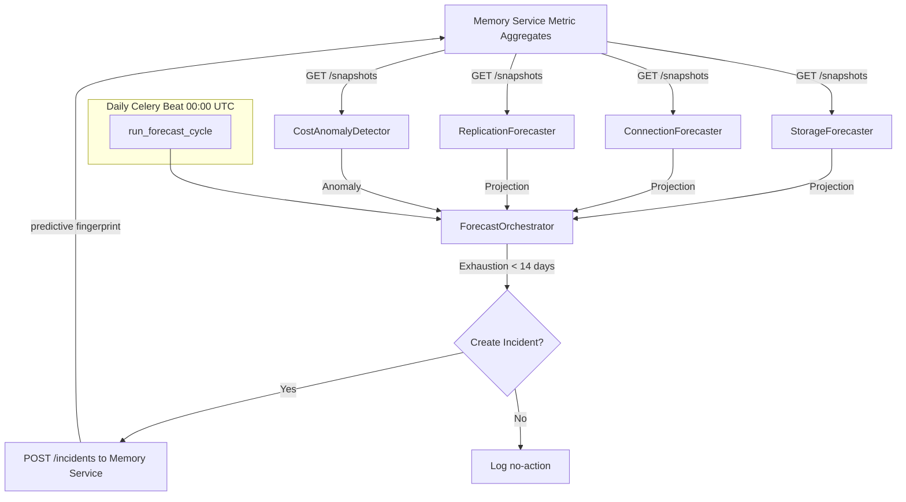
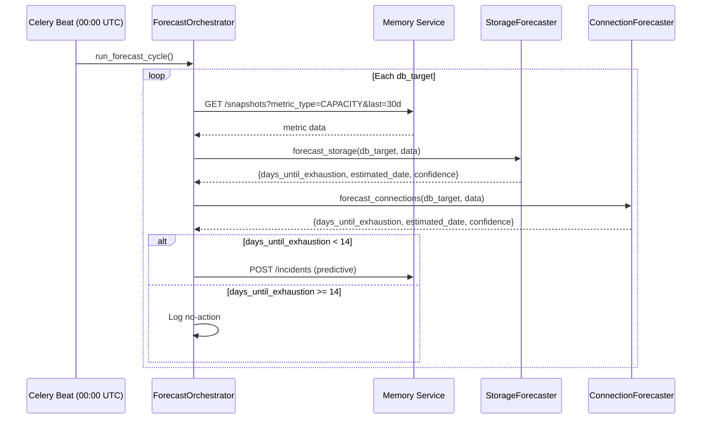

<!--
  Document Structure: This file contains three stacked specification layers.
    § TSD — Technical Specification Document (requirements, API contracts, DDL, configs)
    § SDD — Software Design Document (architecture diagrams, component specs, data models)
    § PRD — Product Requirements Document (business context, objectives, market, release)
  The filename prefix "PRD-" is retained for discoverability.
  Last reviewed: 2026-07-13 (see plan/PLAN-AUDIT-2026-07-13.md)
-->

# Technical Specification Document: Predictive Analytics

## 1. Technical Requirements

### 1.1 Mandatory Requirements
| ID | Requirement | Verification |
|----|-------------|-------------|
| PA-TR-001 | Storage forecast must use linear regression on 30-day window | Unit test |
| PA-TR-002 | Insufficient data (< 7 points) must return days_until_threshold = -1 | Unit test |
| PA-TR-003 | Negative growth trend must return days_until_threshold = -1 | Unit test |
| PA-TR-004 | Predictive incident must be created when exhaustion < 14 days | Integration test |
| PA-TR-005 | Predictive incident must NOT be created when exhaustion >= 14 days | Integration test |
| PA-TR-006 | Cost anomaly must use isolation forest with configurable contamination | Unit test |
| PA-TR-007 | Forecast cycle must complete within 5 minutes at 50 targets | Benchmark test |
| PA-TR-008 | All forecast results must include R² and 95% confidence interval | Unit test |
| PA-TR-009 | Cost anomaly must report deviation_pct from baseline | Unit test |
| PA-TR-010 | Daily forecast schedule must be configurable via Celery Beat | Integration test |

### 1.2 Performance Targets
| Metric | Target | Measurement |
|--------|--------|-------------|
| Single target storage forecast | < 500ms | Timer |
| Single target cost anomaly detection | < 1s | Timer |
| Full cycle (50 targets, 4 forecasters each) | < 5 min | Benchmark |
| Memory service aggregate query | < 200ms P95 | Request timer |
| Predictive incident creation | < 500ms P95 | Request timer |

## 2. API Specification

### 2.1 OpenAPI Contract

**Service:** `predictive-analytics` on port 8006

```yaml
openapi: 3.0.3
info:
  title: AI DBA Copilot - Predictive Analytics
  version: 1.0.0

paths:
  /health:
    get:
      operationId: healthCheck
      responses:
        '200':
          description: Service healthy

  /forecast/storage/{db_target}:
    get:
      operationId: forecastStorage
      parameters:
        - name: db_target
          in: path
          required: true
          schema:
            type: string
        - name: window_days
          in: query
          schema:
            type: integer
            default: 30
      responses:
        '200':
          description: Storage forecast result
          content:
            application/json:
              schema:
                $ref: '#/components/schemas/ForecastResult'

  /forecast/connections/{db_target}:
    get:
      operationId: forecastConnections
      parameters:
        - name: db_target
          in: path
          required: true
          schema:
            type: string
      responses:
        '200':
          description: Connection forecast result

  /forecast/replication/{db_target}:
    get:
      operationId: forecastReplication
      parameters:
        - name: db_target
          in: path
          required: true
          schema:
            type: string
      responses:
        '200':
          description: Replication lag forecast result

  /anomalies/cost:
    get:
      operationId: getCostAnomalies
      parameters:
        - name: db_target
          in: query
          schema:
            type: string
        - name: days
          in: query
          schema:
            type: integer
            default: 7
      responses:
        '200':
          description: Recent cost anomalies
          content:
            application/json:
              schema:
                type: array
                items:
                  $ref: '#/components/schemas/CostAnomaly'

  /forecast/run:
    post:
      operationId: triggerForecastCycle
      responses:
        '200':
          description: Forecast cycle completed
          content:
            application/json:
              schema:
                type: object
                properties:
                  targets_checked:
                    type: integer
                  incidents_created:
                    type: integer
                  incidents_updated:
                    type: integer
                  duration_ms:
                    type: integer

components:
  schemas:
    ForecastResult:
      type: object
      properties:
        db_target:
          type: string
        metric_key:
          type: string
        days_until_threshold:
          type: number
          description: -1 if no breach projected
        estimated_breach_date:
          type: string
          format: date
          nullable: true
        current_value:
          type: number
        threshold_value:
          type: number
        trend_slope:
          type: number
        r_squared:
          type: number
        confidence_interval:
          type: array
          minItems: 2
          maxItems: 2
          items:
            type: number
        data_points:
          type: integer

    CostAnomaly:
      type: object
      properties:
        db_target:
          type: string
        date:
          type: string
          format: date
        daily_cost:
          type: number
        baseline_cost:
          type: number
        deviation_pct:
          type: number
        severity:
          type: string
          enum: [LOW, MEDIUM, HIGH]
```

## 3. Mathematical Specification

### 3.1 Linear Regression Model
```
y = mx + b

Where:
- y = resource utilization percentage (storage_pct, connection_pct, repl_lag_ms)
- x = days from start of training window
- m = slope (units per day)
- b = intercept

Projection:
- days_until_threshold = (threshold - current_value) / m
- Where m > 0 (growing trend)
- Returns -1 if m <= 0 (stable or shrinking)

Confidence Interval (95%):
- CI = t_0.025,n-2 * SE_prediction
- SE_prediction = sqrt(MSE * (1 + 1/n + (x_new - x_mean)² / SSx))
```

### 3.2 Isolation Forest (Cost Anomaly)
```python
from sklearn.ensemble import IsolationForest

model = IsolationForest(
    contamination=0.05,   # Expected 5% anomalies
    random_state=42,
    n_estimators=100
)

# Feature: single feature (daily cost) for simplicity
# Anomaly score < median - 2*IQR → flagged
```

## 4. Configuration Specification

```yaml
# config/predictive-analytics.yaml
service:
  name: predictive-analytics
  port: 8006
  log_level: INFO

forecast:
  window_days: 30
  min_data_points: 7
  predictive_threshold_days: 14

storage:
  threshold_pct: 95.0

connections:
  threshold_pct: 95.0

replication:
  lag_threshold_ms: 30000

cost_anomaly:
  enabled: true
  contamination: 0.05
  window_days: 90
  deviation_threshold_pct: 20  # Minimum deviation to flag

memory_service:
  url: http://memory-service:8005
  timeout_seconds: 10

celery:
  broker_url: redis://redis:6379/0
  result_backend: redis://redis:6379/1
  beat_schedule:
    run-forecast-cycle:
      task: predictive_analytics.tasks.run_forecast_cycle
      schedule: "0 0 * * *"  # Daily 00:00 UTC
```

## 5. Interface Contracts

### 5.1 Forecaster Base Class
```python
class BaseForecaster(ABC):
    @abstractmethod
    async def forecast(
        self, db_target: str, metric_data: pd.DataFrame
    ) -> ForecastResult:
        ...
```

### 5.2 Memory Service Interface
```python
async def get_metric_aggregates(
    db_target: str, metric_type: str, metric_key: str,
    from_date: datetime, to_date: datetime
) -> list[dict]:
    """GET /snapshots?db_target=...&metric_type=...&from=...&to=..."""

async def create_predictive_incident(incident: dict) -> dict:
    """POST /incidents with domain=CAPACITY and predictive error_code"""
```

## 6. Error Handling Specification

| Error Scenario | Log Level | Metric | Recovery |
|----------------|-----------|--------|----------|
| Insufficient data (< 7 points) | INFO | `pred.insufficient_data` | Skip forecast, return -1 |
| Negative/zero growth trend | INFO | `pred.negative_trend` | Skip incident, return -1 |
| Flat trend (slope < 0.01/day) | INFO | `pred.flat_trend` | Skip incident, return -1 |
| Memory service unavailable | ERROR | `pred.memory_unreachable` | Skip target, continue cycle |
| ML model training failure | WARNING | `pred.model_train_failed` | Skip cost anomaly, continue |

## 7. Performance Specification

| Scenario | Target | Measurement |
|----------|--------|-------------|
| Single storage forecast (30 days data) | < 500ms | Timer |
| Single cost anomaly (90 days data) | < 1s | Timer |
| Full cycle (50 targets) | < 5 min | Benchmark |
| Predictive incident creation | < 500ms | Timer |
| Daily cycle memory usage | < 500MB | Memory monitor |

## 8. Implementation Notes

### 8.1 Non-Monotonic Growth Handling
If the trend slope is positive but R² < 0.3 (weak fit), reduce days_until_threshold by 50% as a safety margin. Log warning about low confidence fit.

### 8.2 Predictive Fingerprint
```python
def predictive_fingerprint(db_target: str, metric_key: str, date: datetime) -> str:
    raw = f"{db_target}:predictive_{metric_key}:{date.strftime('%Y-%m-%d')}"
    return hashlib.sha256(raw.encode()).hexdigest()
```

### 8.3 Re-forecast Suppression
If a predictive incident already exists for the same (db_target, metric_key) and was created within the last 24 hours, skip re-creation and update the existing incident's detection_count instead.

---

# Software Design Document: Predictive Analytics

## 1. Overview

This SDD describes the detailed technical design of the Predictive Analytics module. It forecasts database resource exhaustion (storage, connections, replication lag) using linear regression and detects cost anomalies using isolation forest, creating predictive incidents in the memory layer.

## 2. Architecture

### 2.1 High-Level Component Diagram



### 2.2 Forecast Cycle Sequence



## 3. Component Specifications

### 3.1 Base Forecaster Pattern

All forecasters share a common pattern implemented via a base class or protocol:

```python
class BaseForecaster(ABC):
    @abstractmethod
    def forecast(self, db_target: str, metric_data: pd.DataFrame) -> ForecastResult:
        ...
```

**ForecastResult:**
```python
@dataclass
class ForecastResult:
    db_target: str
    metric_key: str
    days_until_threshold: float  # -1 if no breach projected
    estimated_breach_date: Optional[datetime]
    current_value: float
    threshold_value: float
    trend_slope: float          # units per day
    r_squared: float            # goodness of fit
    confidence_interval: tuple[float, float]  # 95% CI
    data_points: int            # number of data points used
```

### 3.2 StorageForecaster

**File:** `src/predictive-analytics/forecaster.py`

**Class: StorageForecaster**

**Method: forecast_storage(db_target: str, window_days: int = 30) -> ForecastResult:**

1. Fetch metric_aggregates for db_target with metric_type = 'CAPACITY' and metric_key = 'storage_pct'.
2. Extract (bucket_ts, avg_value) pairs from last `window_days`.
3. Fit linear regression: `storage_pct ~ days_from_start`.
4. Project: `days_until_100 = (100 - current_value) / slope`.
5. Return ForecastResult with projected date, R², and 95% CI.

**Edge Cases:**
- Negative slope (shrinking storage) → days_until_threshold = -1.
- Insufficient data (< 7 points) → return with days_until_threshold = -1, log warning.
- Slope near zero (< 0.01% per day) → return -1 (stable).

### 3.3 ConnectionForecaster

**File:** `src/predictive-analytics/connection_forecaster.py`

**Class: ConnectionForecaster**

**Method: forecast_connections(db_target: str, window_days: int = 30) -> ForecastResult:**

1. Fetch metric_aggregates for db_target with metric_type = 'CAPACITY' and metric_key = 'connection_pct'.
2. Same linear regression approach as StorageForecaster.
3. Threshold: 95% pool utilization.
4. Return ForecastResult.

### 3.4 ReplicationForecaster

**File:** `src/predictive-analytics/replication_forecaster.py`

**Class: ReplicationForecaster**

**Method: forecast_replication_lag(db_target: str, window_days: int = 30) -> ForecastResult:**

1. Fetch metric_aggregates for db_target with metric_type = 'AVAILABILITY' and metric_key = 'repl_lag_ms'.
2. Linear regression on max_value (worst-case lag).
3. Threshold: configured SLA (default 30,000ms / 30 seconds).
4. Return ForecastResult.

### 3.5 CostAnomalyDetector

**File:** `src/predictive-analytics/cost_anomaly.py`

**Class: CostAnomalyDetector**

| Property | Type | Description |
|----------|------|-------------|
| contamination | float | Expected anomaly proportion (default 0.05) |
| model | IsolationForest | Trained model instance |

**Methods:**
- `fit(data: pd.DataFrame)`: Trains on daily cost values over 90-day window.
- `detect(data: pd.DataFrame) -> list[dict]`: Returns anomalies with deviation_pct and severity.

**Method: detect_cost_anomaly(db_target: str) -> list[dict]:**
1. Fetch 90 days of COST metric snapshots for db_target.
2. Extract daily total cost as feature.
3. Fit isolation forest (or refit if >30 days since last training).
4. Score each day. Flag days with score < median - 2*IQR.
5. Return list of anomaly dicts: {date, daily_cost, baseline_cost, deviation_pct}.

### 3.6 ForecastOrchestrator

**File:** `src/predictive-analytics/orchestrator.py`

**Class: ForecastOrchestrator**

**Method: run_forecast_cycle():**

1. Fetch all db_targets from configuration.
2. For each target:
   a. Run StorageForecaster → if days_until < 14 → create/update predictive incident.
   b. Run ConnectionForecaster → same logic.
   c. Run ReplicationForecaster → same logic.
3. Run CostAnomalyDetector → create incidents for each anomaly.
4. Predictive incidents use fingerprint: `SHA-256(db_target + "predictive_" + metric_key + date_bucket)`.
5. Log cycle summary: {targets_checked, incidents_created, incidents_updated, duration_ms}.

**Incident Creation for Predictions:**
```json
{
    "fingerprint": "SHA-256 hash",
    "error_code_or_metric_type": "predictive_storage_exhaustion",
    "severity": "HIGH",
    "domain": "CAPACITY",
    "status": "ACTIVE",
    "db_target": "db_primary_sql2019"
}
```

### 3.7 Scheduler

**File:** `src/predictive-analytics/scheduler.py`

**Celery Beat Schedule:**
```python
beat_schedule = {
    'run-forecast-cycle': {
        'task': 'predictive_analytics.tasks.run_forecast_cycle',
        'schedule': crontab(hour=0, minute=0),  # Daily at 00:00 UTC
    },
}
```

## 4. REST API Contract

**Service:** `src/predictive-analytics/main.py` (port 8006)

| Method | Path | Request | Response | Description |
|--------|------|---------|----------|-------------|
| GET | /health | — | `{"status": "ok"}` | Health check |
| GET | /forecast/storage/{db_target} | — | `ForecastResult` | Storage forecast |
| GET | /forecast/connections/{db_target} | — | `ForecastResult` | Connection forecast |
| GET | /forecast/replication/{db_target} | — | `ForecastResult` | Replication lag forecast |
| GET | /anomalies/cost | ?days=7 | `[anomaly objects]` | Recent cost anomalies |
| POST | /forecast/run | — | `{"duration_ms": 1234}` | Manual trigger forecast cycle |

**ForecastResult Response:**
```json
{
    "db_target": "db_primary_sql2019",
    "metric_key": "storage_pct",
    "days_until_threshold": 45,
    "estimated_breach_date": "2026-08-27",
    "current_value": 82.3,
    "threshold_value": 95.0,
    "trend_slope": 0.28,
    "r_squared": 0.94,
    "confidence_interval": [38, 52],
    "data_points": 30
}
```

## 5. Error Handling

| Scenario | Behavior | Error Code |
|----------|----------|------------|
| Insufficient data (< 7 days) | Skip forecast, log warning | PRED_001 |
| Negative growth trend | Skip incident creation, log info | PRED_002 |
| Flat trend (slope ~ 0) | Skip, log info | PRED_003 |
| Cost anomaly model not trained | Train on first detect call | PRED_004 |
| Memory service unavailable | Retry 3x, skip cycle | MEM_001 |

## 6. Configuration

| Variable | Default | Description |
|----------|---------|-------------|
| MEMORY_SERVICE_URL | http://memory-service:8005 | Memory service endpoint |
| FORECAST_WINDOW_DAYS | 30 | Training data window for regression |
| PREDICTIVE_THRESHOLD_DAYS | 14 | Days until exhaustion to create incident |
| STORAGE_THRESHOLD_PCT | 95 | Storage utilization alert threshold |
| CONNECTION_THRESHOLD_PCT | 95 | Connection pool alert threshold |
| REPLICATION_LAG_THRESHOLD_MS | 30000 | Replication lag SLA threshold |
| COST_ANOMALY_CONTAMINATION | 0.05 | Expected cost anomaly proportion |

## 7. Testing

| Test ID | Description | Type |
|---------|-------------|------|
| T-SF-001 | Linear growth → correct days-until projection | Unit |
| T-SF-002 | Negative growth → returns -1 | Unit |
| T-SF-003 | Insufficient data → returns -1 with warning | Unit |
| T-CF-001 | Connection pool growth projection | Unit |
| T-RF-001 | Replication lag trend projection | Unit |
| T-CA-001 | Cost spike detected as anomaly | Unit |
| T-CA-002 | Normal cost pattern → no anomaly | Unit |
| T-ORCH-001 | Orchestrator creates incident when < 14 days | Integration |
| T-ORCH-002 | Orchestrator skips incident when >= 14 days | Integration |
| T-ORCH-003 | Daily cycle completes < 5 min at 50 targets | Benchmark |

---

# Product Requirements Document: Predictive Analytics

## 1. Summary
The Predictive Analytics module forecasts database resource exhaustion and cost anomalies using linear regression and isolation forest models. It analyzes historical metric aggregates to project storage saturation, connection pool depletion, replication lag SLA breaches, and unusual cost patterns, then creates predictive incidents when thresholds are breached.

## 2. Contacts
| Name | Role | Comment |
|------|------|---------|
| AI DBA Platform Team | Product and Engineering Owner | Owns forecast accuracy and incident prediction quality. |
| DBA Leads | Domain Stakeholders | Validate prediction thresholds and acceptable false-positive rate for proactive alerts. |
| Finance Operations | Cost Stakeholder | Validate cost anomaly detection and alerting thresholds. |

## 3. Background
### Context
Most database incidents are reactive — the team finds out about storage exhaustion or connection saturation when it has already caused an outage. Predictive analytics aims to shift the team left, catching issues days or weeks before they become critical.

### Why now
The memory layer now stores 90 days of metric snapshots and 2 years of aggregated hourly rollups. This historical data provides the training foundation for meaningful forecasts.

### What recently became possible
1. metric_aggregates table provides clean, hourly-bucketed time series data for trend analysis.
2. Linear regression on 30-day windows can project exhaustion dates with meaningful lead time.
3. Daily cost metrics enable isolation forest anomaly detection for spend spikes.

## 4. Objective
### Objective statement
Build predictive models that forecast storage exhaustion, connection pool saturation, replication lag SLA breaches, and cost anomalies at least 14 days before they occur, creating actionable predictive incidents.

### Why it matters
1. DBAs get proactive warnings days or weeks before an outage, enabling planned maintenance instead of emergency response.
2. Cost anomalies are caught early, preventing billing surprises.
3. Predictive incidents follow the same detection → recommendation → Jira pipeline as real incidents.

### Strategic alignment
Predictive analytics extends the platform from reactive to proactive operations, directly supporting the goal of reducing operational toil and improving system reliability.

### Key Results (SMART)
1. Forecast storage exhaustion with less than 20 percent error at 14-day horizon for tables with monotonic growth.
2. Detect cost anomalies with less than 15 percent false-positive rate.
3. Create predictive incident at least 14 days before projected exhaustion for 90 percent of detected trends.
4. Run daily forecast cycle in under 5 minutes at 50 database targets.
5. Maintain zero false predictions that lead to unnecessary remediation actions.

## 5. Market Segment(s)
### Primary segment
DBA teams managing databases with predictable growth patterns who want proactive warnings instead of reactive incident response.

### Secondary segment
Platform engineering teams responsible for capacity planning across multiple database environments.

### Jobs to be done
1. When storage is trending toward exhaustion, I want a forecast with an estimated exhaustion date so I can plan maintenance.
2. When connection pool usage is growing unsustainably, I want a warning before applications are affected.
3. When daily costs spike unexpectedly, I want an anomaly flagged so I can investigate.

### Constraints
1. All forecasts must be based on metric_aggregates data (not raw snapshots).
2. Predictive incidents follow the same fingerprint pipeline as detected incidents.
3. Forecasts must include confidence intervals or error bounds.

## 6. Value Proposition(s)
### Customer gains
1. Proactive warnings with meaningful lead time for capacity planning.
2. Reduced outage risk from resource exhaustion.
3. Early visibility into cost anomalies without separate monitoring tools.

### Pains avoided
1. Emergency storage expansion during business hours.
2. Application outages from connection pool saturation.
3. Surprise cloud bills from undetected usage spikes.

### Differentiation
1. Integrated with the same incident pipeline as real-time detection — no separate alerting system.
2. Combines resource forecasting (regression) with cost anomaly detection (isolation forest).
3. Uses existing metric_aggregates data — no additional data collection infrastructure.

## 7. Solution
### 7.1 UX and Prototypes
No direct user interface. Forecast results appear as predictive incidents in the Copilot UI dashboard, distinguishable from real-time incidents by domain and severity classification.

### 7.2 Key Features
1. Storage forecaster (StorageForecaster):
   - Uses linear regression on 30-day metric_aggregates window for database file growth.
   - Projects days until configured threshold (percentage or absolute GB) is reached.
   - Creates predictive incident when exhaustion is projected within 14 days.
   - Returns forecast with estimated date, confidence interval, and trend slope.

2. Connection forecaster (ConnectionForecaster):
   - Linear regression on connection pool usage trends.
   - Projects days until pool saturation (near 100 percent usage).
   - Creates predictive incident when saturation projected within 14 days.

3. Replication forecaster (ReplicationForecaster):
   - Analyzes replication lag trends from availability group metrics.
   - Projects time until lag exceeds SLA threshold.
   - Creates predictive incident when SLA breach projected within 14 days.

4. Cost anomaly detector (CostAnomalyDetector):
   - Isolation forest on daily COST metric snapshots over 90-day window.
   - Flags daily spend above modeled baseline by configurable margin.
   - Creates incident with domain COST and severity based on deviation magnitude.

5. Forecast orchestrator (ForecastOrchestrator.run_forecast_cycle):
   - Runs all forecasters in sequence for each configured database target.
   - Creates or updates predictive incidents through memory service.
   - Predictions are fingerprinted using db_target + metric_type + forecast date bucket.
   - Tracks previous forecast values to avoid repeated incident creation for same trend.

6. Daily scheduler:
   - Celery Beat task at 00:00 UTC.
   - Orchestrator cycle runs once per day.

7. REST API (main.py):
   - GET /health — service health.
   - GET /forecast/storage/{db_target} — storage forecast details.
   - GET /forecast/connections/{db_target} — connection forecast details.
   - GET /forecast/replication/{db_target} — replication lag forecast.
   - GET /anomalies/cost — recent cost anomalies.
   - POST /forecast/run — trigger manual forecast cycle.

### 7.3 Technology
- Python 3.12+, FastAPI, Celery with Redis broker.
- scikit-learn for linear regression and isolation forest.
- pandas and numpy for time series data manipulation.

### 7.4 Assumptions
1. At least 30 days of metric_aggregates data exist before storage forecasting produces meaningful results.
2. Database growth patterns are approximately linear over 30-day windows (stable for MVP; non-linear models can be added later).
3. Cost metrics are ingested into the memory layer as COST-type snapshots.
4. Daily forecast cycle is sufficient — sub-daily trends are handled by the real-time detection engine.

## 8. Release
### Timeline approach
Delivered as part of MVP Phase 8 (Sprints 15–16), estimated 2–3 weeks.

### Release 1 scope
- StorageForecaster with linear regression on 30-day window.
- ConnectionForecaster with pool saturation projection.
- ReplicationForecaster with lag SLA breach projection.
- CostAnomalyDetector with isolation forest.
- Forecast orchestrator with predictive incident creation.
- Daily Celery Beat scheduler at 00:00 UTC.
- REST endpoints for forecast data and manual trigger.
- Unit tests for storage forecaster and cost anomaly detector.

### Post-MVP scope
- Non-linear growth models (polynomial, exponential) for storage forecasting.
- Seasonal decomposition for cost anomaly detection.
- In-memory forecast caching to reduce redundant computation.
- Forecast accuracy dashboard with historical vs. actual comparison.
- Proactive recommendation generation (e.g., schedule storage expansion).

### Launch readiness criteria
1. Storage forecaster correctly projects exhaustion date within 20 percent error on test data with known linear trend.
2. Cost anomaly detector flags test spikes without false positives on normal-cost periods.
3. Orchestrator creates predictive incidents via memory service.
4. Daily scheduler runs without error.
5. Predictive incidents are distinguishable from real-time incidents in the UI.
