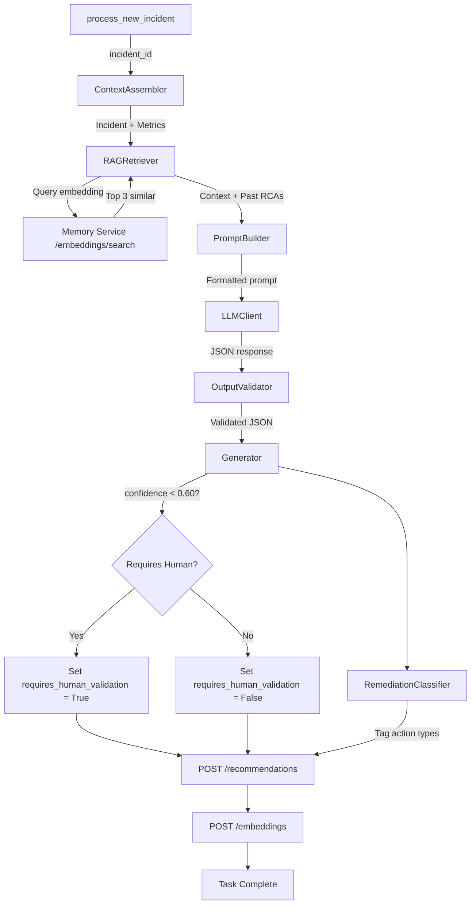
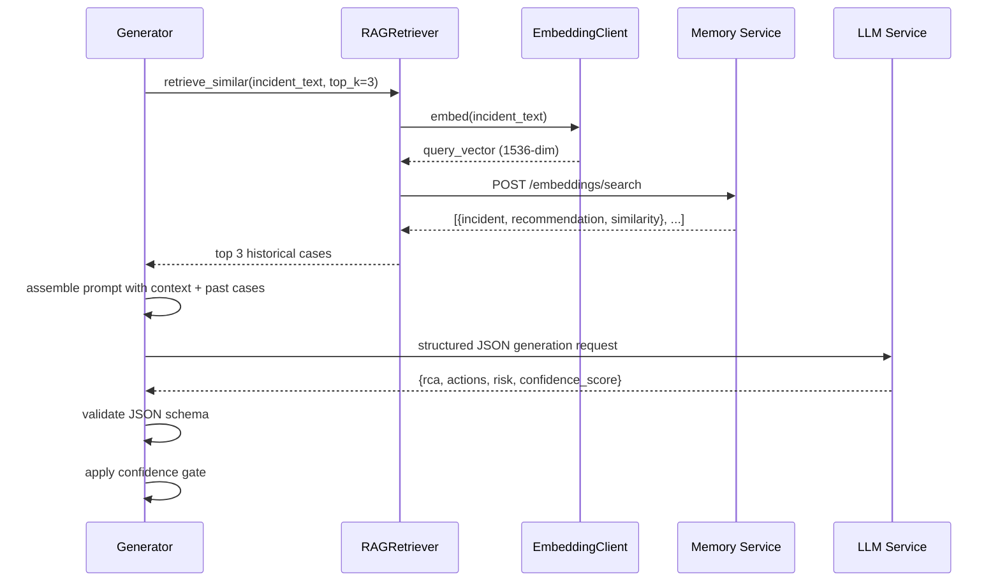

<!--
  Document Structure: This file contains three stacked specification layers.
    § TSD — Technical Specification Document (requirements, API contracts, DDL, configs)
    § SDD — Software Design Document (architecture diagrams, component specs, data models)
    § PRD — Product Requirements Document (business context, objectives, market, release)
  The filename prefix "PRD-" is retained for discoverability.
  Last reviewed: 2026-07-13 (see plan/PLAN-AUDIT-2026-07-13.md)
-->

# Technical Specification Document: Recommendation Engine

## 1. Technical Requirements

### 1.1 Mandatory Requirements
| ID | Requirement | Verification |
|----|-------------|-------------|
| RE-TR-001 | LLM response must be valid JSON conforming to the defined schema | Unit test |
| RE-TR-002 | RAG retrieval must return at least 0 and at most top_k results | Unit test |
| RE-TR-003 | Confidence scores below 0.60 must set requires_human_validation = true | Unit test |
| RE-TR-004 | All SQL text in MCP responses must be scrubbed before LLM prompt assembly | Integration test |
| RE-TR-005 | LLM retry must not exceed max_retries (default 3) | Unit test |
| RE-TR-006 | Embedding model dimension must be exactly 1536 (text-embedding-ada-002) | Static config |
| RE-TR-007 | Temperature must be configurable (default 0.1) | Static config |
| RE-TR-008 | Recommendation generation must complete within 60 seconds | Benchmark test |
| RE-TR-009 | RAG retrieval must complete within 3 seconds | Benchmark test |
| RE-TR-010 | Celery task for generation must be idempotent (same incident_id → same rec_id on retry) | Integration test |

### 1.2 Performance Targets
| Metric | Target | Measurement |
|--------|--------|-------------|
| End-to-end generation (simple incident) | < 15s | Timer |
| End-to-end generation (complex incident with full context) | < 60s | Timer |
| RAG retrieval (10k embeddings) | < 3s P95 | Benchmark |
| Embedding generation (single text) | < 1s P95 | Timer |
| LLM response (gpt-4o, structured output) | < 10s P95 | Timer |
| Concurrent generation requests | 5 | Load test |

## 2. API Specification

### 2.1 OpenAPI Contract

**Service:** `recommendation-engine` on port 8002

```yaml
openapi: 3.0.3
info:
  title: AI DBA Copilot - Recommendation Engine
  version: 1.0.0

paths:
  /health:
    get:
      operationId: healthCheck
      responses:
        '200':
          description: Service healthy

  /generate/{incident_id}:
    post:
      operationId: generateRecommendation
      parameters:
        - name: incident_id
          in: path
          required: true
          schema:
            type: string
            format: uuid
      responses:
        '200':
          description: Recommendation generated
          content:
            application/json:
              schema:
                $ref: '#/components/schemas/GenerationResult'
        '404':
          description: Incident not found
        '503':
          description: LLM service unavailable

  /recommendations/{rec_id}:
    get:
      operationId: getRecommendation
      parameters:
        - name: rec_id
          in: path
          required: true
          schema:
            type: string
            format: uuid
      responses:
        '200':
          description: Recommendation object

  /recommendations/incident/{incident_id}:
    get:
      operationId: getRecommendationsForIncident
      parameters:
        - name: incident_id
          in: path
          required: true
          schema:
            type: string
            format: uuid
      responses:
        '200':
          description: List of recommendations

components:
  schemas:
    GenerationResult:
      type: object
      properties:
        rec_id:
          type: string
          format: uuid
        confidence_score:
          type: number
          format: float
          minimum: 0
          maximum: 1
        risk_level:
          type: string
          enum: [LOW, MEDIUM, HIGH]
        requires_human_validation:
          type: boolean
        duration_ms:
          type: integer

    Recommendation:
      type: object
      properties:
        rec_id:
          type: string
          format: uuid
        incident_id:
          type: string
          format: uuid
        rca_text:
          type: string
        action_steps:
          type: array
          items:
            $ref: '#/components/schemas/ActionStep'
        confidence_score:
          type: number
        risk_level:
          type: string
        requires_human_validation:
          type: boolean
        generated_at:
          type: string
          format: date-time

    ActionStep:
      type: object
      properties:
        step:
          type: string
        command:
          type: string
        type:
          type: string
          enum: [AUTO, APPROVAL_REQUIRED, BLOCKED]
```

## 3. LLM Prompt Specification

### 3.1 System Prompt
```
You are an expert DBA assistant for a platform called AI DBA Copilot. You analyze
database incidents and provide structured Root Cause Analysis (RCA) with
remediation steps.

Rules:
1. Output ONLY valid JSON. No markdown, no code fences, no explanatory text.
2. Base your analysis on the provided context and similar past incidents.
3. Confidence scores must reflect actual certainty. Use 0.95+ only for
   definitively known patterns with exact past match.
4. Risk levels: LOW (safe, reversible actions), MEDIUM (schema changes with
   rollback), HIGH (destructive or irreversible actions).
5. Actions tagged as BLOCKED if they involve DROP, TRUNCATE, or any data-loss risk.
6. Actions tagged as AUTO if they are non-destructive maintenance (ANALYZE,
   UPDATE STATISTICS).
```

### 3.2 Output JSON Schema (Strict)
```json
{
  "$schema": "http://json-schema.org/draft-07/schema#",
  "type": "object",
  "required": ["rca", "actions", "risk", "confidence_score"],
  "properties": {
    "rca": {
      "type": "string",
      "minLength": 10,
      "maxLength": 5000,
      "description": "Detailed root cause analysis in plain text"
    },
    "actions": {
      "type": "array",
      "minItems": 1,
      "maxItems": 10,
      "items": {
        "type": "object",
        "required": ["step", "command", "type"],
        "properties": {
          "step": {"type": "string", "minLength": 5, "maxLength": 500},
          "command": {"type": "string", "maxLength": 2000},
          "type": {"type": "string", "enum": ["AUTO", "APPROVAL_REQUIRED", "BLOCKED"]}
        }
      }
    },
    "risk": {
      "type": "string",
      "enum": ["LOW", "MEDIUM", "HIGH"]
    },
    "confidence_score": {
      "type": "number",
      "minimum": 0.0,
      "maximum": 1.0
    }
  }
}
```

## 4. Configuration Specification

```yaml
# config/recommendation-engine.yaml
service:
  name: recommendation-engine
  port: 8002
  log_level: INFO

llm:
  provider: openai        # openai | azure_openai
  model: gpt-4o
  temperature: 0.1
  max_tokens: 2000
  timeout_seconds: 30
  max_retries: 3
  retry_delay_seconds: [2, 4, 8]

embedding:
  model: text-embedding-ada-002
  dimensions: 1536
  timeout_seconds: 10
  batch_size: 20

rag:
  top_k: 3
  min_similarity_threshold: 0.5
  search_endpoint: http://memory-service:8005/embeddings/search

confidence:
  human_validation_threshold: 0.60
  high_confidence_threshold: 0.80

memory_service:
  url: http://memory-service:8005
  timeout_seconds: 10

mcp_layer:
  url: http://mcp-layer:8004
  timeout_seconds: 30

celery:
  broker_url: redis://redis:6379/0
  result_backend: redis://redis:6379/1
```

## 5. Interface Contracts

### 5.1 LLM Client Interface
```python
class LLMClient:
    async def generate_structured(
        self,
        prompt: str,
        json_schema: dict,
        temperature: float = 0.1
    ) -> dict:
        """Send prompt with response_format=json_object, validate against schema."""
        
    async def generate_raw(self, prompt: str) -> str:
        """Send prompt without JSON enforcement."""
```

### 5.2 Embedding Client Interface
```python
class EmbeddingClient:
    async def embed(self, text: str) -> list[float]:
        """Returns 1536-dimensional embedding vector."""
        
    async def embed_batch(self, texts: list[str]) -> list[list[float]]:
        """Batch embedding with per-item error isolation."""
```

### 5.3 RAG Retriever Interface
```python
class RAGRetriever:
    async def retrieve_similar(
        self, incident_text: str, top_k: int = 3
    ) -> list[dict]:
        """Returns [{incident, recommendation, similarity_score}, ...]"""
        
    async def retrieve_by_id(
        self, incident_id: str, top_k: int = 3
    ) -> list[dict]:
        """Same as above but accepts incident_id directly."""
```

### 5.4 Generator Interface
```python
class Generator:
    async def generate(self, incident_id: str) -> dict:
        """
        Full pipeline: assemble context → RAG retrieve → build prompt →
        call LLM → validate → classify → persist → return summary.
        Returns GenerationResult.
        """
```

## 6. Error Handling Specification

| Error Scenario | Log Level | Metric | Recovery |
|----------------|-----------|--------|----------|
| LLM API timeout (30s) | WARNING | `rec.llm_timeout` | Retry with backoff (2s, 4s, 8s) |
| LLM schema validation failure | WARNING | `rec.schema_failure` | Retry with error feedback in prompt |
| LLM API auth failure | CRITICAL | `rec.llm_auth_failure` | No retry, raise ConfigurationError |
| RAG search returns 0 results | INFO | `rec.rag_empty` | Proceed without past context |
| Incident not found | ERROR | `rec.incident_not_found` | Return 404 |
| Embedding generation failure | ERROR | `rec.embedding_failure` | Log error, skip embedding store |

## 7. Performance Specification

| Scenario | Target | Measurement |
|----------|--------|-------------|
| Context assembly (simple incident) | < 500ms | Timer |
| RAG retrieval (10k embeddings) | < 3s | Benchmark |
| LLM generation (gpt-4o, 2000 tokens) | < 10s | Timer |
| Full pipeline (simple) | < 15s | End-to-end timer |
| Full pipeline (complex, with query plan) | < 60s | End-to-end timer |
| Embedding storage (POST /embeddings) | < 500ms P95 | Request timer |

## 8. Implementation Notes

### 8.1 Idempotency
The `generate_recommendation` Celery task must be idempotent. Before generating, check if a recommendation already exists for the incident_id. If found, return the existing rec_id instead of generating a new one.

### 8.2 LLM Retry Strategy
```python
retry_delays = [2, 4, 8]  # seconds
max_retries = 3

for attempt in range(max_retries):
    try:
        result = await llm.generate_structured(prompt, schema)
        if validate_schema(result, schema):
            return result
    except (TimeoutError, APIError) as e:
        if attempt < max_retries - 1:
            await asyncio.sleep(retry_delays[attempt])
            # Append validation error to prompt for retry
            prompt += f"\n\nPrevious attempt failed: {e}. Please ensure valid JSON output."
            continue
        raise
```

### 8.3 Confidence Calibration
- ≥ 0.80: High confidence. Green display. No human validation needed.
- 0.60 – 0.79: Medium confidence. Yellow display. No human validation needed.
- < 0.60: Low confidence. Red display. requires_human_validation = true. Script extraction blocked in UI.

### 8.4 Context Assembly Order
1. Fetch incident (mandatory — fail if missing).
2. Fetch metric snapshots (±30 min, best-effort).
3. Fetch config history (best-effort).
4. Fetch query plan via MCP (only for PERFORMANCE domain, best-effort).
5. RAG retrieval (best-effort, fallback to empty list).

---

# Software Design Document: Recommendation Engine

## 1. Overview

This SDD describes the detailed technical design of the AI DBA Copilot Recommendation Engine. It generates AI-powered Root Cause Analysis (RCA) for detected incidents using Retrieval-Augmented Generation (RAG) with pgvector similarity search, produces structured JSON action steps, and enforces a 0.60 confidence gate for human validation.

## 2. Architecture

### 2.1 High-Level Component Diagram



### 2.2 RAG Sequence



## 3. Component Specifications

### 3.1 LLMClient

**File:** `src/recommendation-engine/llm_client.py`

**Class: LLMClient**

| Property | Type | Description |
|----------|------|-------------|
| api_key | str | OpenAI or Azure OpenAI key |
| endpoint | str | API endpoint URL |
| model | str | Model name (default gpt-4o) |
| temperature | float | Generation temperature (default 0.1) |
| max_retries | int | Max retries on schema failure (default 3) |

**Methods:**
- `generate_structured(prompt: str, json_schema: dict) -> dict`: Sends prompt with response_format=json_object. Validates output against schema. Retries up to max_retries on parse/validation failure.
- `generate_raw(prompt: str) -> str`: Sends prompt without JSON enforcement (for embedding input prep).

**Error Handling:**
| Scenario | Behavior |
|----------|----------|
| API timeout (30s) | Retry with exponential backoff (2s, 4s, 8s) |
| Schema mismatch | Retry with error feedback in prompt |
| API auth failure | Raise ConfigurationError, no retry |
| Rate limit (429) | Retry after Retry-After header |

### 3.2 EmbeddingClient

**File:** `src/recommendation-engine/embedding_client.py`

**Class: EmbeddingClient**

| Property | Type | Description |
|----------|------|-------------|
| model | str | Embedding model (default text-embedding-ada-002) |
| dimensions | int | Vector dimension (1536) |

**Methods:**
- `embed(text: str) -> list[float]`: Returns 1536-dimensional embedding vector.
- `embed_batch(texts: list[str]) -> list[list[float]]`: Batch embedding with error isolation (per-item retry).

### 3.3 ContextAssembler

**File:** `src/recommendation-engine/context_assembler.py`

**Class: ContextAssembler**

**Method: assemble(incident_id: str) -> dict:**
1. Fetch incident from memory service `GET /incidents/{incident_id}`.
2. Fetch metric snapshots ±30 minutes around detected_at.
3. Fetch configuration_history entries for the db_target around detection time.
4. If domain == PERFORMANCE, fetch query plan via MCP layer.
5. Return assembled context dict with: incident, metrics_window, config_changes, query_plan.

**Context Payload Structure:**
```python
{
    "incident": { ... },
    "metrics_window": [  # Last 30 snapshots before detection
        {"timestamp": "...", "metric_type": "...", "payload": {...}},
        ...
    ],
    "config_changes": [  # Recent parameter changes
        {"parameter_name": "...", "old_value": "...", "new_value": "...", "changed_at": "..."},
        ...
    ],
    "query_plan": "..." or None,  # Only for PERFORMANCE domain
    "similar_past_incidents": [...]  # Populated after RAG retrieval
}
```

### 3.4 RAGRetriever

**File:** `src/recommendation-engine/rag_retriever.py`

**Class: RAGRetriever**

**Method: retrieve_similar(incident_text: str, top_k: int = 3) -> list[dict]:**
1. Embed incident_text using EmbeddingClient.
2. Call memory service `POST /embeddings/search` with query_vector and top_k.
3. Results include similarity score: `1 - (embedding <=> query_vector)`.
4. Return list of {incident, recommendation, similarity_score}.

### 3.5 PromptBuilder

**File:** `src/recommendation-engine/prompt_templates.py`

**Prompt Structure (system message):**
```
You are an expert DBA assistant. Given the following incident context and similar
past incidents, provide a Root Cause Analysis and recommended action steps.

Output strictly as JSON:
{
    "rca": "string - detailed root cause analysis",
    "actions": [
        {
            "step": "string - description of action",
            "command": "string - executable SQL or command",
            "type": "string - AUTO | APPROVAL_REQUIRED | BLOCKED"
        }
    ],
    "risk": "LOW | MEDIUM | HIGH",
    "confidence_score": float between 0.0 and 1.0
}

Current Incident:
{incident_context}

Similar Past Incidents:
{past_incidents_context}
```

### 3.6 OutputValidator

**File:** `src/recommendation-engine/generator.py`

**Validation Rules:**
1. Parse JSON successfully.
2. `rca` is non-empty string.
3. `actions` is non-empty array.
4. Each action has `step`, `command`, `type` (one of AUTO/APPROVAL_REQUIRED/BLOCKED).
5. `risk` is one of LOW/MEDIUM/HIGH.
6. `confidence_score` is float between 0.0 and 1.0.
7. If any validation fails → retry with validation error in prompt.

### 3.7 Generator

**File:** `src/recommendation-engine/generator.py`

**Method: generate(incident_id: str) -> dict:**
1. Call ContextAssembler.assemble(incident_id).
2. Call RAGRetriever.retrieve_similar(incident.rca_text or description).
3. Build prompt with context + similar incidents.
4. Call LLMClient.generate_structured(prompt).
5. Validate JSON output → retry if needed.
6. Set requires_human_validation = confidence_score < 0.60.
7. Call RemediationClassifier to tag action types.
8. POST recommendation to memory service.
9. POST embedding of rca_text to memory service.
10. Return recommendation summary.

### 3.8 RemediationClassifier

**File:** `src/recommendation-engine/remediation_classifier.py`

**Classification Rules:**

| Action Pattern | Classification | Notes |
|----------------|---------------|-------|
| ANALYZE TABLE / UPDATE STATISTICS | AUTO | Safe, non-destructive |
| CREATE INDEX | APPROVAL_REQUIRED | Schema change |
| ALTER DATABASE / ALTER CONFIGURATION | APPROVAL_REQUIRED | Configuration change |
| KILL / TERMINATE | APPROVAL_REQUIRED | Process termination |
| DROP TABLE / DROP INDEX | BLOCKED | Destructive |
| TRUNCATE TABLE | BLOCKED | Destructive |
| Any unrecognized pattern | APPROVAL_REQUIRED | Conservative default |

**Method: classify(actions: list[dict]) -> list[dict]:**
Tags each action with type field based on command text pattern matching.

### 3.9 Celery Tasks

**File:** `src/recommendation-engine/tasks.py`

| Task | Trigger | Description |
|------|---------|-------------|
| generate_recommendation(incident_id) | process_new_incident chain | Full RCA generation pipeline |
| sync_missing_embeddings | Celery Beat hourly | Backfill embeddings for new content |

## 4. REST API Contract

**Service:** `src/recommendation-engine/main.py` (port 8002)

| Method | Path | Request | Response | Description |
|--------|------|---------|----------|-------------|
| GET | /health | — | `{"status": "ok"}` | Health check |
| POST | /generate/{incident_id} | — | `{"rec_id": "...", "confidence": 0.85, "risk": "MEDIUM"}` | Generate recommendation for incident |
| GET | /recommendations/{rec_id} | — | Full recommendation object | Get recommendation by ID |
| GET | /recommendations/incident/{incident_id} | — | `[recommendation objects]` | Get recommendations for incident |

**Error Response Envelope:**
```json
{
    "error": "REC_003",
    "message": "Recommendation generation failed after 3 retries",
    "details": {"incident_id": "abc-123", "last_error": "Schema validation failed"}
}
```

## 5. Data Models

### Recommendation Output Schema (REQ-010)
```json
{
    "rca": "High CPU is caused by a missing index on orders.order_date. The query plan shows a full table scan on a 50M row table. Past incident DBA-204 had the same root cause and was resolved by creating index idx_orders_order_date.",
    "actions": [
        {
            "step": "Create covering index on orders.order_date",
            "command": "CREATE INDEX idx_orders_order_date ON orders(order_date) INCLUDE (status, total);",
            "type": "APPROVAL_REQUIRED"
        },
        {
            "step": "Update table statistics after index creation",
            "command": "UPDATE STATISTICS orders;",
            "type": "AUTO"
        }
    ],
    "risk": "MEDIUM",
    "confidence_score": 0.82
}
```

## 6. Error Handling

| Scenario | Behavior | Error Code |
|----------|----------|------------|
| LLM API unavailable | Retry 3x with backoff, then fail open | LLM_001 |
| RAG returns < 3 results | Log warning, proceed with available results | RAG_001 |
| JSON schema validation fails | Retry with error feedback up to 3 times | VAL_001 |
| Incident not found | Return 404 | INC_001 |
| Context assembly partial failure | Log warnings, assemble best-effort context | CTX_001 |

## 7. Configuration

| Variable | Default | Description |
|----------|---------|-------------|
| OPENAI_API_KEY | — | OpenAI API key |
| AZURE_OPENAI_ENDPOINT | — | Azure OpenAI endpoint |
| LLM_MODEL | gpt-4o | Generation model |
| LLM_TEMPERATURE | 0.1 | Generation temperature |
| EMBEDDING_MODEL | text-embedding-ada-002 | Embedding model |
| RAG_TOP_K | 3 | Number of similar incidents to retrieve |
| CONFIDENCE_THRESHOLD | 0.60 | Human validation gate threshold |
| MEMORY_SERVICE_URL | http://memory-service:8005 | Memory service endpoint |
| MCP_LAYER_URL | http://mcp-layer:8004 | MCP integration layer endpoint |

## 8. Testing

| Test ID | Description | Type |
|---------|-------------|------|
| T-RAG-001 | Top-3 retrieval returns correct similarity ranking | Unit |
| T-RAG-002 | Empty embedding store returns empty results gracefully | Unit |
| T-CTX-001 | Context assembler fetches all required data | Unit |
| T-CTX-002 | Query plan only fetched for PERFORMANCE domain | Unit |
| T-GEN-001 | confidence_score 0.59 sets requires_human_validation=True | Unit |
| T-GEN-002 | confidence_score 0.61 sets requires_human_validation=False | Unit |
| T-GEN-003 | Valid JSON schema accepted | Unit |
| T-GEN-004 | Invalid JSON schema triggers retry | Unit |
| T-CLS-001 | ANALYZE classified as AUTO | Unit |
| T-CLS-002 | DROP classified as BLOCKED | Unit |
| T-CLS-003 | Unknown pattern classified as APPROVAL_REQUIRED | Unit |
| T-E2E-001 | Full pipeline: incident → recommendation → stored → retrievable | Integration |

---

# Product Requirements Document: Recommendation Engine

## 1. Summary
The Recommendation Engine generates AI-powered Root Cause Analysis (RCA) and remediation steps for each detected incident. It uses retrieval-augmented generation (RAG) to find and learn from similar past incidents, produces structured JSON output, and gates recommendations below confidence 0.60 for mandatory human review.

## 2. Contacts
| Name | Role | Comment |
|------|------|---------|
| AI DBA Platform Team | Product and Engineering Owner | Owns RCA quality, latency, and LLM integration. |
| DBA Leads | Domain Stakeholders | Validate RCA accuracy, action step feasibility, and risk classification. |
| Security and Compliance Team | Governance Stakeholder | Validates LLM output constraints and confidence gate policy. |

## 3. Background
### Context
Incident response today depends heavily on individual DBA expertise. Finding similar past incidents requires searching chat logs, ticket comments, and personal notes. This makes response time inconsistent and institutional knowledge fragile.

### Why now
The detection engine produces structured incidents with consistent metadata. The memory layer stores prior incidents with vector embeddings. Together they create the data foundation needed for useful, context-aware RCA generation.

### What recently became possible
1. pgvector enables semantic retrieval of past incidents by meaning, not just keywords.
2. LLMs with structured JSON output (response_format=json_object) produce parseable, machine-actionable RCA.
3. Embedding models (text-embedding-ada-002) provide stable 1536-dimensional vector representations.

## 4. Objective
### Objective statement
Build a recommendation engine that produces accurate, structured, confidence-scored RCA within minutes of a new incident, learning from past cases through RAG.

### Why it matters
1. DBAs get consistent, high-quality RCA without starting from zero each time.
2. Remediation actions are structured and risk-labeled, enabling safe automated or approval-gated execution.
3. Institutional knowledge accumulates in the embedding store instead of disappearing when team members change.

### Strategic alignment
The recommendation engine is the core intelligence layer of the platform. Its quality directly determines whether DBAs trust and adopt the system.

### Key Results (SMART)
1. Generate first RCA and action steps within 60 seconds of incident creation for 90 percent of new incidents.
2. Achieve mean confidence score of 0.70 or higher across production incidents within 90 days.
3. Reduce manual RCA authoring time by at least 50 percent for incidents similar to prior cases.
4. Maintain 100 percent compliance with structured JSON output schema (rca, actions, risk, confidence_score).
5. Ensure 100 percent of recommendations below 0.60 confidence are flagged requires_human_validation.

## 5. Market Segment(s)
### Primary segment
DBA teams managing complex database estates who spend significant time writing incident post-mortems and RCA documentation.

### Secondary segment
SRE platform teams that need standardized, repeatable incident analysis across multiple service owners.

### Jobs to be done
1. When a new incident appears, I want suggested RCA and action steps so I can respond faster.
2. When analyzing a recurring problem, I want past recommendations surfaced so I do not redo work.
3. When confidence is low, I want clear indication so I apply my judgment before acting.

### Constraints
1. All LLM output must be valid, parseable JSON with exactly the schema fields defined in REQ-010.
2. Confidence below 0.60 must block script extraction in the UI.
3. No LLM call may modify state directly — output is written to recommendations table only.

## 6. Value Proposition(s)
### Customer gains
1. Faster, more consistent incident response through structured AI recommendations.
2. Cumulative knowledge that improves over time as more incidents are embedded and retrieved.
3. Clear confidence signals that let DBAs decide when to trust and when to investigate further.

### Pains avoided
1. Starting from zero on every incident investigation.
2. Writing unstructured, hard-to-track manual RCA notes.
3. Losing incident context when team members rotate.

### Differentiation
1. RAG retrieves top-3 similar past incidents before generation, grounding the AI in real prior cases.
2. Strict JSON schema enforcement with automatic retry on format failure.
3. Confidence scoring that maps directly to approval policy (≥0.60 auto-acceptable, <0.60 human review).

## 7. Solution
### 7.1 UX and Prototypes
The recommendation engine is headless. Its outputs appear in the Copilot UI incident detail view as:
- RCA text section.
- Action steps list with type (AUTO, APPROVAL_REQUIRED, BLOCKED).
- Confidence bar (green ≥0.80, yellow ≥0.60, red <0.60).
- Risk badge (LOW, MEDIUM, HIGH).

### 7.2 Key Features
1. LLM client (LLMClient):
   - Supports OpenAI and Azure OpenAI endpoints.
   - Uses response_format=json_object for structured output.
   - Configurable model (default gpt-4o) and temperature (default 0.1).
   - Up to 3 automatic retries on schema mismatch or parse failure.

2. Embedding client (EmbeddingClient):
   - text-embedding-ada-002 for 1536-dimensional vectors.
   - embed(text) for single texts, embed_batch(texts) for bulk.
   - Called by both the generator and the memory service backfill tasks.

3. Context assembler (ContextAssembler):
   - Fetches the triggering incident from memory service.
   - Retrieves metric snapshots from ±30 minutes around detection time.
   - Pulls configuration_history entries for the target database.
   - Includes query plan from MCP when domain is performance.

4. RAG retriever (RAGRetriever):
   - Embeddes the incident description text.
   - Calls memory service /embeddings/search with top_k=3.
   - Returns incident + recommendation context for retrieved matches.
   - Cosine similarity ranking: 1 - (embedding <=> query_vector).

5. Prompt templates (PromptTemplates):
   - Enforce JSON output schema per REQ-010:
     {rca: string, actions: [{step: string, command: string, type: string}], risk: "LOW"|"MEDIUM"|"HIGH", confidence_score: number}
   - Templates include incident context, retrieved past incidents, and structured output instruction.

6. Recommendation generator (Generator):
   - Assemble context → retrieve similar incidents → build prompt → call LLM → validate JSON → set requires_human_validation flag → POST result to memory service.
   - Also stores embedding for the new recommendation to improve future retrieval.

7. Remediation classifier (RemediationClassifier):
   - Tags each action step as AUTO, APPROVAL_REQUIRED, or BLOCKED.
   - AUTO: ANALYZE, UPDATE STATISTICS, non-destructive maintenance.
   - APPROVAL_REQUIRED: CREATE INDEX, parameter changes.
   - BLOCKED: DROP, TRUNCATE, any destructive operation.

### 7.3 Technology
- Python 3.12+, FastAPI, Celery with Redis broker.
- OpenAI Python SDK for LLM and embedding calls.
- httpx for memory service REST calls.
- pgvector-compatible embedding dimensions (1536).

### 7.4 Assumptions
1. OpenAI / Azure OpenAI API availability meets uptime requirements (see RISK-001 in implementation plan for Ollama fallback consideration).
2. Embedding model dimension (1536) remains stable for the MVP lifecycle.
3. Top-3 RAG retrieval provides sufficient context without exceeding LLM context windows.
4. Temperature 0.1 provides sufficiently deterministic output for structured RCA.

## 8. Release
### Timeline approach
Delivered as part of MVP Phase 6 (Sprints 11–12), estimated 3–4 weeks.

### Release 1 scope
- LLM client with OpenAI and Azure OpenAI support + retry logic.
- Embedding client with single and batch modes.
- Context assembler for performance-domain incidents.
- RAG retriever with top-3 cosine similarity search.
- Structured JSON prompt templates.
- Generator pipeline with confidence gating.
- Remediation classifier for action type tagging.
- Celery task chained from detection engine process_new_incident.
- REST endpoints: POST /generate/{incident_id}, GET /recommendations/{rec_id}, GET /recommendations/incident/{incident_id}.
- Unit tests for RAG retriever, context assembler, generator confidence gating.

### Post-MVP scope
- Support for additional domains beyond performance (capacity, availability, etc.).
- Gemini / Anthropic LLM provider support.
- Prompt versioning and A/B evaluation.
- Continuous improvement loop from remediation outcomes.
- Multi-turn conversation for iterative RCA refinement.

### Launch readiness criteria
1. RAG retrieval returns relevant prior incidents in integration test with at least 3 seed cases.
2. Confidence gate correctly flags recommendations below 0.60.
3. Structured JSON schema validated for every test generation call.
4. End-to-end pipeline test: incident → recommendation → stored → retrievable via search.
